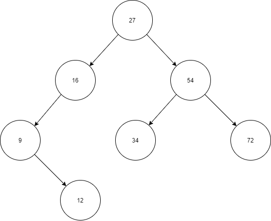

## 이진 검색 트리

트리는 계층 구조 표현 외에도 검색(Search)를 위한 용도로 사용할 수 있다.
그 중 대표적인 것이, 이진 검색 트리(Binary Search Tree)이다.

> 이진 트리는 각 노드가 왼쪽과 오른쪽, 최대 두 개의 자식 노드만을 가질 수 있는 트리를 의미한다.  




**순회**  
이진 검색 트리에서 왼쪽 자식은 현재 노드의 우선 순위보다 항상 낮고, 오른쪽 자식은 우선 순위가 더 높다.  
이러한 특징으로 아래 특징까지 도출해낼 수 있다.

- 루트 노드에서 왼쪽 아래로 쭉 내려가서 만나는 노드가 우선 순위가 가장 낮다.
- 루트 노드에서 오른쪽 아래로 내려가서 만나는 노드가 우선 순위가 가장 높다.
- 중위 순회하면 정렬된 원소의 목록을 얻을 수 있다.


**검색**  
Binary Search와 유사하게 한 번 탐색으로 후보군을 절반씩 삭제해가며 O(logN)에 값을 찾는다.  


## 이진 검색 트리의 동작  

위에서 정리한 특징은 정렬된 배열에 비해서 나을게 없다. 
이진 검색 트리의 장점은 노드의 삽입과 삭제에 있어 배열보다 효율적으로 동작할 수 있다.  

``` cpp
template <typename T>
class Tree;

template <typename T>
class TreeNode{
  friend class Tree<T>;
  private:
    T value;
    TreeNode * left;
    TreeNode * right;
  
  public:
    TreeNode(T value)
    :value(value), left(nullptr), right(nullptr)
    {}
};

template <typename T>
class Tree{
  private:
    TreeNode<T> * root;
  
  public:
    Tree():root(nullptr)
    {}

    // 노드 탐색
    TreeNode<T> * find(T value){
      TreeNode<T> * cur = getRoot();

      if(cur == nullptr) return nullptr;
      while(cur != nullptr){
        if(cur->value == value) return cur;
        else if(cur->value > value) cur = cur->left;
        else if(cur->value < value) cur = cur->right;
      }

      return cur;
    }

    // 데이터 삽입(중복 고려X)
    void insert(T value){
      TreeNode<T> * newNode = new TreeNode<T>(value);

      if(root == nullptr){
        root = newNode;
        return;
      }

      TreeNode<T> * curNode = getRoot();
      while(true){
        if(curNode->value > newNode->value){
          if(curNode->left == nullptr){
            curNode->left = newNode;
            break;
          }
          else curNode = curNode->left;
        }
        else{
          if(curNode->value < newNode->value){
            if(curNode->right == nullptr){
              curNode->right = newNode;
              break;
            }
            else curNode = curNode->right;
          }
        }        
      }
    }

    // 데이터 삭제
    void remove(T value){
      // 삭제 대상 찾기
      TreeNode<T> * targetNode = getRoot();
      TreeNode<T> * parentNode = nullptr;

      bool findTarget = false;
      while(targetNode != nullptr){
        if(targetNode->value == value) break;
        
        parentNode = targetNode;
        if(targetNode->value > value) targetNode = targetNode->left;
        else targetNode = targetNode->right;
      }

      // 못 찾으면 종료
      if(targetNode == nullptr) return;

      // Case 1. 삭제 노드의 자식이 없을 때
      // 그냥 삭제!
      if(targetNode->left == nullptr && targetNode->right == nullptr){
        if(parentNode->left == targetNode) parentNode->left = nullptr;
        else parentNode->right = nullptr;
      }
      // Case 2. 삭제 노드의 자식이 하나 일 때
      // 삭제 노드의 자식을 부모와 연결시켜 줌
      else if(targetNode->left == nullptr){
        if(parentNode->left == targetNode) parentNode->left = targetNode->right;
        else parentNode->right = targetNode->right;
      }
      else if(targetNode->right == nullptr){
        if(parentNode->left == targetNode) parentNode->left = targetNode->left;
        else parentNode->right = targetNode->left;
      }
      // Case 3. 삭제 노드의 자식이 둘 일 때
      // 오른쪽 자식에서 가장 작은 값을 가지는 노드를 올리고 삭제한다.
      else{
        TreeNode<T> * swapNode = targetNode->right;
        while(swapNode->left != nullptr) swapNode = swapNode->left;
        
        T newValue = swapNode->value;
        remove(swapNode->value);

        if(parentNode->left == targetNode){
          parentNode->left = new TreeNode<T>(newValue);
          parentNode->left->left = targetNode->left;
          parentNode->left->right = targetNode->right;
        }
        else{
          parentNode->right = new TreeNode<T>(newValue);
          parentNode->right->left = targetNode->left;
          parentNode->right->right = targetNode->right;
        }

        
      }

      delete targetNode;
    }
    
    TreeNode<T>* getRoot(){
      return root;
    }

    void inOrder(TreeNode<T> * cur){
      if(cur != nullptr){
        inOrder(cur->left);
        cout << cur->value << " ";
        inOrder(cur->right);
      }
    }
};

int main(){
  Tree<int> tree;
  tree.insert(27);
  tree.insert(13);
  tree.insert(10);
  tree.insert(15);
  tree.insert(30);
  tree.insert(28);
  tree.insert(32);
  tree.insert(31);
  tree.insert(40);
  tree.insert(35);

  tree.remove(32);

  tree.inOrder(tree.getRoot());
}
```  

<br/>

참고
- 구종만, 프로그래밍 대회에서 배우는 알고리즘 문제 해결 전략