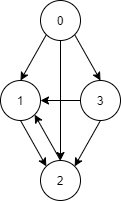
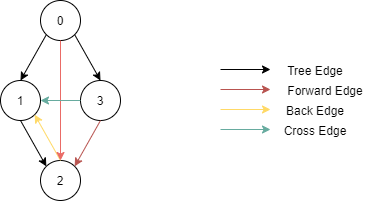
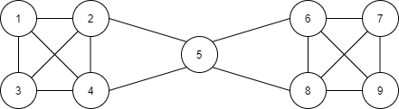
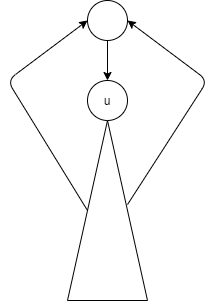
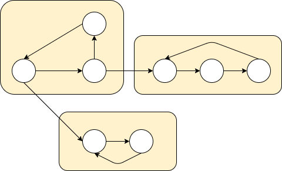
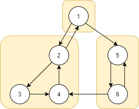

## DFS의 간선 분류  

  

다음과 같은 그래프가 있다고 하자. 
단순히 DFS에 사용되는 엣지 외에도 이를 활용하면 더 많은 그래프의 정보를 알 수 있다. 

DFS를 했을 때 사용되는 엣지만 모아서 본다면 트리의 형태를 보인다. 
이 트리를 DFS Spanning Tree라고 부른다. 
그리고 이렇게 트리를 생성했을 때, 그래프의 엣지들은 아래와 같이 4가지로 분류될 수 있다. 

|분류|설명|
|:--|:--|
|Tree Edge| 스패닝 트리에 포함된 간선 |
|Forward Edge| 트리의 조상에서 자식 방향으로 연결되면서 스패닝 트리에 포함되지 않음 |
|Back Edge | 트리의 자식에서 조상 방향으로 연결되면서 스패닝 트리에 포함되지 않음 |
|Cross Edge | 조상-자식 관계가 아닌 노드 간의 연결|  

  

> 방향이 없는 그래프에서는 Cross Edge는 존재할 수 없고,  
> Forward Edge와 Back Edge의 구분이 없다.

``` cpp
vector<vector<int> > adj;
vector<int> discovered; // i번 노드의 발견 순서
vector<int> finished; // dfs(i)의 종료 여부
int counter; // 지금까지 발견한 정점의 수

void dfs(int here){
	discovered[here] = counter;

	for(int next : adj[here]){
		if(discovered[next] == -1){
			cout << "Tree Edge\n";
			dfs(next);
		}
		else if(discovered[here] < discovered[next]){
			cout << "Forward Edge\n";
		}
		else if(finished[next] == 0){
			cout << "Back Edge\n";
		}
		else{
			cout << "Corss Edge\n";
		}
	}
	finished[here] = 1;
}
```

대표적으로 사이클 존재 여부를 확인할 수 있다. 
Back Edge가 존재한다면 사이클이 존재한다고 볼 수 있다.


## 절단점  

[11266 : 단절점](https://www.acmicpc.net/problem/11266)

절단점이란 어떤 노드와 이에 연결된 엣지를 모두 지웠을 때, 
그래프가 두 개 이상의 컴포넌트로 나눠지는 점을 말한다. 



위 그림에서 절단점은 5번 노드이다. 
이 노드를 삭제한다면 1~4 노드와 6~9 노드 사이의 연결이 완전히 사라지게 된다. 

어떤 점 u가 절단점임을 어떻게 판단할 수 있을까? 
먼저 DFS 스패닝 트리를 구성한다. 
u가 지워졌을 때 그래프가 나눠지지 않는 경우는 u의 자식 노드들이 전부 u의 조상 노드와 연결되어 있을 때이다. 

  

이를 확인하기 위해서는 서브 트리에서 갈 수 있는 트리의 최소 깊이를 반환하도록 하는 것이다. 
만약 u의 자손들이 모두 u보다 위에 있는 노드로 거슬로 올라 갈 수 있으면 이는 절단점이 아닌 것이다.  

마지막으로, 루트인 경우에를 별도로 고려해 줘야 한다. 
루트의 자식이 하나 또는 존재하지 않을 때는 절단점이라고 볼 수 없다. 
루트의 경우에는 자식이 둘 이상 존재할 때 절단점이라고 판단할 수 있다.

``` cpp
#define DEBUG 0
#define LOG(string) cout << string

#include <iostream>
#include <vector>
#include <algorithm>

using namespace std;

int v, e;
vector<vector<int> > adj;
vector<int> discovered;
vector<bool> isCutVertex;
int counter = 0;

int findCutVertex(int, bool);

int main(){
    ios_base::sync_with_stdio(false);
    cin.tie(NULL);

	cin >> v >> e;
	adj.assign(v+1, vector<int>(0));
	discovered.assign(v+1, -1);
	isCutVertex.assign(v+1, false);
	for(int i = 0 ; i < e ; i++){
		int a, b;
		cin >> a >> b;
		adj[a].push_back(b);
		adj[b].push_back(a);
	}

	for(int i = 1 ; i <= v ; i++){
		if(discovered[i] == -1){
			findCutVertex(i, true);
		}
	}

	int answer = 0;
	vector<int> cutVertexList;
	for(int i = 1 ; i <= v ; i++){
		if(isCutVertex[i]){
			answer++;
			cutVertexList.push_back(i);
		}
	}

	cout << answer << "\n";
	for(int cutVertex : cutVertexList){
		cout << cutVertex << " ";
	}

    return 0;
}

int findCutVertex(int here, bool isRoot){
	discovered[here] = counter++;
	int ret = discovered[here];
	int children = 0;

	for(int next : adj[here]){
		if(discovered[next] == -1){
			++children;

			int subTree = findCutVertex(next, false);

			if(!isRoot && subTree >= discovered[here]) isCutVertex[here] = true;
			ret = min(ret, subTree);
		}
		else{
			ret = min(ret, discovered[next]);
		}
	}

	if(isRoot) isCutVertex[here] = (children >= 2);
	return ret;
}
```

## SCC(Strongly Connected Component)  

[2150 : Strongly Connected Component](https://www.acmicpc.net/problem/2150)

위의 예에서, 절단점을 포함하지 않는 서브 그래프를 Biconnected Component라고 부른다. 
이 개념은 무향 그래프에서만 정의 된다. 
방향 그래프에서는 두 정점 (u, v) 사이에 엣지들이 존재한다고 해도 
방향이 존재하기 때문에 두 정점이 연결되었다고 볼 수 는 없으므로 절단점 개념을 그대로 사용할 수 없다. 

여기서 정의되는 개념이 **SCC(Strongly Connected Component)**이다. 
두 정점 u와 v에 대해 양방향으로 가는 경로가 존재할 때 같은 SCC에 속해 있다고 말한다. 

  

SCC를 구하기 위해서 사용하는 알고리즘은 Tarjan Algorithm인데 
이는 DFS를 수행하면서 각 정점들을 SCC로 묶어낸다.  

DFS 탐색 중 어떤 SCC를 처음 방문했다고 가정하자. 
이 정점을 u라고 했을 때, 동일한 SCC 내에는 모든 정점이 연결되어 있기에 dfs(u)가 종료되기 전에 모든 노드를 방문한다. 
따라서, SCC의 정점들은 u를 루트로 하는 서브 트리에 포함된다고 말할 수 있고, 
SCC를 찾는 알고리즘은 DFS Spanning Tree를 적절히 구분하면 찾아 낼 수 있다. 

재귀 호출이 반환될 때 마다 엣지를 자를지 말지 결정하며, 간선 (u, v)를 자른다고 가정해보자. 
자른다는 것은 v에서 u로 가는 경로가 없다는 것으며 하나의 SCC를 구분하는 행위이다. 
절단점을 찾는 알고리즘과 같이, v를 루트로 하는 서브 트리를 순회하며 Back Edge을 사용해 갈 수 있는 가장 높은 정점을 찾는다. 
찾은 정점이 만약 u보다 더 높은 노드로 갈 수 있다면 이는 u 또한 접근 가능함을 의미하며 이 엣지는 잘라서는 안된다.  

절단점을 찾는 알고리즘과 다른 것은 방향 그래프이기 때문에 존재하는 Cross Edge이다. 

  

DFS를 통해 1에서 시작하여 (2, 3, 4)를 방문하고 5를 방문했다고 가정하자. 
5번을 루트로 하는 서브트리에서 1번으로 가는 Back Edge은 없지만, 
(6, 4) 엣지의 존재 때문에 1로 갈 수 있는 가능성이 있다. 
하지만 이 케이스에서 (2, 3, 4)에서는 1로 다시 갈 수 없고 이미 하나의 SCC로 묶여 있는 상태이다.
따라서 1과 5사이는 Back Edge가 없고, Cross Edge로도 통할 수 없으니 연결은 끊어지는 것이 맞다. 

정리하자면 (u, v)를 자를 수 없는 기준은 다음과 같다.   

1. v를 루트로 하는 서브트리에서, v보다 먼저 발견된 정점으로 가는 back edge가 존재하는 경우
2. v보다 먼저 발견되었으면서 아직 SCC로 묶여 있지 않는 cross edge가 존재하는 경우


``` cpp
#define DEBUG 0
#define LOG(string) cout << string

#include <iostream>
#include <vector>
#include <algorithm>
#include <stack>
#include <map>

using namespace std;

int v, e;
vector<vector<int> > adj;
vector<int> discovered;
vector<int> sccId;
stack<int> st;

int sccCounter = 0;
int vertexCounter = 0;

int scc(int here);

int main(){
    ios_base::sync_with_stdio(false);
    cin.tie(NULL);

	cin >> v >> e;
	adj.assign(v+1, vector<int>(0));
	for(int i = 0 ; i < e ; i++){
		int a, b;
		cin >> a >> b;
		adj[a].push_back(b);
	}

	// tarjan SCC
	discovered.assign(v+1, -1);
	sccId.assign(v+1, -1);
	for(int i = 1 ; i <= v ; i++){
		if(discovered[i] == -1) scc(i);
	}

	map<int, int> idMap;
	int answerId = 0;
	int maxId = *max_element(sccId.begin(), sccId.end());
	vector<vector<int> > answer(maxId + 1, vector<int>(0));
	for(int i = 1 ; i <= v ; i++){
		if(idMap.find(sccId[i]) == idMap.end()){
			idMap[sccId[i]] = answerId++;
		}
		
		answer[idMap[sccId[i]]].push_back(i);
	}

	cout << answer.size() << "\n";
	for(int i = 0 ; i < answer.size() ; i++){
		for(int j : answer[i]){
			cout << j << " ";
		}
		cout << -1 << "\n";
	}

    return 0;
}

int scc(int here){
	int ret = discovered[here] = vertexCounter++;

	st.push(here);
	for(int next : adj[here]){
		if(discovered[next] == -1) ret = min(ret, scc(next));
		else if(sccId[next] == -1) ret = min(ret, discovered[next]);
	}

	if(ret == discovered[here]){
		while(true){
			int t = st.top();
			st.pop();

			sccId[t] = sccCounter;
			if(t == here) break;
		}
		++sccCounter;
	}

	return ret;
}
```

<br/>

참고
- 구종만, 프로그래밍 대회에서 배우는 알고리즘 문제 해결 전략