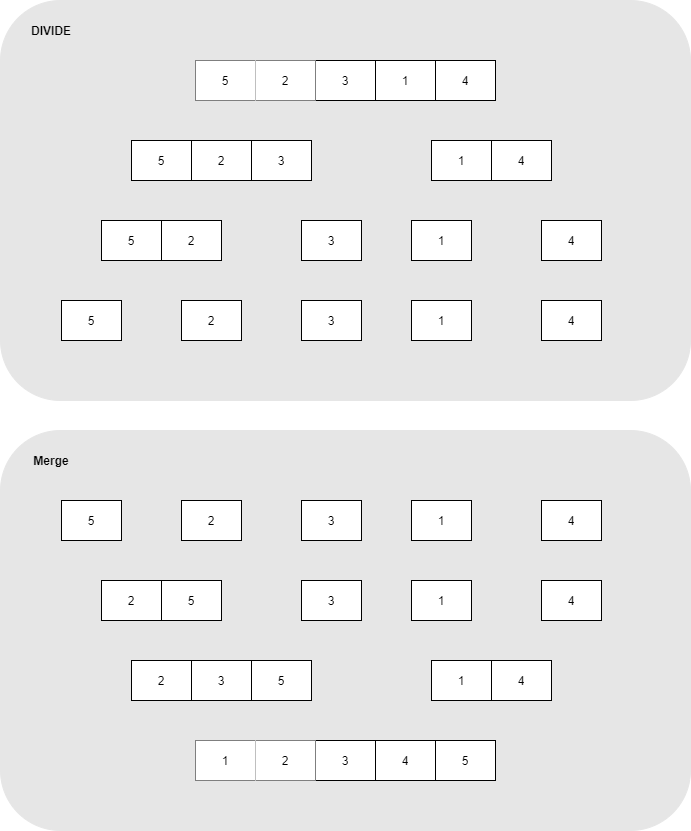
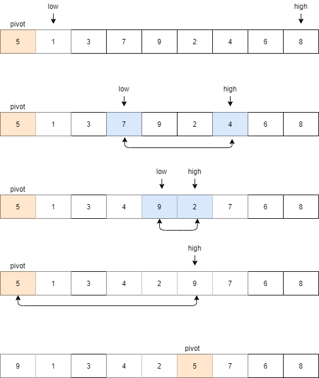

## Divide & Conquer  

Divide & Conquer(분할 정복)은 유명한 알고리즘 디자인 패러다임으로, 
문제를 둘 이상으로 나누어 각 문제에 대한 답을 재귀적으로 구한다음 최종 해를 구하는 방법이다.  

1. divide : 문제를 더 작은 문제로 분할
2. base case : 더 이상 답을 분할하지 않고 곧장 풀 수 있는 문제의 제일 작은 단위
3. merge : 각 문제에 대한 해답을 원래 문제에 대한 정답으로 병합  

이러한 분할 정복으로 해결할 수 있는 문제는 정렬 알고리즘에서도 나타난다. 
merge sort, quick sort는 전형적인 분할 정복의 예이다.


## Merge Sort  

각 요소를 쪼갠 뒤 다시 합치는 divide & conquer 방식으로 정렬을 해결한다.

  

``` cpp
void mergeSort(vector<int> & arr, int left, int right){	
	// 데이터가 하나 되는 순간(left == right)까지 쪼갠다
	if(left < right)
	{
		int mid = (left + right) / 2;
		
		mergeSort(arr, left, mid);
		mergeSort(arr, mid + 1, right);
		
		mergeArea(arr, left, mid, right);
	}
}

void mergeArea(vector<int> & arr, int left, int mid, int right){
	int frontIdx = left;   // 앞 배열 인덱스
	int rearIdx = mid + 1; // 뒷 배열 인덱스
	int resultIdx = 0;  // 결과 배열 인덱스
	
	vector<int> temp(right - left + 1, 0);
	// merge할 배열 중 하나가 끝날 때 까지 채우기
	while(frontIdx <= mid && rearIdx <= right)
	{
		if(arr[frontIdx] <= arr[rearIdx])
			temp[resultIdx++] = arr[frontIdx++];
		else
			temp[resultIdx++] = arr[rearIdx++];
	}

	// 먼저 다 채운 배열이 뒷 배열이면 앞 배열 나머지 요소 채우기
	while(frontIdx <= mid) temp[resultIdx++] = arr[frontIdx++];
	
	// 먼저 다 채운 배열이 앞 배열이면 뒷 배열 나머지 요소 채우기
	while(rearIdx <= right) temp[resultIdx++] = arr[rearIdx++];
	
	for(int i = left; i <= right; i++) arr[i] = temp[i - left];
}
```

## Quick Sort  

pivot이라는 기준 원소를 통해 divide & conquer 방식으로 정렬 결과를 구한다. 

1. 리스트에 있는 임의의 한 원소를 선택하며 이를 **pivot**이라고 한다.
2. pivot을 기준으로 보다 작은 우선 순위는 왼쪽으로 큰 우선 순위는 오른쪽으로 옮긴다.
3. pivot을 제외한 양 쪽을 크기가 0 또는 1이 될 때 까지 재귀적으로 호출한다.  




``` cpp
int partition(vector<int> & arr, int left, int right){
	int pivot = arr[left];
	int low = left + 1;
	int high = right;
	
	while(low <= high){
		// pivot 보다 큰 값 찾기
		while(pivot >= arr[low] && low <= right) low++;
		
		// pivot 보다 작은 값 찾기
		while(pivot <= arr[high] && high >= left + 1) high--;
			
		// low와 high 위치가 역전되지 않았으면
		if(low <= high) swap(arr[low], arr[high]);
	}
	swap(arr[left], arr[high]);
	
	return high; // 제 자리를 찾아간 pivot 위치
}

void quickSort(vector<int> & arr, int left, int right){
	if(left >= right) return;

	int pivot = partition(arr, left, right);
	quickSort(arr, left, pivot - 1);
	quickSort(arr, pivot + 1, right);
}
```

<br/>

참고
- 구종만, 프로그래밍 대회에서 배우는 알고리즘 문제 해결 전략