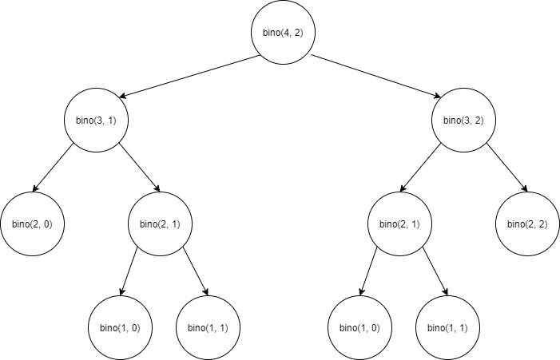

## Dynamic Programming  

DP는 PS에서 디자인 패러다임 중 하나로 동적 프로그래밍 또는 동적 계획법이라고 불린다. 
동적 계획법은 큰 의미에서는 분할 정복과 비슷한 접근 방식을 취한다. 
문제를 나누어 계산하여 이를 재활용함으로써 중복된 계산을 막아 속도를 높인다. 

예를 들어 이항 계수를 구할 필요가 있다고 가정하자. 
이항 계수는 아래와 같은 점화식으로 표현할 수 있고 이는 재귀적인 코드로 나타낼 수 있다.

$ _{n}\mathrm{C}_{k} = _{n-1}\mathrm{C}_{k} + _{n-1}\mathrm{C}_{k-1} $

``` cpp
// 이항 계수
int bino(int n, int r){
  if(r == 0 || n == r) return 1;
  
  return bino(n-1, r-1) + bino(n-1, r);
}
```

 

호출 과정은 그림과 같으며 일부 노드들은 중복되어 연산됨을 확인할 수 있다. 
이는 깊이가 깊어 질수록 지수적으로 증가하며 값이 조금만 커져도 감당하기 힘들다. 

하지만 아래와 같은 코드로 작성을 하면 어떨까?

``` cpp
int cache[30][30]; // -1로 초기화
int bino2(int n, int r){
  if(r == 0 || n == r) return 1;
  if(cache[n][r] != -1) return cache[n][r];

  return cahce[n][r] = bino2(n-1, r-1) + bino2(n-1, r);
}
```

이는 한 번 계산한 값은 ```cache```에 저장함으로써 중복 연산을 피한다. 
이와 같이 계산한 값을 저장하여 재활용함으로써 최적화하는 기법을 **메모이제이션(memoization)**이라고 한다. 

|n|2|3|4|5|6|...|18|19|...|24|25|
|:--|:--|:--|:--|:--|:--|:--|:--|:--|:--|:--|:--|
|bino 호출 횟수|3|5|11|19|39|...|97239|184755|...|5408311|10400599|
|bino2 호출 횟수|3|5|8|11|15|...|99|109|...|168|181|


DP의 핵심은 간단한다. 
원하는 정답을 구하려면 완전 탐색 기반으로 점화식을 작성하고, 메모이제이션을 하는 것이다. 
핵심은 간단한데 많이 어렵다.... 아래에서 DP를 설명하는 가장 유명한 문제 몇 가지를 다뤄본다.

### LIS(Longest Increasing Sub-sequnce)  

[11053 : 가장 긴 증가하는 부분 수열](https://www.acmicpc.net/problem/11053)

동적 계획법을 연습하기 위한 유명한 문제 중 하나이다. 
어떤 배열이 존재할 때 그 부분 배열은 0개 이상의 요소를 제거하고 남은 것으로 정의한다. 
그 중 부분 수열의 숫자들이 오름차순으로 증가하면 이를 증가 부분 수열이라고 한다. 

예를 들어 S = {1, 3, 4, 2, 4}라고 했을 때 증가 부분 수열은 아래와 같은 케이스가 될 수 있다.
  
    - {1, 3}
    - {1, 3, 4}
    - {1, 4}
    - {1, 2, 4}
    - {1, 2}


##### 완전 탐색으로 시작하기

먼저 모든 케이스를 고려해보면 배열을 순회하며 하나를 선택하고, 
그 뒤에 있는 요소들 중 더 큰 것만 선택하여 부분 배열을 만들고,
이를 재귀적으로 호출하는 방식으로 구현할 수 있다.

``` cpp
int lis(const vector<int> & A){
  if(A.empty()) return 0;

  int ret = 0;
  for(int i = 0 ; i < A.size() ; i++){
    vector<int> B;
    for(int j = i + 1 ; j < A.size() ; j++){
      if(A[i] < A[j]) B.push_back(A[j]);
    }

    ret = max(ret, 1 + lis(B));
  }

  return ret;
}
```

##### 메모이제이션

lis(start)를 ```S[start]```에서 시작하는 부분 증가 수열 중 최대 길이라 정의하자

``` cpp
int n;
int cache[100]; // -1로 초기화
int S[100]; 
int lis2(int start){
  int& ret = cache[start];
  if(ret != -1) return ret;

  ret = 1;
  for(int next = start + 1 ; next < n ; next++){
    if(S[start] < S[next]) ret = max(ret, lis2(next) + 1);
  }

  return ret;
}
```

##### 조금 더 개선하기  

```lis2```의 input은 시작 인덱스가 된다. 
이를 통해 해답을 구하기 위해서는 다음과 같은 형태의 코드가 필요하다.

``` cpp
int maxLen = 0;
for(int start = 0 ; start < n ; start++){
  maxLen = max(maxLen, lis2(start));
}
```

이를 lis2에서 개선하기 위해서는 ```S[-1] = -∞```라 하자. 
```lis2(-1)```을 호출 했을 때 모든 요소는 S[-1] 보다 크니까 모든 위치에 대한 계산을 진행할 수 있다.

``` cpp
int n;
int cache[101]; // -1로 초기화. -1 인덱스를 위해 크기가 하나 커짐
int S[100];
int lis3(int start){
  int& ret = cache[start+1];
  if(ret != -1) return ret;

  ret = 1;
  for(int next = start + 1 ; next < n ; next++){
    if(start == -1 || S[start] < S[next]) ret = max(ret, lis3(next) + 1);
  }

  return ret;
}
```

#### 수열 실제로 출력하기  

기존 로직에서 길이 대신 실제 원소를 담는 배열을 만들도록 할 수 있지만, 
모든 케이스마다 이를 처리하기에는 메모리 문제 등이 발생 할 수 있다. 
때문에 DP에서는 별도로 이를 구성한다. 

``` cpp
int n;
int cache[101], S[100], choices[101];
int lis4(int start){
  int& ret = cache[start+1];
  if(ret != -1) return ret;

  ret = 1;
  int bestNext = -1;
  for(int next = start + 1 ; next < n ; next++){
    if(start == -1 || S[start] < S[next]){
      int cand = lis4(next) + 1;
      if(cand > ret){
        ret = cand;
        bestNext = next;
      }
    }
  }

  choices[start+1] = bestNext;
  return ret;
}

void reconstruct(int start, vector<int>& seq){
  if(start != -1) seq.push_back(S[start]);
  int next = choices[start+1];
  if(next != -1) reconstruct(next, seq);
}
```

> LIS는 더 개선될 수 있다. 위 코드들은 $ O(N^2) $ 이지만 $ O(NlgN) $ 까지 줄일 수 있다. 하지만 여기서 다루지는 않는다.


### 0/1 Knapsack

[12865 : 평범한 배낭](https://www.acmicpc.net/problem/12865)  

0/1 Knapsack문제에서는 가방의 용량이 주어진다. 
그리고 여러 물건과 각 물건의 무게, 가치가 주어진다. 

|Product|Weight|Value|
|:--|:--|:--|
|a|6|13|
|b|4|8|
|c|3|6|
|d|5|12|

이 때, 가방에 물건을 담았을 때 그 가치를 최대로 하려면 어떻게 해야할까? 

쉽게 접근할 수 있는 방법은 Greedy하게 접근할 수 있다. 
물건의 단위 무게당 가치가 가장 높은 것 부터 넣으면 어떨까?

|Product|Weight|Value|단위 무게당 가치|
|:--|:--|:--|:--|
|a|6|13|2.17|
|b|4|8|2|
|c|3|6|2|
|d|5|12|2.4|

여기서 d가 단위 무게당 가치가 제일 높다. 
이를 가방에 넣으면 더 이상 넣을 수 있는 것은 없고 가방의 가치는 12가 된다.
하지만 정답은 b와 c를 담아 가치를 14로 만들어야 한다. 

이러한 접근 fractional kanpsack 문제인 물건을 쪼개서 넣을 수 있는 경우에 성립하고, 
0/1 knapsack에서는 물건을 넣거나 넣지 않거나 중에 선택하며 이는 DP로 풀이 가능하다.

```pack```을 다음과 같이 정의한다.  

```pack[capacity][item] = 가방의 용량이 capacity만큼 남았을 때, item 이후의 물건들을 싸서 얻을 수 있는 최대 가치``` 

그리고 이를 구하기 위한 점화식은 아래와 같이 세울 수 있다.

$$
pack[capacity][item] = max \begin{dcases} 
   pack[capacity-weight[item]][item+1] + value[item] \\
   pack[capacity][item+1]
   \end{dcases}
$$

물건들을 순회하면서, 
해당 물건을 가져가는 경우와 그리고 가져가지 않는 경우를 나워서 재귀적으로 구현하면 된다. 

``` cpp
int n, capacity;
int weight[100], value[100];
int cache[100001][100];

int pack(int capacity, int item){
	if(item == n) return 0;
	int& ret = cache[capacity][item];

	if(ret != -1) return ret;

	// 물건을 담지 않는 경우
	ret = pack(capacity, item + 1);

	// 물건을 담는 경우
	if(capacity >= weight[item]){
		ret = max(ret, pack(capacity - weight[item], item + 1) + value[item]);
	}

	return ret;
}
```


### TSP  

[2098 : 외판원 순회](https://www.acmicpc.net/problem/2098)  
[10971 : 외판원 순회 2](https://www.acmicpc.net/problem/10971)

Traveling Sales-man Person이라고 불리는 CS에서 정말 유명한 문제가 있다. 
한 영업 사원이 특정 도시에서 출발해 다른 도시들을 한 번씩 모두 방문한 뒤 시작 도시로 돌아오고자 한다. 

처음 접근은 완전탐색으로 접근할 수 있다. 
DFS를 통해 접근하면 모든 경우의 수를 만들어 문제를 해결할 수 있다. 

``` cpp
int n;
int dist[10][10];
bool visited[10];
vector<int> path;

int shortestPath(int distance){
	if(path.size() == n){
		if(dist[path.back()][path[0]] > 0) return distance + dist[path.back()][path[0]];
		else return INF;
	}

	int ret = INF;
	for(int next = 0 ; next < n ; next++){
		int here = path.back();
		if(visited[next] || dist[here][next] == 0) continue;

		path.push_back(next);
		visited[next] = true;

		int cand = shortestPath(distance + dist[here][next]);
		ret = min(ret, cand);

		path.pop_back();
		visited[next] = false;
	}

	return ret;
}
```

하지만 이 경우 N!의 경우의 수가 존재하는데 10! = 3,628,800 정도 까지는 해결이 가능하지만 
15!만 되어도 이 값은 1조를 넘어가버린다.

메모이제이션을 하기 위해 정보를 최소한으로 받도록 ```shortestPath```의 정의를 수정한다. 
방문한 순서는 유지하지 않아도 무방한 정보이므로 이를 수정한다.

    1. 방문한 경로의 계산
      기존의 전체 경로 반환에서 남은 경로의 길이를 반환하도록 변경.
    2. 도시의 방문 여부
      방문 여부는 확인해야하지만 굳이 배열로 순서까지 유지할 필요 없다.

그리고 변경한 ```shortestPath()``` 정의는 아래와 같다.

``` shirtestPath(here, visited) = 현재 위치가 here이고 각 도시의 방문 여부를 담은 visited이 주어질 때, here에서 시작해 나머지 도시들을 방문하는 부분 경로의 최소 길이를 반환```

``` cpp
int n;
int dist[MAX][MAX];
int cache[MAX][1 << MAX];

int shortestPath(int here, int visited){
	if(visited == (1 << n) - 1){
		return dist[here][0] == 0 ? INF : dist[here][0];
	}

	int& ret = cache[here][visited];
	if(ret >= 0) return ret;
	ret = INF;
	for(int next = 0 ; next < n ; next++){
		if(visited & (1 << next) || dist[here][next] == 0) continue;

		int cand = dist[here][next] + shortestPath(next, visited + (1 << next));
		ret = min(ret, cand);
	}

	return ret;
}
```


<br/>

참고
- 구종만, 프로그래밍 대회에서 배우는 알고리즘 문제 해결 전략