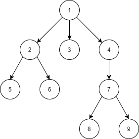

## 최소 공통 조상  

최소 공통 조상은 트리에서 두 노드 (u, v)의 최소 공통 조상 LCA(u, v)는 
두 노드를 모두 자손으로 갖는 노드 중 가장 아래 있는 이다. 



- LCA(5, 6) = 2
- LCA(3, 8) = 1
- LCA(7, 8) = 7
- ...

## Niave Solution  

[11437 : LCA](https://www.acmicpc.net/problem/11437)  

먼저 노드의 depth가 같은 두 노드를 생각해본다. 
Naive한 접근법으로는 두 노드가 루트를 향해 한 칸씩 거슬러 올라가면서 같은 노드를 방문할 때 
같은 노드를 만난다면 그 노드가 바로 최소 공통 조상이 된다.  

위와 같은 접근법으로 다음과 같은 알고리즘을 세울 수 있다.

1. 모든 노드에 대해 부모 노드와 depth를 계산한다.
2. 구하고자 하는 노드 쌍의 depth를 확인하고, 일치하지 않으면 동일한 depth를 가지도록 조절한다.
3. 두 노드를 한 칸씩 거슬러 올라가며 같은 노드를 방문할 때 까지 방문한다. 

``` cpp
#define DEBUG 0
#define LOG(string) cout << string

#include <iostream>
#include <vector>
#include <algorithm>

using namespace std;

vector<vector<int> > adj;
vector<int> depth;
vector<int> parent;

void dfs(int, int);
int lca(int, int);

int main(){
	ios_base::sync_with_stdio(false);
	cin.tie(NULL);

	int n;
	cin >> n;

	adj.resize(n+1);
	depth.resize(n+1);
	parent.resize(n+1);

	for(int i = 0 ; i < n - 1 ; i++){
		int a, b;
		cin >> a >> b;

		adj[a].push_back(b);
		adj[b].push_back(a);
	}

	// Depth, Parent 구하기
	dfs(1, 1);

	int m;
	cin >> m;
	for(int i = 0 ; i < m ; i++){
		int a, b;
		cin >> a >> b;

		cout << lca(a, b) << "\n";
	}

	return 0;
}

void dfs(int node, int curDepth){
	depth[node] = curDepth;

	for(int child : adj[node]){
		if(depth[child] == 0){
			dfs(child, curDepth + 1);
			parent[child] = node;
		}
	}
}

int lca(int a, int b){
	// a : small depth
	// b : big depth 
	if(depth[a] > depth[b]) swap(a, b);
	
	// depth 조절
	while(depth[a] < depth[b]){
		b = parent[b];
	}

	while(a != b){
		a = parent[a];
		b = parent[b];
	}

	return a;
}
```

위 알고리즘은 $ O(n) $이 소요된다. 
트리가 skewed한 상태에는 어느 정도 시간이 걸리고 이어지는 문제에서는 TLE가 발생한다.

## Memoization (Segment Tree)  

[11438 : LCA 2](https://www.acmicpc.net/problem/11438)  

세그먼트 트리를 사용하면 최대 공통 조상을 $ O(nlgn) $의 시간에 해결할 수 있다.  

세그먼트 트리는 선형 데이터를 처리하기 위한 자료 구조로 트리를 선형으로 만들 필요가 있다. 
구현 방안에는 전위 순회 결과(재귀 호출 후 돌아오는 부분 포함)로 나타내는 것이 있다.  


1 - 2 - 5 - 2 - 6 - 2 - 1 - 3 - 1 - 4 - 7 - 8 - 7 - 9 - 7 - 4 - 1

노드의 수를 n이라고 하면 엣지는 n-1개가 존재한다. 
각 엣지는 하위 노드 방문과 상위 노드로 돌아오는 과정이 포함되므로 2n-2개의 방문이 존재하고, 
최초 루트 노드를 포함하면 변환 결과의 길이는 2n-1이 된다. 

두 노드 u, v는 반드시 LCA(u, v)의 다른 서브 트리에 존재하기에 
u, v 사이에 있는 가장 상위 노드를 구하면 된다.

RMQ를 사용하여 상위 노드를 구하려면 트리의 상하관계에서는 위에 있는 노드가 더 작은 값을 가지도록 일련번호를 매긴다. 
이는 전위순회를 하며 노드의 방문 순서대로 번호를 매기면 만족시킬수 있다.

``` cpp
#define DEBUG 0
#define LOG(string) cout << string

#include <iostream>
#include <vector>
#include <algorithm>
#include <climits>

using namespace std;

class RMQ{
private:
	int n; // input array 크기
	vector<int> rangeMin; // 구간 최소 값 트리

	// 최소 값으로 초기화
	int init(const vector<int> & array, int left, int right, int node){
		if(left == right) return rangeMin[node] = array[left];

		int mid = (left + right) / 2;
		int leftMin = init(array, left, mid, node * 2);
		int rightMin = init(array, mid + 1, right, node * 2 + 1);

		return rangeMin[node] = min(leftMin, rightMin);
	}

	/**
	*  @param left 쿼리 범위의 시작
	*  @param right 쿼리 범위의 끝
	*  @param node 노드 번호
	*  @param nodeLeft 해당 노드가 나타내는 범위의 시작
	*  @param nodeRight 해당 노드가 나타내는 범위의 끝
	* 
	*  쿼리가 표현하는 범위와 노드가 표현하는 범위의 교집합의 최소 원소를 반환한다.
	*/
	int query(int left, int right, int node, int nodeLeft, int nodeRight){
		// 교집합이 공집합 : 두 구간은 겹치지 않으므로 INFINITE 반환
		if(right < nodeLeft  || nodeRight < left) return INT_MAX;
		// 교집합이 [nodeLeft, nodeRight] : 미리 계산해둔 노드의 값 반환
		else if(left <= nodeLeft && nodeRight <= right) return rangeMin[node];
		// 그 외의 모든 경우 : 재귀적으로 query 호출 후 더 작은 값 반환
		else{
		int mid = (nodeLeft + nodeRight) / 2;
		return min(query(left, right, node*2, nodeLeft, mid), query(left, right, node*2+1, mid+1, nodeRight));
		}
	}

public:
	RMQ(const vector<int> & array){
		n = array.size();
		rangeMin.resize(n * 4);
		init(array, 0, n-1, 1);
	}

	// 외부 호출을 위한 인터페이스
	int query(int left, int right){
		return query(left, right, 1, 0, n-1);
	}
};

RMQ* rmq;

vector<vector<int> > adj;
vector<int> depth;

int nextSerial = 0;    // 일련번호
vector<int> trip;      // 순회 결과
vector<int> locInTrip; // locInTrip[u] : u가 trip에서 처음 등장하는 위치
vector<int> no2Serial; // 노드번호 -> 일련번호
vector<int> serial2No; // 일련번호 -> 노드번호

void resourceInit(int);
void dfs(int, int);
int lca(int, int);

int main(){
    ios_base::sync_with_stdio(false);
    cin.tie(NULL);

    int n;
	cin >> n;
	resourceInit(n);

	for(int i = 0 ; i < n - 1 ; i++){
		int a, b;
		cin >> a >> b;

		adj[a].push_back(b);
		adj[b].push_back(a);
	}

	// Depth, Parent 구하기
	dfs(1, 1);
	rmq = new RMQ(trip);
	
	int m;
	cin >> m;
	for(int i = 0 ; i < m ; i++){
		int a, b;
		cin >> a >> b;

		cout << lca(a, b) << "\n";
	}

    return 0;
}

void resourceInit(int n){
	adj.resize(n+1);
	depth.resize(n+1);
	locInTrip.resize(n+1);
	no2Serial.resize(n+1);
	serial2No.resize(n+1);
}

void dfs(int node, int curDepth){
	// 노드에 일련 번호 부여
	no2Serial[node] = nextSerial;
	serial2No[nextSerial] = node;
	nextSerial++;
	
	depth[node] = curDepth;
	
	locInTrip[node] = trip.size();
	trip.push_back(no2Serial[node]);

	for(int child : adj[node]){
		if(depth[child] == 0){
			dfs(child, curDepth + 1);
			trip.push_back(no2Serial[node]);
		}
	}
}

int lca(int a, int b){
	int u = locInTrip[a];
	int v = locInTrip[b];

	if(u > v) swap(u, v);

	return serial2No[rmq->query(u, v)];
}
```

## Memoization (Dynamic Programming)  

이 문제는 DP로도 최적화할 수 있다. 
노드의 부모를 저장하는 ```parent[node]``` 대신에 노드의 $ 2^k $ 번째 부모 노드를 저장하는 ```parent[node][k]```를 구성하는 것이다. 
노드의 수가 100,000일 때, $ 2^{17} > 100,000 $ 이므로 k의 범위를 17까지 구성하면 된다.
트리가 skewed한 상태라도 찾고자 하는 위치에 접근이 더 용이하며 이도 마찬가지로 $ O(nlgn) $의 시간을 가진다. 

``` cpp
#define DEBUG 0
#define LOG(string) cout << string
#define MAX_K 18

#include <iostream>
#include <vector>
#include <algorithm>

using namespace std;

int n;
vector<vector<int> > adj;
vector<int> depth;
vector<vector<int> > parent;

void dfs(int, int);
int lca(int, int);
void calAncestor();

int main(){
    ios_base::sync_with_stdio(false);
    cin.tie(NULL);

	cin >> n;

	adj.resize(n+1);
	depth.resize(n+1);
	parent.assign(n+1, vector<int>(MAX_K));

	for(int i = 0 ; i < n - 1 ; i++){
		int a, b;
		cin >> a >> b;

		adj[a].push_back(b);
		adj[b].push_back(a);
	}

	// Depth, Parent 구하기
	dfs(1, 1);
	calAncestor();
	
	int m;
	cin >> m;
	for(int i = 0 ; i < m ; i++){
		int a, b;
		cin >> a >> b;

		cout << lca(a, b) << "\n";
	}

    return 0;
}

void dfs(int node, int curDepth){
	depth[node] = curDepth;

	for(int child : adj[node]){
		if(depth[child] == 0){
			dfs(child, curDepth + 1);
			parent[child][0] = node;
		}
	}
}

void calAncestor(){
	for(int k = 0 ; k < MAX_K - 1 ; k++){
		for(int node = 1 ; node <= n ; node++){
			parent[node][k+1] = parent[parent[node][k]][k];
		}
	}
}

int lca(int a, int b){
	// a : small depth
	// b : big depth 
	if(depth[a] > depth[b]) swap(a, b);
	
	// depth 조절
	for(int k = MAX_K - 1 ; k >= 0 ; k--){
		if((1 << k) <= depth[b] - depth[a]){
			b = parent[b][k];
		}
	}

	if(a == b) return a;

	for(int k = MAX_K - 1 ; k >= 0 ; k--){
		if(parent[a][k] != parent[b][k]){
			a = parent[a][k];
			b = parent[b][k];
		}
	}

	return parent[a][0];
}
```

<br/>

참고
- 구종만, 프로그래밍 대회에서 배우는 알고리즘 문제 해결 전략