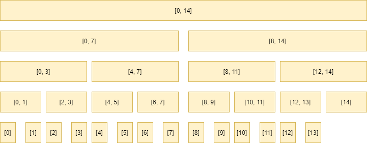
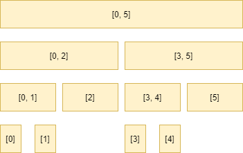
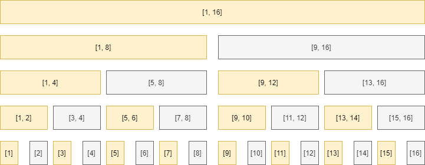
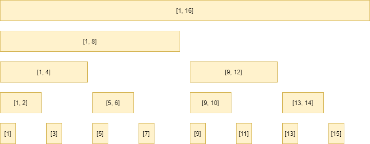

## Segment Tree

세그먼트 트리는 일차원 배열의 특정 구간에 대한 query를 빠르게 처리하는데 사용한다.  

예시로 배열의 특정 구간에 대한 최소치를 구하는 문제가 있다. 
{1, 2, 1, 2, 3, 1, 2, 3, 4}에서 [2, 4] 구간은 {1, 2, 3} 이 중 최소치는 1이다. 
물론 각 구간을 순회하면서 돌면 해는 구할 수 있지만 이는 O(n)의 시간을 소요하며 
전처리를 통해 세그먼트 트리를 구성해두면 빠르게 해를 구할 수 있다.  

기본적인 아이디어는 배열의 **구간들을 표현하는 이진 트리**를 생성하는 것이다. 
루트 노드는 항상 배열의 전체 구간 [0, n-1]을 의미하고, 
그 왼쪽 오른쪽 자식은 왼쪽 절반 구간 오른쪽 절반 구간을 의미한다. 
그리고 구간의 길이가 1인 노드들은 트리의 리프 노드가 된다.  

 

세그먼트 트리의 각 노드는 해당 구간에 대한 결과 값을 저장하고 있다. 
예를 들어 구간의 최소 값을 구하기 위해서는 각 노드는 해당 구간의 최소 값을 저장하고 있다. 
이러한 전처리 과정을 수행한다면 어떠한 구간이 주어지더라도 몇 가지의 노드의 합집합으로 표현 가능하며 $ O(lgn) $으로 해결이 가능하다.  

<br/>

### 구현  

full binary tree 모양처럼 보이기에 이는 1차원 배열로 표현할 수 있다. 
그렇다면 트리를 배열로 표현하는데 있어서 인덱스는 몇으로 잡아야할까. 
위 경우 길이 15를 표현하는데 29개의 노드가 필요하다. 
대충 2n으로 커버 가능할 것 같지만 아니다. 

 

위와 같이 완전한 full binary tree가 아니기 때문에 적절한 크기는 배열의 길이 
n을 가까운 2의 거듭 제곱 꼴로 올리고 2를 곱한 값, 만약 위 예시처럼 n=6이라면 8로 올리고 2를 곱한 16이 적절한 크기다. 
생각보다 귀찮은 연산이므로 4n으로 크기를 잡으면 메모리가 조금 낭비되겠지만 모든 경우 커버 가능하다.  

``` cpp
#include <vector>
#include <algorithm>

using namespace std;

class RMQ{

private:
  int n; // input array 크기
  vector<int> rangeMin; // 구간 최소 값 트리

  // 최소 값으로 초기화
  int init(const vector<int> & array, int left, int right, int node){
    if(left == right) return rangeMin[node] = array[left];

    int mid = (left + right) / 2;
    int leftMin = init(array, left, mid, node * 2);
    int rightMin = init(array, mid + 1, right, node * 2 + 1);

    return rangeMin[node] = min(leftMin, rightMin);
  }

  /**
   *  @param left 쿼리 범위의 시작
   *  @param right 쿼리 범위의 끝
   *  @param node 노드 번호
   *  @param nodeLeft 해당 노드가 나타내는 범위의 시작
   *  @param nodeRight 해당 노드가 나타내는 범위의 끝
   * 
   *  쿼리가 표현하는 범위와 노드가 표현하는 범위의 교집합의 최소 원소를 반환한다.
   */
  int query(int left, int right, int node, int nodeLeft, int nodeRight){
    // 교집합이 공집합 : 두 구간은 겹치지 않으므로 INFINITE 반환
    if(right < nodeLeft  || nodeRight < left) return INT_MAX;
    // 교집합이 [nodeLeft, nodeRight] : 미리 계산해둔 노드의 값 반환
    else if(left <= nodeLeft && nodeRight <= right) return rangeMin[node];
    // 그 외의 모든 경우 : 재귀적으로 query 호출 후 더 작은 값 반환
    else{
      int mid = (nodeLeft + nodeRight) / 2;
      return min(query(left, right, node*2, nodeLeft, mid), query(left, right, node*2+1, mid+1, nodeRight));
    }
  }

  /** 
   *  @param index 수정하고자 하는 인덱스 값
   *  @param newValue 수정하고자 하는 값
   *  @param node 노드 번호
   *  @param nodeLeft 해당 노드가 나타내는 범위의 시작
   *  @param nodeRight 해당 노드가 나타내는 범위의 끝
   *  
   *  트리의 갱신, 트리 생성 후 값이 바뀐다면 O(lgn)으로 수정이 가능하다  
   */
  int update(int index, int newValue, int node, int nodeLeft, int nodeRight){
    // 새로운 값이 노드가 표현하는 구간과 상관 없으면 무시한다.
    if(index < nodeLeft || index > nodeRight) return rangeMin[node];

    // 리프까지 내려온 경우
    if(nodeLeft == nodeRight) return rangeMin[node] = newValue;

    else{
      int mid = (nodeLeft + nodeRight) / 2;
      return rangeMin[node] = min(
        update(index, newValue, node*2, nodeLeft, mid),
        update(index, newValue, node*2+1, mid+1, nodeRight)
      );
    }
  }

public:
  RMQ(const vector<int> & array){
    n = array.size();
    rangeMin.resize(n * 4);
    init(array, 0, n-1, 1);
  }

  // 외부 호출을 위한 인터페이스
  int query(int left, int right){
    return query(left, right, 1, 0, n-1);
  }

  // 외부 호출을 위한 인터페이스
  int update(int index, int newValue){
    return update(index, newValue, 1, 0, n-1);
  }
};
```

## Fenwick Tree  

세그먼트 트리로 구할 수 있는 흔한 예는 구간 합을 빠르게 구하는 것이다. 
이 때 기본적인 세그먼트 트리 대신 이를 변형한 형태로 구성한 것을 **펜윅 트리** 또는 **이진 인덱스 트리**라고 부른다. 
펜윅 트리도 세그먼트 트리이기에 일단 같은 구조로 생각해볼 수 있다.

> 펜윅 트리에서는 계산의 편의상 0번이 아닌 1번 인덱스부터 시작하도록 구성한다.

 

하지만 회색으로 표기된 부분을 잘 생각해보면 부분합을 구하는데 있어 불필요한 요소라는 것을 추론할 수 있다. 
예제에서 [9, 16] 구간을 예로들면, [1, 16] 구간의 합을 구할 때는 루트를 바로 사용하면 되고, 다른 위치의 합을 구할 때도 이 값은 사용할 수 없다. 
그래서 실제 구성하는 트리의 모양은 아래와 같이 된다.

 

이 때 트리 노드의 수는 정확히 n개가 되므로 배열 A의 부분합을 구하기 위해서는 같은 크기의 배열이 존재하면 된다. 
그리고 트리는 아래와 같이 정의된다.

$ tree[i] = $ ***표현 구간의 끝이 i인 합***

> Example) 
> - tree[8] : [1, 8] 구간의 합
> - tree[10] : [9, 10] 구간의 합 

이 같은 구조에서 psum[13]를 구하기 위해서는 tree[13], tree[12], tree[8]의 합으로 구할 수 있다.  
그렇다면 psum을 구하기 위해 트리의 어떤 인덱스를 더해야하는지는 어떻게 알 수 있을까. 
이는 비트를 통해 확인해보는게 좋다.

- $$ 13 = 1101_{(2)} $$  
- $$ 12 = 1100_{(2)} = 1101_{(2)} - 1_{(2)} $$   
- $$ 8 = 1000_{(2)} = 1100_{(2)} - 100_{(2)} $$    

이 때 값을 구하는 것은 오른쪽에서부터 분리해낼 수 있는 비트를 하나씩 빼는 것이다.  

> 110**1**, 1**100**, **1000**, 0  

이렇게 되면 부분합을 구할 때 더해야 하는 노드들을 알 수 있다.

--------------------  

다음으로는 배열에서 값을 변경하는 연산이다. 
예를 들어 A[5]에서 값을 3 늘리고 싶다하면 A[5]를 포함하는 구간들의 합들을 3씩 증가시켜주면 된다. 
이 때 포함되어야 하는 값은 tree[5], tree[6], tree[8], tree[15]가 된다.  

더해야하는 트리의 인덱스를 구하는 것도 비슷하게 이루어 진다. 
이 때 값을 구하는 것은 오른쪽에서 분리할 수 있는 비트를 반대로 하나씩 더하는 것이다.  

- $$ 5 = 101_{(2)} $$
- $$ 6 = 110_{(2)} = 101_{(2)} + 1_{(2)} $$  
- $$ 8 = 1000_{(2)} = 110_{(2)} + 10_{(2)} $$  
- $$ 16 = 10000_{(2)} = 1000_{(2)} + 1000_{(2)}$$  

> 10**1**, 1**10**, **1000**, **10000**, -


### 구현

``` cpp
#include <vector>

using namespace std;

class FenwickTree{

private:
	vector<int> tree;

public:
  /**
   *  @param n index 시작인 1인 배열의 크기
   */
	FenwickTree(int n)
	: tree(n)
	{}

	int sum(int pos){
		int ret = 0;
		while(pos > 0){
			ret += tree[pos];
			pos &= (pos - 1);
		}

		return ret;
	}

	void add(int pos, int val){
		while(pos < tree.size()){
			tree[pos] += val;
			pos += (pos & -pos);
		}
	}
};
```

<br/>

참고
- 구종만, 프로그래밍 대회에서 배우는 알고리즘 문제 해결 전략