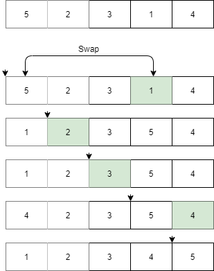
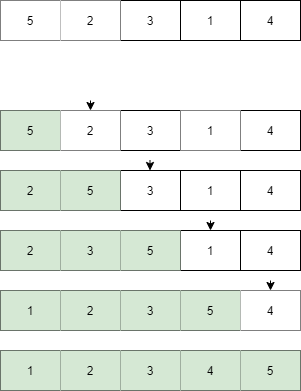
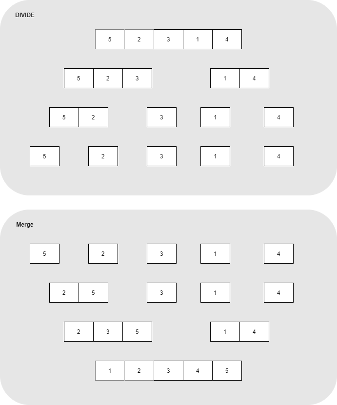
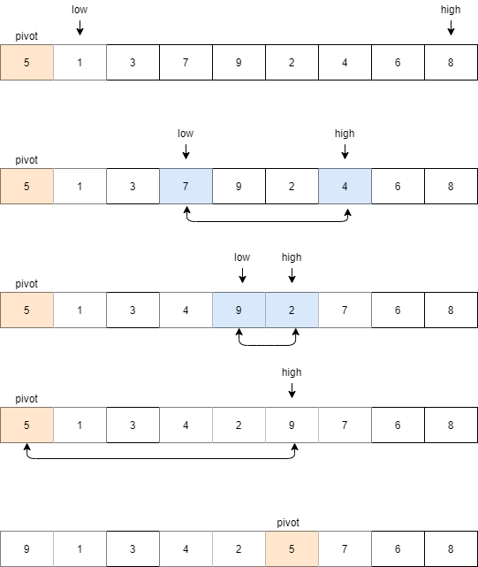

# Sorting  

일차원으로 저장되어 있는 데이터를 정렬 하는 방법을 알아본다.  

정리하고자 하는 방식들의 Time Complexity는 아래와 같다.

|종류|Time Complexity|
|:--|:--|
|Bubble Sort| $ O(N^2) $ |
|Selection Sort| $ O(N^2) $ |
|Insertion Sort| $ O(N^2) $ |
|Heap Sort| $ O(NlgN) $ |
|Merge Sort| $ O(NlgN) $ |
|Quick Sort| $ O(NlgN) $ |

## Bubble Sort  

직관적이고 간단한 접근으로 해결한다. 
인접한 두 개의 데이터를 비교하며 위치를 찾아간다. 
이를 N-1번 반복하면 모든 데이터가 정렬된 결과를 얻을 수 있다. 

 

``` cpp
void bubbleSort(vector<int> & arr, int n){
    for(int i = 0 ; i < n - 1 ; i++){
        for(int j = 0 ; j < n - 1 ; j++){
            if(arr[j] > arr[j+1])  swap(arr[j], arr[j+1]);
        }
    }
}
```

## Selection Sort  

길이가 N일 때 N번 순회를 하며 가장 우선 순위가 작거나 높은 요소를 찾아 맨 왼쪽 또는 오른쪽과 위치를 변경한다.

 

``` cpp
void selectionSort(vector<int> & arr, int n){
    for(int i = 0 ; i < n - 1 ; i++){
        int prior = i;
        for(int j = i + 1 ; j < n ; j++){
            if(arr[prior] > arr[j]){
                prior = j;
            }
        }
        swap(arr[i], arr[prior]);
    }
}
```

## Insertion Sort  

배열에서 정렬된 부분과 정렬이 아직되지 않은 부분을 구분한다. 
N번 순회를 하며 매 번 요소를 정렬된 부분의 적절한 위치에 삽입한다.

  

``` cpp
void insertionSort(vector<int> & arr, int n){
    for(int i = 1 ; i < n ; i++){
		int cur = arr[i];
		int j;
		for(j = i - 1 ; j >= 0 ; j--){
			if(arr[j] > cur) arr[j+1] = arr[j];
			else break;
		}
		arr[j+1] = cur;
	}
}
```

## Heap Sort  

가장 우선 순위가 높은 데이터가 루트 노드에 존재하는 힙을 사용하여 정렬을 할 수 있다. 
N개 데이터를 모두 힙에 넣었다가 N번 ```pop```을 진행하면 정렬된 결과를 얻을 수 있다.  

힙의 push와 pop은 모두 $ O(lgN) $의 시간을 가지므로, 정렬 결과는 $ O(NlgN) $ 으로 구할 수 있다.

``` cpp
void heapSort(vector<int> & arr){
	vector<int> heap;

	for(int i = 0 ; i < arr.size() ; i++){
		push_heap(heap, arr[i]);
	}

	for(int i = 0 ; i < arr.size() ; i++){
		arr[i] = pop_heap(heap);
	}
}
```

## Merge Sort  

각 요소를 쪼갠 뒤 다시 합치는 divide & conquer 방식으로 정렬을 해결한다.

  

``` cpp
void mergeSort(vector<int> & arr, int left, int right){	
	// 데이터가 하나 되는 순간(left == right)까지 쪼갠다
	if(left < right)
	{
		int mid = (left + right) / 2;
		
		mergeSort(arr, left, mid);
		mergeSort(arr, mid + 1, right);
		
		mergeArea(arr, left, mid, right);
	}
}

void mergeArea(vector<int> & arr, int left, int mid, int right){
	int frontIdx = left;   // 앞 배열 인덱스
	int rearIdx = mid + 1; // 뒷 배열 인덱스
	int resultIdx = left;  // 결과 배열 인덱스
	
	vector<int> resultArr(right + 1, 0);
	// merge할 배열 중 하나가 끝날 때 까지 채우기
	while(frontIdx <= mid && rearIdx <= right)
	{
		if(arr[frontIdx] <= arr[rearIdx])
			resultArr[resultIdx++] = arr[frontIdx++];
		else
			resultArr[resultIdx++] = arr[rearIdx++];
	}
	
	// 먼저 다 채운 배열이 앞 배열이면 뒷 배열 나머지 요소 채우기
	if(frontIdx > mid) 
	{
		for(int i = rearIdx ; i <= right ; i++)
			resultArr[resultIdx++] = arr[i];
	}
	// 먼저 다 채운 배열이 뒷 배열이면 앞 배열 나머지 요소 채우기
	else 
	{
		for(int i = frontIdx ; i <= right ; i++)
			resultArr[resultIdx++] = arr[i];
	}
	
	for(int i = left; i <= right; i++)
		arr[i] = resultArr[i];
}
```

## Quick Sort  

pivot이라는 기준 원소를 통해 divide & conquer 방식으로 정렬 결과를 구한다. 

1. 리스트에 있는 임의의 한 원소를 선택하며 이를 **pivot**이라고 한다.
2. pivot을 기준으로 보다 작은 우선 순위는 왼쪽으로 큰 우선 순위는 오른쪽으로 옮긴다.
3. pivot을 제외한 양 쪽을 크기가 0 또는 1이 될 때 까지 재귀적으로 호출한다.  




``` cpp
int partition(vector<int> & arr, int left, int right){
	int pivot = arr[left];
	int low = left + 1;
	int high = right;
	
	while(low <= high){
		// pivot 보다 큰 값 찾기
		while(pivot >= arr[low] && low <= right) low++;
		
		// pivot 보다 작은 값 찾기
		while(pivot <= arr[high] && high >= left + 1) high--;
			
		// low와 high 위치가 역전되지 않았으면
		if(low <= high) swap(arr[low], arr[high]);
	}
	swap(arr[left], arr[high]);
	
	return high; // 제 자리를 찾아간 pivot 위치
}

void quickSort(vector<int> & arr, int left, int right){
	if(left >= right) return;

	int pivot = partition(arr, left, right);
	quickSort(arr, left, pivot - 1);
	quickSort(arr, pivot + 1, right);
}
```