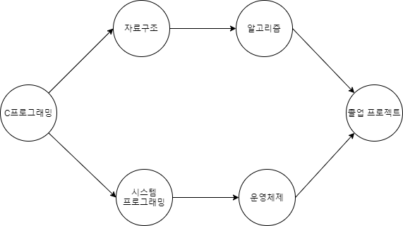
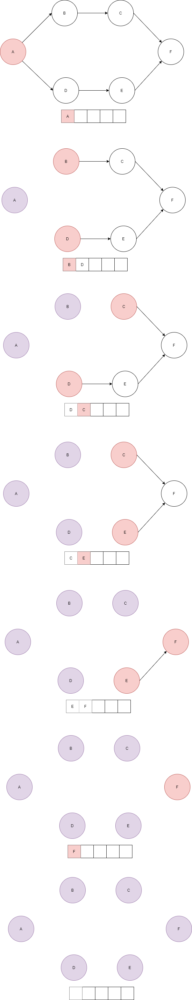

## Topological Sort  

위상 정렬은 어떤 작업 또는 행동의 순서를 예를 들어 많이 설명한다. 
예를 들어 학부 과정에서의 수업 수강도 이를 예를 들 수 있다.



학부를 졸업하기 위해서는 다음과 같은 순서로 수강할 수 있다.  

**C프로그래밍 → 자료구조 → 알고리즘 → 시스템 프로그래밍 → 운영체제 → 졸업 프로젝트**

위상 정렬은 이러한 순서를 결정해 준다. 
과목의 선행 이수 조건만 지킨다면 여러 가지 경우의 수가 발생할 수 있다.  

다시 말해, 위상 정렬은 방향 그래프에서 그래프의 방향을 거스르지 않으면서 정점들을 나열하는 알고리즘이다.
그리고 예제의 특징을 생각해볼 때 다음과 같은 제약이 존재한다.
- 그래프는 방향이 있어야 한다.
- 그래프에서 사이클이 발생해서는 안된다.

## 구현  

위상 정렬은 큐를 사용하여 구현할 수 있으며 동작 방식은 다음과 같다.
1. 해당 노드로 들어오는 엣지가 없는 노드를 찾아 큐에 삽입한다.
2. 큐에서 노드를 꺼내 해당 노드에서 발생하는 엣지들을 모두 삭제한다.
3. 모든 노드에 대해 로직이 수행될 때 까지 1~2를 반복한다.



``` cpp
queue<int> q;
for(int i = 0 ; i < nodeCnt ; i++){
	if(indegree[i] == 0) q.push(i);
}

while(!q.empty()){
	int curNode = q.front();
	q.pop();
	cout << curNode << " ";

	for(int i = 0 ; i < nodeCnt ; i++){
		if(adj[curNode][i] == 1){
			--indegree[i];
			if(indegree[i] == 0) q.push(i);
		} 
	}
}
```

