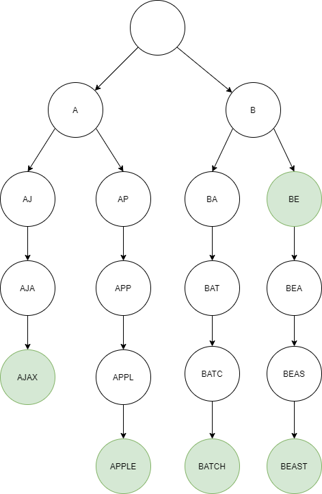
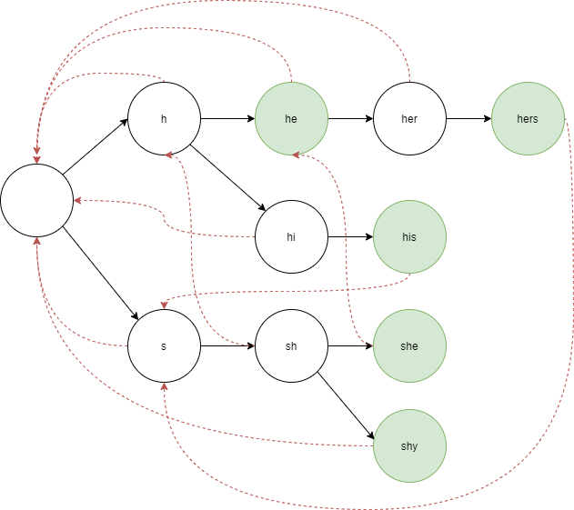

## Trie  

두 원소를 비교하는 경우 단순히 정수나 실수형 같은 경우에는 상수 시간이 소요된다. 
하지만 문자열 같은 경우에는 최악의 경우 문자열 길이 만큼의 시간이 소요 된다. 
이진탐색트리 같은 경우에는 N개 중에 특정 원소를 찾는데 필요한 시간이 일반적으로 $ O(lgN) $ 만큼 소요된다.
하지만 키 값으로 문자열을 사용한다면 이는 문자열의 길이 M이라면 최대 $ O(MlgN) $ 만큼 소요된다.

트라이는 이러한 문제를 해결하기 위해 고안된 자료구조로, 
문자열 집합을 트리로 구성해 놓으면 해당 집합 내에서 찾고자 하는 원소를 $ O(M) $ 안에 찾을 수 있다. 

 

위 그림은 전형적인 트라이 구조를 나타낸 것으로, 집합 {"AJAX", "APPLE", "BATCH", "BE", "BEAST"} 를 나타낸다. 
그리고 초록색으로 표현된 부분은 해당 문자열이 집합에 포함되어 있음을 의미한다.  

트라이는 사실 어떤 길을 따라 가느냐에 따라 문자열을 구성할 수 있으므로 노드 자체에 문자열을 저장하고 있지 않는다. 
대신 트라이는 자식 노드들을 가리키는 포인터와, 이 노드가 종료 노드인지를 나타내는 boolean 값으로 구성된다. 
또한 자식 포인터들은 동적으로 구성되는 것이 아니라 알파벳 같은 경우에는 26개의 배열로 고정 길이로 표현한다. 

> 고정 배열로 표현하기 때문에 잡아먹는 메모리가 엄청 크다. 
> 따라서, 트라이로 해결하는 문제는 대부분의 문자열 길이가 그렇게 길지 않다.

### 구현

``` cpp
#include <iostream>
#include <cstring>

using namespace std;

const int ALPHABETS = 26;

struct TrieNode {
	TrieNode* children[ALPHABETS];
	bool terminal;

	// 알파벳을 인덱스로 대응
	int toNumber(char ch){
		return ch - 'A';
	}

	TrieNode()
	: terminal(false)
	{
		memset(children, 0, sizeof(children));
	}

	~TrieNode() {
		for(int i = 0 ; i < ALPHABETS ; i++){
			if(children[i]) delete children[i];
		}
	}

	void insert(const char* key){
		// 문자열의 끝인 경우 terminal check 후 종료
		if(*key == 0){
			terminal = true;
			return;
		}

		int next = toNumber(*key);
		if(children[next] == NULL){
			children[next] = new TrieNode();
		}
		children[next]->insert(key + 1);
	}

	TrieNode* find(const char* key){
		if(*key == 0) return this;

		int next = toNumber(*key);
		if(children[next] == nullptr) return nullptr;
		return children[next]->find(key+1);
	}
};

int main(){
	TrieNode root;
	
	root.insert("AJAX");
	root.insert("APPLE");
	root.insert("BATCH");
	root.insert("BE");
	root.insert("BEAST");

	cout << root.find("AJAX")->terminal << "\n";// 1
	cout << root.find("APP")->terminal << "\n"; // 0
}
```

## 아호-코라식 알고리즘  

문자열 집합에서 포함된 문자열을 찾기 위한 자료구조로도 사용할 수 있지만, 
문자열에서 특정 문자열이 존재하는지 확인할 수 있는 다중 문자열 탐색에도 사용할 수 있다.  

찾고자하는 단어가 {"hers", "his", "she", "he", "shy"} 라고 하자. 
이들 모두를 트라이로 구성해 놓으면 모든 부분 문자열을 한 번에 찾을 수 있다.  

아호-코라식 알고리즘은 KMP 알고리즘의 확장이라고 볼 수도 있다. 
KMP 알고리즘은 접두사도 되고 접미사도 되는 문자열의 길이를 구하는 전처리를 통해 
문자열 검색에 실패했을 때 다음 탐색 위치가 어디인지 알려주는 **Failure Function**이 핵심인데 
여기서도 이러한 함수가 필요하다.

failure(s)는 다음과 같이 정의 한다. 

***failure(s) = s의 접미사이면서 트라이에 포함된 가장 긴 문자열까지 가는 화살표***




그렇다면 이 실패 정보들은 어떻게 코드로 구현할 수 있을까?  

"sh"와 "she"의 케이스를 보면 이 둘의 실패 링크인 "h"와 "he" 또한 부모-자식 관계인 것을 알 수 있다. 
따라서 어떤 노드의 실패 링크는 부모 노드의 실패 링크를 기반으로 구할 수 있다.  

하지만 항상 이를 만족하는 것은 아니다. 
"sh"와 "shy"의 케이스를 보면 이 둘의 실패 링크는 "h"와 ""인데 이 때는 "sh"의 실패 링크인 "h"에서 "hy"로의 진입이 존재하지 않기 때문이다. 
이 때는 "h"의 실패 링크를 한 번 더 따라간다. 여기서 루트에서도 "y"로의 진입이 불가능하기 때문에 "shy"의 실패 링크는 루트가 된다.  


### 구현

구현을 위해 트라이 노드에 추가적인 정보가 필요하다.
- terminal : insert한 needle의 번호를 저장
- fail : 실패 함수에 의한 링크
- output : 이 노드에 방문했을 때 등장하는 needle의 번호

``` cpp
#include <iostream>
#include <cstring>
#include <vector>
#include <queue>

using namespace std;

const int ALPHABETS = 26;

// 알파벳을 인덱스로 대응
int toNumber(char ch){
	return ch - 'A';
}

struct TrieNode {
	TrieNode* children[ALPHABETS];
	TrieNode* fail;
	int terminal;
	vector<int> output;

	TrieNode()
	: terminal(-1)
	{
		memset(children, 0, sizeof(children));
	}

	~TrieNode() {
		for(int i = 0 ; i < ALPHABETS ; i++){
			if(children[i]) delete children[i];
		}
	}

	void insert(const char * key, const int& num){
		// 문자열의 끝인 경우 terminal check 후 종료
		if(*key == 0){
			terminal = num;
			return;
		}

		int next = toNumber(*key);
		if(children[next] == NULL){
			children[next] = new TrieNode();
		}
		children[next]->insert(key + 1, num);
	}

	TrieNode* find(const char * key){
		if(*key == 0) return this;

		int next = toNumber(*key);
		if(children[next] == nullptr) return nullptr;
		return children[next]->find(key+1);
	}
};


class AhoCorasick{
private:
	TrieNode* root;

	void computeFailureFunc(TrieNode* root){
		queue<TrieNode*> q;

		root->fail = root;
		q.push(root);

		while(!q.empty()){
			TrieNode* here = q.front();
			q.pop();

			for(int edge = 0 ; edge < ALPHABETS ; ++edge) {
				TrieNode* child = here->children[edge];
				if(!child) continue;
				
				// 1레벨 노드들은 모두 루트로 연결
				if(here == root) child->fail = root;
				else{
					TrieNode* t = here->fail;
					while(t != root && t->children[edge] == nullptr){
						t = t->fail;
					}

					if(t->children[edge]){
						t = t->children[edge];
					}

					child->fail = t;
				}		

				child->output = child->fail->output;
				if(child->terminal != -1){
					child->output.push_back(child->terminal);
				}
				q.push(child);
			}
		}
	}

public:
	AhoCorasick(TrieNode* root)
	: root(root)
	{
		computeFailureFunc(root);
	}

	/**
	 *  Trie에 포함된 패턴을 s에서 찾는다.
	 *  s 내에서 패턴이 출현할 때마다 (마지막 글자, 패턴 번호)의 쌍을 저장한다.
	 */
	vector<pair<int, int> > getResult(const string& s){
		vector<pair<int, int> > ret;
		TrieNode* state = root;

		for(int i = 0 ; i < s.size() ; i++){
			int chr = toNumber(s[i]);

			while(state != root && state->children[chr] == nullptr){
				state = state->fail;
			}

			if(state->children[chr]){
				state = state->children[chr];
			}

			for(int j = 0 ; j < state->output.size() ; j++){
				ret.push_back({i, state->output[j]});
			}
		}

		return ret;
	}
};


int main(){
	TrieNode root;
	
	root.insert("AJAX", 1);
	root.insert("APPLE", 2);
	root.insert("BATCH", 3);
	root.insert("BE", 4);
	root.insert("BEAST", 5);

	const char s[100] = "AJAXEITWEJTBATCHBBBBEBEBEBEAST";
	
	AhoCorasick ahoCorasick(&root);
	vector<pair<int, int> > ret = ahoCorasick.getResult(s);
	for(auto cur : ret){
		cout << cur.first << " " << cur.second << "\n";
	}
}
```

출력 내용은 아래와 같다.

```
3 1     (0~3, AJAX)
15 3    (11~15, BATCH)
20 4    (19~20, BE)
22 4    (21~22, BE)
24 4    (23~24, BE)
26 4    (25~26, BE)
29 5    (25~29, BEAST)
```

<br/>

참고
- 구종만, 프로그래밍 대회에서 배우는 알고리즘 문제 해결 전략