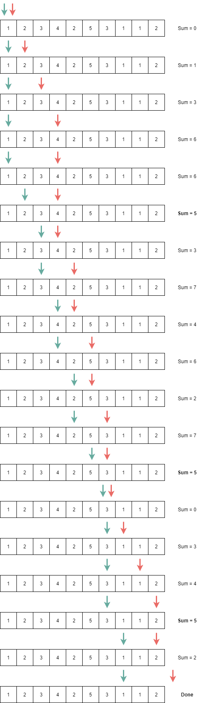
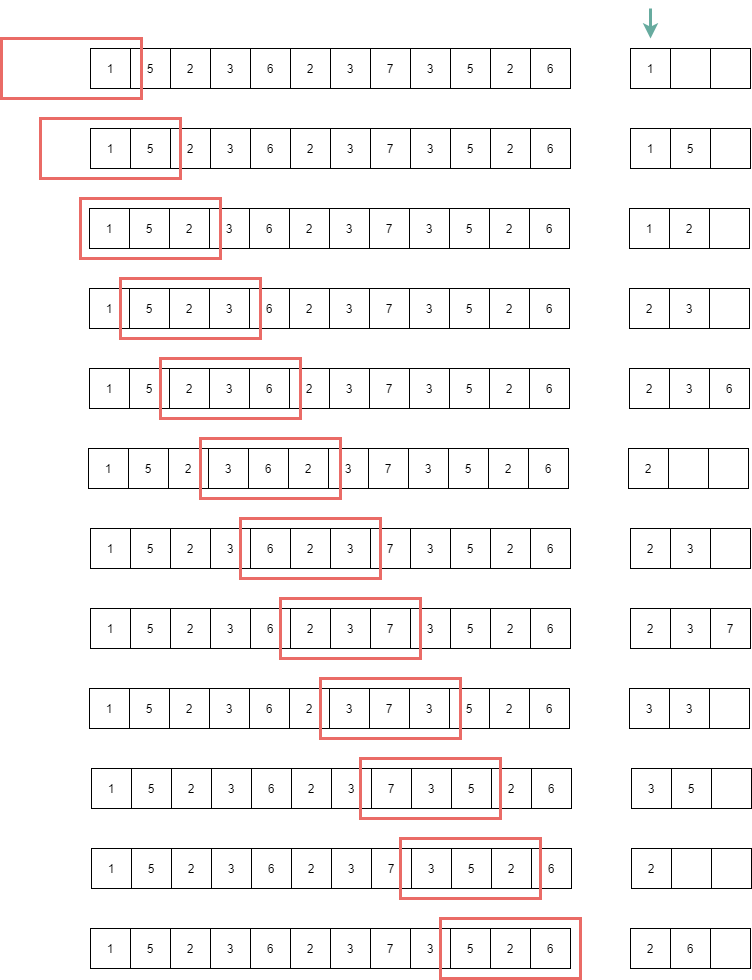

## Two Pointers  

투 포인터 알고리즘은 말 그대로 일차원 데이터에서 두 개의 포인터를 가지고, 
범위를 조절해가며 원하는 해를 구하는 기법이다. 

[2003 : 수들의 합 2](https://www.acmicpc.net/problem/2003)  

위 문제는 일차원 배열이 주어졌을 때 수열에서 [i, j] 구간에서 
A[i], A[i+1], ... , A[j]의 합이 M이 되는 경우의 수를 구하는 문제이다.

``` cpp
int sum = 0;
int answer = 0;

for(int i = 0 ; i < cnt ; i++){
	for(int j = i ; j < cnt ; j++){
		int sum = 0;
		for(int k = i ; k <= j ; k++){
			sum += arr[k];
		}
		if(sum == target) answer++;
	}
}
```

naive한 솔루션으로는 이중 포문으로 i와 j를 구성하고 이들의 합을 구하는 방식을 생각해볼 수 있다.
그러나 이는 $ O(N^3) $ 의 시간을 가지며 배열의 크기가 조금만 커져도 TLE가 발생한다. 

이는 전형적인 투 포인터 문제로 구간을 정의하는 두 인덱스를 지정함으로써
구간 합을 구하는데 있어서 중복 계산을 제거하고, 해가 될 수 없는 구간은 스킵한다.  

먼저 시작과 끝을 의미하는 ```start```와 ```end```를 정의하고 아래를 따라 해를 구한다. 
- 합이 구하고자 하는 값 보다 작다면 ```end```를 증가시키며 해당 배열의 값을 더한다.
- 합이 구하고자 하는 값 보다 크면 ```start```를 증가시키며 해당 배열의 값을 제외한다.
- 합이 구하고자 하는 값과 일치하면 ```answer```를 증가시킨다.

``` cpp
	int cnt, target;
	cin >> cnt >> target;
	int arr[10000];
	for(int i = 0 ; i < cnt ; i++) cin >> arr[i];
	
	int start = 0, end = 0;
	int sum = 0;
	int answer =  0;
	while(start <= end){
		if(sum >= target) sum -= arr[start++];
		else if(end == cnt) break;
		else sum += arr[end++];
		
		if(sum == target) answer++;
	}

	cout << answer;
```

구하고자 하는 합이 5일 경우 다음과 같이 동작한다.



## Sliding Window  

슬라이딩 윈도우도 두 개의 포인터를 유지한다는 것이 동일하다. 
차이점이라하면 투 포인터는 두 구간의 크기가 가변적이지만 
슬라이딩 윈도우에서는 그 크기가 고정적이다.

[11003 : 최솟값 찾기](https://www.acmicpc.net/problem/11003)  

슬라이딩 윈도우에서는 이를 구현하기 위해 보편적으로 deque를 사용하며 
모든 요소를 순회하며 아래를 따라 특정 크기의 구간에서 최소 값을 유지한다.
1. 덱의 앞을 확인하여 구간을 벗어난다면 제거한다.
2. 덱의 뒤를 확인하여 현재 값보다 큰 것들은 모두 삭제한 뒤 현재 값을 삽입한다.
3. 현재 덱의 front 값이 구간의 최소 값이 된다.

``` cpp
// value, index
deque<pair<int, int> > d;
for(int i = 0 ; i < n ; i++){
	// 덱에는 최대 L개의 수를 포함한다.
	if(!d.empty() && d.front().second <= i - l) d.pop_front();
	// 현재 값 보다 큰 값들은 뒤에서 모두 제거한다.
	while(!d.empty() && d.back().first > arr[i]) d.pop_back();

	d.push_back({arr[i], i});
	cout << d.front().first << " ";
}
```

