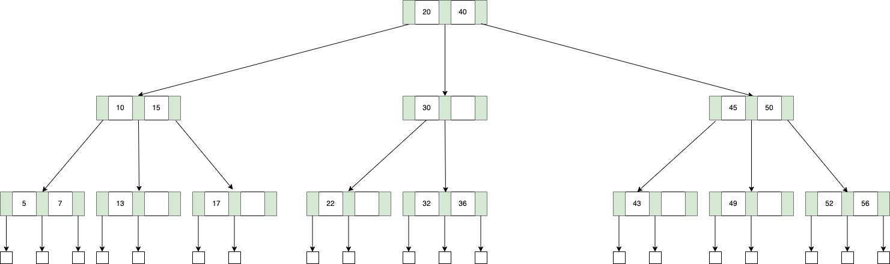
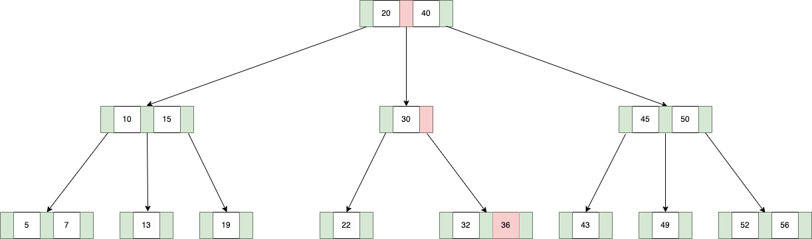

B-Tree는 Balanced Tree의 한 종류이며, 많은 데이터베이스에서 인덱스 구조로 사용되는 자료구조이다. 
아래는 3차 B-Tree의 예시이다. 

### M-Way(Multiway) Search Tree

B-Tree의 더 상위 개념은 하나의 노드에 여러 개의 키가 할당될 수 있는 M-Way(Multiway) Search Tree이며 그 특징은 아래와 같다. 

#### 각 노드는 최대 M개의 자식, M-1개의 값을 가질 수 있다
만약 M=3이라면 이를 3차 트리라고 한다. 그리고 자식의 개수가 K이면, 키의 개수는 K-1개여야 한다. 

#### 노드 내부 키 값들은 정렬되어 있다
각 노드의 키 값들은 정렬되어 있으며 여기에는 자식 트리의 값들 까지 포함한다. 
예를 들어, K번 째 값은 K번 째 자식 트리 내부의 모든 값 보다 크고, K+1번 째 자식 트리의 모든 값보다 작다. 

### B-Tree

B-Tree를 만족하기 위해서는 아래와 같은 특징을 가져야 한다. 

#### 모든 리프 노드의 레벨은 같다  
2차 B-Tree 같은 경우는 내부 값은 1개, 자식은 2개를 가진다. 
이 때 조건을 만족하기 위해서는 항상 Full Binary Tree를 만족해야 한다. 
즉, 키의 수가 $2^k - 1$ 개 일 때만 성립할 수 있다. 

#### 루트 노드는 최소 2개의 자식을 가지며, 모든 노드는 최소 M/2개의 자식을 가진다  
M차 B-Tree의 failure node들의 레벨이 $l+1$이라면, 키의 수는 최대 $M^{l} - 1$ 개가 된다. 
그렇다면 키의 최소 개수는 어떻게 될까? 
전제 조건에 따르면 루트 노드는 최소 2개의 자식을 가지고, 각 노드는 $M/2$ 개의 자식을 가지므로 level 3에서는 최소 $2[M/2]$ 개의 노드가 나타난다. 
이를 더 일반화하면 level l에서는 $2[M/2]^{l-2}$ 개의 nonfailure node를 가진다. 
그리고 키의 개수를 $N$이라고 할 때, failure node의 개수는 $N+1$이 되며, 이는 $l+1$ level에 위치한다. 

$N + 1 = number\;of\;failure\;nodes$  
$N + 1 = number\;of\;nodes\;at\;level\;(l + 1)$    
$N + 1 \geq 2[M/2]^{l-1}$  

$\therefore N \geq 2[M/2]^{l-1} - 1, l >= 1$

$M=200$이고 $N \leq 2*10^6-1$ 이라고 했을 때, l은 3 이하의 값을 가진다. 
매우 큰 N에 대해서도 B-Tree는 최소한의 노드(디스크) 접근이 이루어지는데, 
이것이 바로 Red-Black Tree나 다른 트리들 보다 인덱스 구조에 사용되는 이유이다. 

### B-Tree의 탐색  

B-Tree의 형태를 이해한다면, 탐색 과정은 직관적으로 이루어진다. 
36이라는 값을 찾는다고 가정해보자. 

1. 루트 노드에서 20~40 사이의 값을 가지므로 중간 서브 트리로 넘어간다. 
2. 30보다 큰 값을 가지므로 오른쪽 서브 트리로 넘어간다.
3. 선형 탐색 결과 36이 존재하며 탐색이 완료된다. 

 

참고
- Ellis Horowitz, Sartaj Sahni, Susan Anderson-Freed, Fundamentals of Data Structures in C