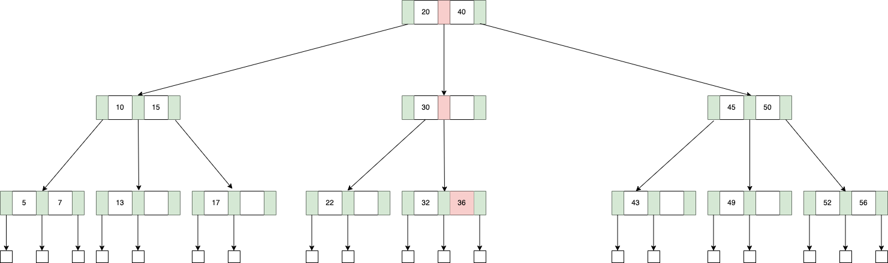

어떤 연산을 진행할 때, 산술이나 논리 연산이 동작하는 시간보다 비교할 수 없을 정도로 많은 시간을 잡아 먹는 것이 디스크나 메모리 접근이다. 
AVL Tree나 Red-Black Tree는 노드 하나가 몇 바이트밖에 되지 않기 때문에 디스크 블록과 같은 큰 단위를 효율적으로 사용할 수 없다. 
B-Tree는 연산의 수는 증가할지 모르지만, 디스크 접근을 줄이기 위해 높이를 줄이는 방식을 선택한다. 
하나의 노드가 여러 개의 키를 가지고 자식들을 가지며, 보통 하나의 캐시 라인이나 디스크 블록을 채울 수 있는 가장 큰 차수를 사용한다. 
많은 데이터베이스에서 인덱스를 표현하는 구조로 채택하고 있는 자료구조이기도 하다. 
아래는 3차 B-Tree의 예시이다. 

### M-Way(Multiway) Search Tree

B-Tree의 더 상위 개념은 하나의 노드에 여러 개의 키가 할당될 수 있는 M-Way(Multiway) Search Tree이며 그 특징은 아래와 같다. 

#### 각 노드는 최대 M개의 자식, M-1개의 키를 가질 수 있다
만약 M=3이라면 이를 3차 트리라고 한다. 그리고 자식의 개수가 K이면, 키의 개수는 K-1개여야 한다. 

#### 노드 내부 키 값들은 정렬되어 있다
각 노드의 키 값들은 정렬되어 있으며 여기에는 자식 트리의 값들 까지 포함한다. 
예를 들어, K번 째 값은 K번 째 자식 트리 내부의 모든 값 보다 크고, K+1번 째 자식 트리의 모든 값보다 작다. 

### B-Tree

B-Tree를 만족하기 위해서는 아래와 같은 특징을 가져야 한다. 

#### 모든 외부 노드의 레벨은 같다  
n(키의 값 수) >= 0이고, m > 2 일 때 B-Tree는 항상 존재한다. 
하지만, m=2(2차 B-Tree) 같은 경우는 조건을 만족하기 위해 항상 Full Binary Tree를 만족해야 한다. 
즉, 키의 수가 $2^k - 1$ 개 일 때만 성립할 수 있다. 

> External node는 탐색 중에 트리에서 찾고자 하는 원소를 찾지 못했을 때 도달하는 노드를 의미하며 실제 구현에서는 nullptr을 의미한다. 

#### 루트 노드는 최소 2개의 자식을 가지며, 모든 노드는 최소 M/2개의 자식을 가진다  
M차 B-Tree의 외부 노드들의 레벨이 $l+1$이라면, 키의 수는 최대 $M^{l} - 1$ 개가 된다. 
그렇다면 키의 최소 개수는 어떻게 될까? 
전제 조건에 따르면 루트 노드는 최소 2개의 자식을 가지고, 각 노드는 $M/2$ 개의 자식을 가지므로 level 3에서는 최소 $2[M/2]$ 개의 노드가 나타난다. 
이를 더 일반화하면 level l에서는 $2[M/2]^{l-2}$ 개의 nonfailure node를 가진다. 
그리고 키의 개수를 $N$이라고 할 때, failure node의 개수는 $N+1$이 되며, 이는 $l+1$ level에 위치한다. 

$N + 1 = number\;of\;failure\;nodes$  
$N + 1 = number\;of\;nodes\;at\;level\;(l + 1)$    
$N + 1 \geq 2[M/2]^{l-1}$  

$\therefore N \geq 2[M/2]^{l-1} - 1, l >= 1$

$M=200$이고 $N \leq 2*10^6-1$ 이라고 했을 때, l은 3 이하의 값을 가진다. 
실질적으로는 노드 하나를 탐색하는데 있어, 한 번의 메모리 접근을 하도록 구성한다. 
메인 메모리를 대상으로는 그 크기가 보통 수십, 디스크 대상으로는 수백으로 구성된다. 

### 노드 탐색  

B-Tree의 형태를 이해한다면, 탐색 과정은 직관적으로 이루어진다. 
36이라는 값을 찾아보자. 

1. 루트 노드에서 20~40 사이의 값을 가지므로 중간 서브 트리로 넘어간다. 
2. 30보다 큰 값을 가지므로 오른쪽 서브 트리로 넘어간다.
3. 선형 탐색 결과 36이 존재하며 탐색이 완료된다. 

### 노드 삽입

1. 삽입 가능한 적절한 위치가 존재하는 경우  

25의 값을 갖는 키를 삽입해보자. 위치를 탐색했을 때, 적절한 공간이 존재한다면 그냥 삽입하면 된다. 

  

2. 트리를 분할해야하는 경우  

이제 이어 26의 값을 갖는 키를 삽입해보자. 
위치 상 [22, 25]를 가지는 노드에 삽입되어야 하는데 이미 가득 차 있기 때문에 분할하고 새로운 노드를 생성하는 작업이 필요하다. 
세 가지 값 중 가장 작은 값은 기존 노드의 위치에, 중간 값은 부모 노드에, 가장 큰 값은 새로운 노드의 원소로 삽입된다. 
이 때 부모 노드에 키가 삽입되면 부모를 다시 분할해야하는 케이스가 발생할 수 있는데 그 때는 이를 재귀적으로 적용하면 된다. 

 

참고
- Ellis Horowitz, Sartaj Sahni, Susan Anderson-Freed, Fundamentals of Data Structures in C, Pearson