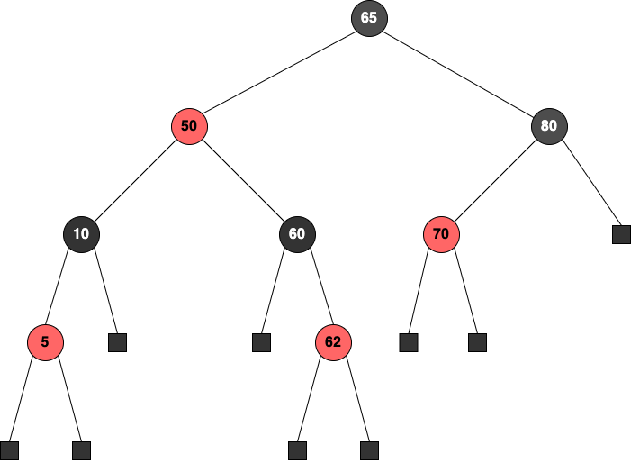
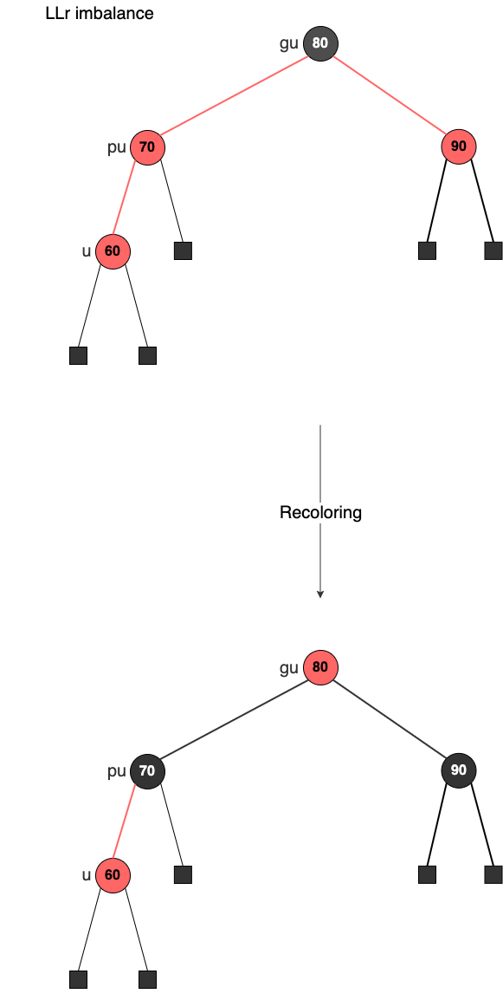
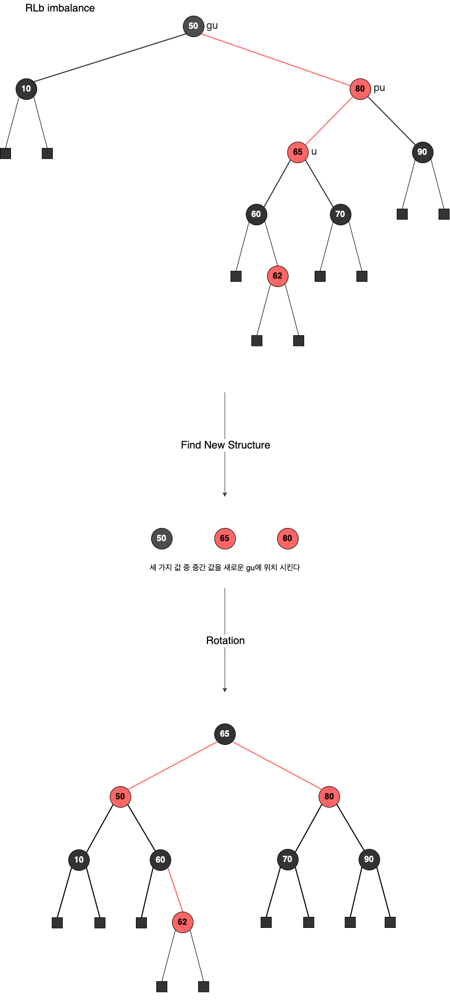

## Red-Black Tree  

레드-블랙 트리는 모든 노드가 Black 또는 Red의 색상을 가지는 이진 탐색 트리이다. 
먼저, 레드-블랙 트리를 정의할 때는 확장 이진 트리를 사용하여 정의한다. 
확장 이진 트리는 기존 트리에서 NULL Pointer를 특수한 노드로 치환한 것인데 이를 **External Node**라고 부른다. 
그리고 기존의 노드들을 **Internal Node**라고 부른다. 

> 개념 상 external node를 표현하는 것이며, 실제 구현에서 nullptr은 그냥 nullptr이다. 

  

레드 블랙 트리는 다음과 같은 성질을 만족한다. 
1. root node와 external node는 검정색이다
2. root node에서 external node로 가는 경로에서 2개의 연속된 red node가 존재할 수 없다
3. root node에서 external node로 가는 경로에 있는 black node의 수는 동일하다

좀 더 개념을 확장해서 자식 노드를 가리키는 포인터에도 각 색깔을 할당하면 아래와 같은 특징을 가진다. 
1. internal node로 부터 external node를 가리키는 포인터는 검정색이다
2. root node에서 external node로 가는 경로에서 2개의 연속적인 red pointer가 존재할 수 없다
3. root node에서 external node로 가는 경로 있는 black pointer의 수는 동일하다

> 한 node에서 external node까지 존재하는 black pointer의 수를 **rank**라고 한다. 
> root node의 rank는 2가 되고 root node의 왼쪽 자식의 rank는 2, 오른쪽 자식의 rank는 1이 된다. 

위 성질을 기반으로 레드-블랙 트리는 아래의 정리들을 도출할 수 있다. 

**정리1**  
root node에서 external node까지의 경로 길이를 pointer의 수라고 할 때, 
임의의 두 경로 P, Q에 대해 $ length(P) <= 2 * length(Q) $를 만족한다. 

root node의 rank를 r이라고 했을 때, 레드-블랙 트리의 특징 상 마지막 포인터의 색은 검정색이다. 
또한, 연속적으로 빨간 포인터를 가질 수 없으므로 외부 노드로의 경로는 r과 2*r 사이의 포인터 수를 가지게 되고 $ length(P) <= 2 * length(Q) $를 만족하게 된다. 

**정리2**  
레드-블랙 트리의 높이를 h라고 하고, internal node의 수를 n, root node의 rank를 r이라고 할 때 아래가 성립한다. 

- $ h \leq 2r $
- $ n \geq 2r - 1 $
- $ h \leq 2log_2(n+1) $

마지막 높이에 대한 성질을 통해, 레드-블랙 트리의 탐색, 삽입, 삭제의 시간은 $ O(logn) $을 만족함을 알 수 있다. 

### 노드 삽입  

삽입의 시작인 일반적인 이진 탐색 트리에서의 삽입과 동일하다. 
그리고 새로운 노드를 어떤 색상으로 지정할 것인가가 문제인데, 새로운 노드는 일단 red node로 가정하고 삽입을 한다.
red node를 삽입하면 레드-블랙 트리의 특징 중 **'경로에서 2개의 연속적인 red node가 존재할 수 없다'**를 위반할 수도 있다. 
이 때 다시 레드-블랙 트리의 특성을 복구하는 것이 삽입 과정의 핵심이다. 

위 특징을 위반 했다면 u의 parent(pu)는 red node일 것이고, 
red node는 root node가 될 수 없으므로 u의 grand parent(gu) 또한 반드시 존재하며 이는 black node일 것이다. 
세부적인 트리의 형태는 다양하게 나타날 수 있으며 다음과 같이 크게 3종류를 확인한다. 

- pu가 gu의 왼쪽 자식인지 오른쪽 자식인지?
- u가 pu의 왼쪽 자식인지 오른쪽 자식인지?
- gu의 다른 쪽 자식(삼촌)의 색상이 무엇인지?

예를 들면 pu가 gu의 왼쪽 자식이고(L), u가 pu의 왼쪽 자식이며(L), gu의 다른 쪽 자식이 검정색(b)이라면 이를 'LLb'라고 표현한다. 
여기서 레드-블랙 트리의 성질을 회복하기 위한 작업은 색상을 재지정하는 **recoloring**과 배치를 재구성하는 **reconstructuring**이 있는데 이는 gu의 다른 쪽 자식이 무슨 색상이냐에 따라 결정된다. 

### Recoloring  

색상을 재배치하는 것은 LLr, LRr, RLr, RRr과 같이 삼촌이 Red node일 때이다. 
아래는 LLb인 케이스에서 노드의 색상들을 변경함으로써 해결하는 과정이다. 

  

- pu의 색상을 검정으로 변경한다
- gu의 색상을 빨강으로 변경한다
- gu의 다른 쪽 자식을 검정으로 변경한다

이 때도 문제가 생길 수 있는데 **gu가 root node인 경우**에는 root node를 그대로 black node 두면 된다. 
또 하나는 **gu의 부모가 red node인 경우**인 경우인데 이 때는 gu를 새로운 u로 두고 재귀적으로 적용해나가야 한다. 

### Restructuring  

노드 배치 자체를 재구성하는 것은 삼촌이 Black node일 때이다. 
아래는 RLb인 케이스에서 노드들을 재배치하는 과정이며, AVL 트리에서의 회전과 유사하게 동작한다. 

  

u, pu, gu 세 가지 값 중 중간 크기 값을 나머지 둘의 부모로 위치시키며 black node로 변경한다. 
그리고 나머지 자식 둘은 red node로 변경한다. 
이 때 root node에서 external node로 가는 모든 경로 상의 black node의 수는 변하지 않는다. 
recoloring이 새로운 불균형을 만들 수 있는 것과는 다르게 이는 한 번의 작업만으로 항상 레드-블랙 트리의 성질을 만족시킴을 보장할 수 있다.  

 

참고
- Ellis Horowitz, Sartaj Sahni, Susan Anderson-Freed, Fundamentals of Data Structures in C