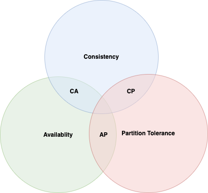
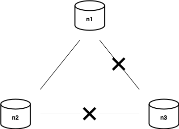
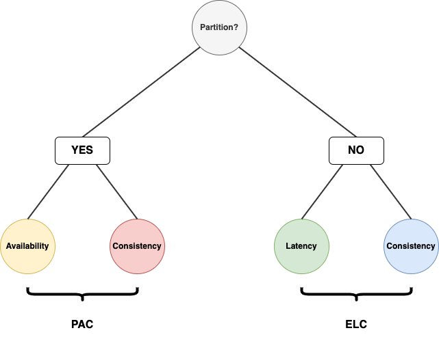

## CAP Theorem

CAP 정리는 아래 세 가지 항목을 모두 만족하는 분산 시스템을 설계할 수는 없다는 정리이다. 

**Consistency**  
일관성은 분산 시스템에 접속하는 모든 클라이언트가 어떤 노드에 접속했느냐에 관계 없이 언제나 같은 데이터를 응답 받아야함을 의미한다.

**Availability**  
가용성은 일부 노드에 장애가 발생하더라도 클라이언트가 응답을 받을 수 있음을 의미한다. 
즉 일부 노드가 죽은 것과 상관 없이 살아있는 노드가 있다면 그 노드에 읽기와 쓰기가 가능함을 의미한다. 

**Partition Tolerance**  
여기서 파티션은 두 노드 사이에 네트워크 장애가 발생하여서 클러스터가 여러 조각으로 나눠진 것을 의미한다. 
이 떄 파티션된 각 클러스터에 접속하더라도 시스템이 이상 없이 동작해야하며 이를 파티션 감내라고 한다.

분산 시스템은 세 가지 중 오직 두 가지만 선택 가능하다. 
세 가지 경우의 수가 존재할 수 있는데 사실 상 **CA**는 현실적으로 구현하는 것이 어렵다. 
일관성과 가용성을 완벽하게 지원하기 위해서는 네트워크 장애가 존재하지 않는 환경이여야 한다. 

CA는 분산 시스템이 아닌 단일 서버로 보는 것이 맞다. 
단일 서버이기 때문에 네트워크에 관한 걱정은 할 필요 없으며, 노드가 하나이기에 서버가 살아 있다면 가용 가능한 상태로 볼 수 있다. 
그리고 이 상태에서 일관성을 유지하게 된다. 
대다수의 관계형 데이터베이스 시스템의 모양이다. 

이론적으로는 CA 클러스터를 구성하는 것도 가능하다. 
CA 클러스터에서는 파티션이 발생하면 모든 노드를 내려 어떤 클라이언트도 통신할 수 없도록 만들어야한다. 
CAP에서 가용성은 '살아있는 노드가 받은 요청은 처리되어야 한다'로 볼 수도 있는데 이 같은 경우 모든 노드가 죽어있기 때문에 가용하지 않은 상태라 할 수 없다고도 볼 수 있다. 
어쨋든 CA 클러스터에서는 네트워크 장애가 거의 없음을 보장해야하는데 이는 천문학적인 비용이 들 수 있다. 
또한, 파티션이 발생하면 모든 노드를 내려야되기에 파티션 발생 여부를 주기적으로 점검해야할 필요가 있는데 이 또한 쉬운 일이 아니다. 
통상 네트워크 장애는 피할 수 없는 일로 보기에, 분산 시스템에서는 **Partition Tolerance는 선택이 아니라 사실상 기본 전제**가 된다. 

다음과 같이 파티션이 발생하여 n3와 더 이상 통신할 수 없는 상황을 가정해보자. 
n1, n2에 기록한 데이터는 n3로 전달되지 않으며, n3에 기록된 데이터는 n1, n2로 전달되지 않는다. 
만약 **CP**라면 불일치를 피하기 위해 n1과 n2에 쓰기 연산을 중단 시키고 가용성을 포기한다. 
**AP**라면 일관성을 버리게 된다. n1, n2가 n3에서 전달 받지 못한 데이터가 있을지라도 읽기 연산을 계속해서 허용한다. 
그리고 마찬가지로 쓰기 연산도 허용하며 파티션 문제가 허용된 후에 데이터들을 n3에 전달하게 될 것이다.

## PACELC

CAP 이론은 많은 오해를 불러 일으킬 수 있다. 
일단 분산 시스템을 CA로 설계하는 것은 불가능하며 P를 기본적으로 전제한다. 
그리고 C와 A 중 하나를 선택해야하는데 이것도 이분법적으로 나눠지는 것이 아니다. 
실제 시스템들은 위 예시처럼 간단하지 않다. 
극단적인 CP, AP 시스템은 존재하지 않으며 대부분의 분산 시스템은 어느 정도의 가용성과 어느 정도의 일관성을 제공하며 이는 정도의 차이이다. 

이를 보완하기 위한 이론이 **PACELC**이다. 
이는 파티션이 발생한 경우와 아닌 경우를 구분하며, **P**artition이 발생한 경우에는 **A**vailability와 **C**onsistency 사이를 절충해야하며, 
파티션이 발생하지 않은 **E**lse 상황에서는 **L**atency와 **C**onsistency 사이를 절충해야함을 의미한다.

 

참고
- 알렉스 쉬, 가상 면접 사례로 배우는 대규모 시스템 설계 기초, 이병준, 인사이트
- 프라모드 사달게이, 마틴 파울러, 빅데이터 세상으로 떠나는 간결한 안내서 NoSQL, 윤성준, 인사이트
- [System Design Interview Basics: CAP vs. PACELC](https://designgurus.org/blog/system-design-interview-basics-cap-vs-pacelc)
