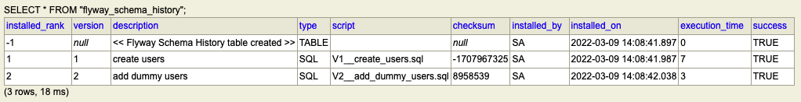
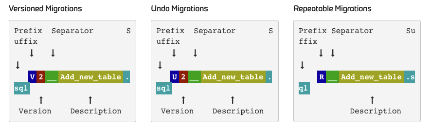

---
title: 'Flyway - Version control for database'
date: '2022-03-04'
categories:
  - database
tags:
  - database
  - flyway
description: 'flyway에 대해 알아봅시다'
indexImage: './cover.png'
--

## Flyway  

  

많은 시스템들은 위와 같은 구조를 가지고 있다. 
코드 레벨에서는 git을 비롯한 여러 형상 관리를 위한 도구가 존재하고, 이를 기반으로 CI/CD 프로세스를 진행하곤 한다. 

하지만 데이터베이스에 한정해서 생각해보면 어떨까? 
데이터베이스 스키마 변경을 포함하는 개발 작업을 할 때에는, 이를 별도로 기록해뒀다가 프로덕션에 내보내기 전에 개발과 운영 데이터베이스 스키마를 일치시켜주는 작업을 하는 방식으로 해왔었다. 
이런 환경에서는 변경 사항을 누락시키거나 혹은 아예 깜빡해버리는 경우 자칫 상황이 험악해질 수 있다. 
이 같은 상황에서 데이터베이스 스키마에 대해서도 이력 관리를 하고 마이그레이션을 자동화 할 수 있도록 지원하는 도구가 **Flyway**이다. 

### How to work  

```
(1)
├── db
│   └── migration
│       ├── V1__create_users.sql
```

각 변경 사항은 특정 디렉터리에서 파일로 관리된다. 
flyway가 실행되면 ```flyway_schema_history```라는 테이블에서 버전 정보를 가져오게 된다. 
만약 아직 초기화 되지 않은 상태라면 테이블을 쟈동으로 생성한다. 
그리고 flyway는 파일이 있는 경로를 스캔하여 버전 정보를 기준으로 순차적으로 정렬한 뒤, 신규 사항을 마이그레이션해 준다. 

```
(2)
├── db
│   └── migration
│       ├── V1__create_users.sql
│       └── V2__add_dummy_users.sql
```

첫 번째 작업을 진행했다면 히스토리 테이블에는 v1까지 기록되어 있을 것이다. 
그리고 새롭게 flyway가 실행되면 v1 이 후 사항을 마이그레이션하게 된다. 



### SQL-based migrations  

마이그레이션 파일은 보편적으로 sql 파일로 작성한다. 
그리고 주로 아래의 용도로 사용된다. 

- DDL 변경(CREATE/ALTER/DROP)
- 참조용 데이터 값의 변경(e.g. 코드 테이블)
- 일반 데이터의 벌크성 변경(e.g. 사용자 테이블에 초기 데이터 삽입)

그리고 각 파일들은 네이밍 규칙을 반드시 준수해야한다. 

  

- Prefix: **V**(version), **U**(undo), **R**(repeatable)
- Version: 2, 2.1, 2_2와 같이 dot(.) 또는 underscore(_)로 구분되는 숫자(repeatable은 버전 정보 없음)
- Separator: __ (2개의 underscore)
- Description: 마이그레이션에 대한 설명이며 space 또는 underscore 사용 가능
- Suffix: .sql

### Spring configuration  

``` groovy
dependencies {
    implementation 'org.flywaydb:flyway-core'
}
```

스프링에서는 아래와 같이 ```org.flyway.core.Flyway``` 클래스를 빈으로 등록해줘야 한다. 

``` xml
<bean id="flywayConfig" class="org.flywaydb.core.api.configuration.ClassicConfiguration">
    <property name="dataSource" ref="..."/>
    ...
</bean>

<bean id="flyway" class="org.flywaydb.core.Flyway" init-method="migrate">
    <constructor-arg ref="flywayConfig"/>
</bean>
```

스프링부트에서는 Auto Configuration에 의해 컨벤션에 맞추어 놓으면 딱히 세팅할게 없다. 마이그레이션 파일들은 'src/main/resource/db/migration'에 위치시키고, 별도의 database url을 지정하지 않았다면 datasource의 정보를 사용한다. 추가적인 설정이 필요하다면 프로퍼티 설정로 값을 조정한다. 

[Common Application Properties : Data Migration Properties](https://docs.spring.io/spring-boot/docs/current/reference/html/application-properties.html#appendix.application-properties.data-migration)

``` yml
spring:
  flyway:
    baseline-on-migrate: true

  datasource:
    driver-class-name: org.h2.Driver
    url: jdbc:h2:mem:testdb;MODE=MYSQL;DB_CLOSE_DELAY=-1
    username: sa
    password:

  h2:
    console:
      enabled: true
      path: /h2-console
      settings:
        web-allow-others: true

  jpa:
    show-sql: true
    hibernate:
      ddl-auto: none
    properties:
      hibernate:
        format_sql: true
```

<br/>

참고
- [Documentation - Flyway by Redgate](https://flywaydb.org/documentation/)
- [Common Application Properties](https://docs.spring.io/spring-boot/docs/current/reference/html/application-properties.html#appendix.application-properties)