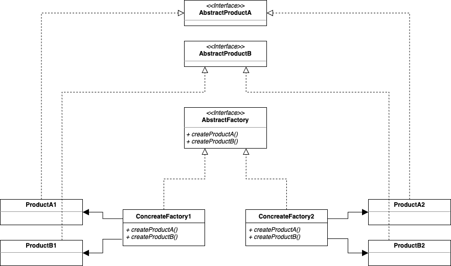

## Abstract Factory Pattern   

>> 참고: [Factory Method Pattern](https://stalker5217.netlify.app/design-pattern/factory-method-pattern/)

패턴의 목적은 팩토리 메서드 패턴과 동일하다. 
구상 클래스과 같이 구체적인 요소에 대한 의존을 줄이고, 의존성 역전을 통해 객체지향 원칙을 준수한다. 

추상 팩토리 패턴은 말 그대로 객체를 제공하는 클래스인 팩토리를 추상화하는 방식으로 구현한다. 
추상 팩토리에서는 구상 클래스에 의존하지 않고 서로 연관되거나 의존적인 객체로 이루어진 제품군을 생산하는 인터페이스를 제공하며, 
구상 클래스는 서브 클래스에서 생성하는 방식을 따른다. 



### 패턴 적용  

팩토리 메서드 패턴에서 ```PizzaStore```와 ```Pizza``` 관계를 정의했고, 여기서는 ```Pizza```와 그 원재료들의 관계를 고려한다. 
피자에는 여러 재료들이 들어가며 피자 도우, 소스, 치즈, 페퍼로니, 야채, 조개가 존재한다고 해보자. 

먼저 재료를 공급할 수 있는 **팩토리 인터페이스**가 필요하며, 뉴욕 스타일 피자를 만드는데 사용할 구체 팩토리와 시카고 스타일 피자를 만드는데 사용할 구체 팩토리를 생성한다. 

``` java
public interface PizzaIngredientFactory {

	Dough createDough();

	Sauce createSauce();

	Cheese createCheese();

	Veggies[] createVeggies();

	Pepperoni createPepperoni();

	Clams createClam();
}
```

``` java
public class ChicagoPizzaIngredientFactory implements PizzaIngredientFactory {
	@Override
	public Dough createDough() {
		return new ThickCrustDough();
	}

	@Override
	public Sauce createSauce() {
		return new PlumTomatoSauce();
	}

	@Override
	public Cheese createCheese() {
		return new MozzarellaCheese();
	}

	@Override
	public Veggies[] createVeggies() {
		return new Veggies[] {
			new BlackOlives(),
			new Spinach(),
			new Eggplant()
		};
	}

	@Override
	public Pepperoni createPepperoni() {
		return new SlicedPepperoni();
	}

	@Override
	public Clams createClam() {
		return new FrozenClams();
	}
}
``` 

``` java
public class NYPizzaIngredientFactory implements PizzaIngredientFactory {

	@Override
	public Dough createDough() {
		return new ThinCrustDough();
	}

	@Override
	public Sauce createSauce() {
		return new MarinaraSauce();
	}

	@Override
	public Cheese createCheese() {
		return new ReggianoCheese();
	}

	@Override
	public Veggies[] createVeggies() {
		return new Veggies[] {
			new Garlic(),
			new Onion(),
			new Mushroom(),
			new RedPepper()
		};
	}

	@Override
	public Pepperoni createPepperoni() {
		return new SlicedPepperoni();
	}

	@Override
	public Clams createClam() {
		return new FreshClams();
	}
}
```

추상 팩토리에서 반환하는 타입 또한 인터페이스가 되며, 이를 구현하는 구상 클래스에서는 각 재료들을 가져올 수 있는 팩토리를 멤버로 가진다. 
그리고 최종적으로 이를 사용해야하는 클라이언트 입장에서는 구상 클래스에 팩토리를 주입시켜 사용하게 된다. 


``` java
public abstract class Pizza {
	String name;

	Dough dough;
	Sauce sauce;
	Veggies[] veggies;
	Cheese cheese;
	Pepperoni pepperoni;
	Clams clam;

	abstract void prepare();

	void bake() {
		System.out.println("Bake for 25 minutes at 350");
	}

	void cut() {
		System.out.println("Cutting the pizza into diagonal slices");
	}

	void box() {
		System.out.println("Place pizza in official PizzaStore box");
	}

	void setName(String name) {
		this.name = name;
	}

	String getName() {
		return name;
	}
}
```

``` java
public class CheesePizza extends Pizza {
	PizzaIngredientFactory ingredientFactory;

	public CheesePizza(PizzaIngredientFactory ingredientFactory) {
		this.ingredientFactory = ingredientFactory;
	}

	@Override
	void prepare() {
		System.out.println("Preparing " + name);
		dough = ingredientFactory.createDough();
		sauce = ingredientFactory.createSauce();
		cheese = ingredientFactory.createCheese();
	}
}
```

``` java
public class ChicagoPizzaStore implements PizzaStore {
	@Override
	public Pizza createPizza(String item) {
		Pizza pizza = null;
		PizzaIngredientFactory ingredientFactory = new ChicagoPizzaIngredientFactory();

		if (item.equals("cheese")) {

			pizza = new CheesePizza(ingredientFactory);
			pizza.setName("Chicago Style Cheese Pizza");

		} else if (item.equals("veggie")) {

			pizza = new VeggiePizza(ingredientFactory);
			pizza.setName("Chicago Style Veggie Pizza");

		} else if (item.equals("clam")) {

			pizza = new ClamPizza(ingredientFactory);
			pizza.setName("Chicago Style Clam Pizza");

		} else if (item.equals("pepperoni")) {

			pizza = new PepperoniPizza(ingredientFactory);
			pizza.setName("Chicago Style Pepperoni Pizza");

		}
		return pizza;
	}
}
```


<br/>

참고
- 에릭 프리먼, 엘리자베스 롭슨, 키이시 시에라, 버트 베이츠, 헤드 퍼스트 디자인 패턴, 서환수, 한빛미디어
- https://github.com/bethrobson/Head-First-Design-Patterns