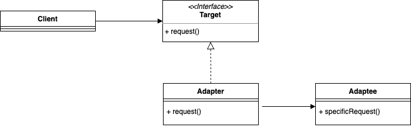
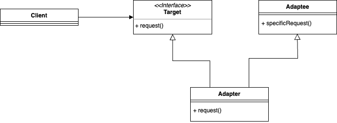
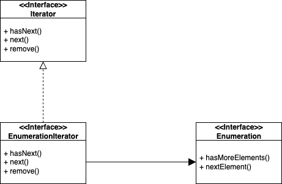

## Adapter Pattern  

주변에서 쉽게 볼 수 있는 어댑터에는 전압 변경 어댑터가 있다. 
한국에서는 220v를 표준으로 사용하고, 일본에서는 110v를 표준으로 사용하기에 일본 내수용 전자기기를 직구해서 사용하기 위해서는 돼지코를 사서 전압 변경이 필요한 것이다.  

디자인 패턴에서 말하는 어댑터도 같은 의미이다. 
만약 어떤 소프트웨어에서 특정 기능을 사용하기 위해 인터페이스를 정의하여 사용하고 있다고 해보자. 
그런데 추가로 신규 업체에서 라이브러리를 제공하여 이를 사용하게 되는데 이는 기존에 정의된 인터페이스와는 다르다. 
클라이언트에서 사전 정의된 인터페이스를 수정할 수도 없고, 업체에서 제공한 라이브러리를 직접 수정할 수도 없다. 
그 때는 기존의 인터페이스를 구현하면서 업체에서 제공한 라이브러리를 사용할 수 있도록 해주는 일종의 중개인 역할의 클래스가 필요한데 이를 어댑터라 한다. 

어댑터 패턴을 정의해보면 특정 클래스 인터페이스를 클라이언트에서 요구하는 다른 인터페이스로 변환하는 역할을 담당한다. 
그래서 인터페이스가 호환되지 않아 같이 쓸 수 없었던 클래스를 사용할 수 있게 도와주는 것이다. 



위 구현 형태를 **객체 어댑터**라고 한다. 클라이언트에서 사용하고 있는 인터페이스를 구현하며 실제 어댑티를 composition 형태로 지니고 있게 된다. 



어댑터 패턴을 구현하는 방법은 하나 더 있는데 이를 **클래스 어댑터**라고 한다. 
객체 어댑터에서는 어댑티를 속성으로 가지는 composition 형태로 구성되는 반면, 이는 **다중 상속**을 사용한다. 
사실 자바를 비롯하여 다중 상속을 지원하지 않는 언어가 많기 때문에 참조 정도만 해두자. 

### 패턴 적용  

자바 컬렉션에서 일련의 항목들에 접근할 수 있는 방법에는 ```Enumeration```과 ```Iterator```가 존재한다. 
```Enumeration``` 인터페이스는 자바의 초기 모델이며 요즘 새로운 코드를 작성할 때는 ```Iterator``` 인터페이스를 준수하는 것이 좋다. 
만약 어떤 레거시 코드에서 ```Enumeration```만을 제공할 때에는 아래와 같이 ```Iterator``` 스펙을 사용할 수 있도록 어댑터를 구현할 수 있다.  



여기서 나타나는 한 가지 문제점은 ```Enumeration```은 삭제 연산을 제공하지 않는다는 것이다. 
이를 어댑터에서 완벽하게 구현해낼 수 있는 방법은 사실 방법은 없다. 
그냥 두고 호출 시 예외를 발생시키는 것이 그나마 가장 좋은 방법이라고 할 수 있다. 


``` java
public class EnumerationIterator implements Iterator<Object> {
	Enumeration<?> enumeration;

	public EnumerationIterator(Enumeration<?> enumeration) {
		this.enumeration = enumeration;
	}

	@Override
	public boolean hasNext() {
		return enumeration.hasMoreElements();
	}

	@Override
	public Object next() {
		if (!hasNext()) {
			throw new NoSuchElementException();
		}

		return enumeration.nextElement();
	}

	@Override
	public void remove() {
		throw new UnsupportedOperationException();
	}
}
```

``` java
public class EnumerationIteratorTestDrive {
	public static void main (String[] args) {
		Vector<String> v = new Vector<>(Arrays.asList(args));
		Iterator<?> iterator = new EnumerationIterator(v.elements());
		while (iterator.hasNext()) {
			System.out.println(iterator.next());
		}
	}
}
```

<br/>

참고
- 에릭 프리먼, 엘리자베스 롭슨, 키이시 시에라, 버트 베이츠, 헤드 퍼스트 디자인 패턴, 서환수, 한빛미디어