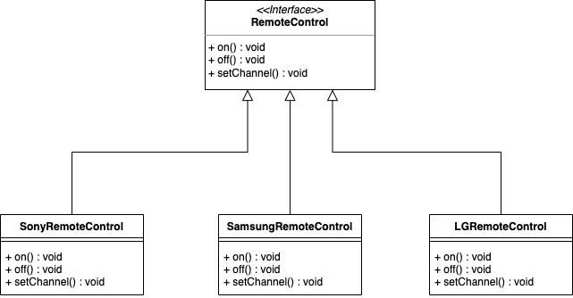
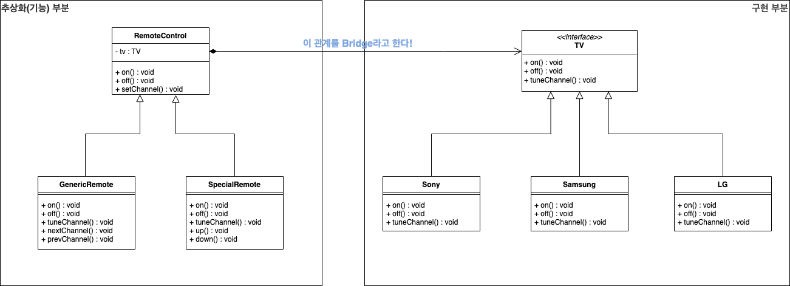

## Bridge Pattern  

리모컨을 나타내는 클래스를 구현한다고 해보자. 
리모컨들은 TV 브랜드마다 내부적으로는 다르게 동작해야하기 때문에 각 TV 브랜드에 적합하게 구현할 필요가 있다. 
이 때 일차원적으로 생각해보면 ```RemoteControl```이라는 인터페이스로 일단 한 번 추상화하고 각 TV 브랜드에 맞게 구체 클래스를 작성할 수 있다.



요구사항이 더 이상 발생하지 않는다면 다행이지만, 리모컨 기능이라는 추상화 부분이 변경되면 어떻게 될까? 
일반 리모컨과 추가 기능이 포함된 특별한 리모컨으로 나누어진다면 아래와 같이 6개의 구체 클래스가 생성될 것이다. 

- ```GenericSonyRemoteControl```
- ```GenericSamsungRemoteControl```
- ```GenericLGRemoteContol```
- ```SpecialSonyRemoteControl```
- ```SpecialSamsungRemoteControl```
- ```SpecialLGRemoteContol```

이렇게되면 얼핏 봐도 유지보수가 쉽지 않아 보인다. 
**브릿지 패턴**은 추상화된 부분(리모컨의 기능)과 구현 부분(각 TV 브랜드에 맞는 구현)을 composition을 사용하여 분리하고, 
이들이 각각 독립적으로 확장해 나갈 수 있도록하는 패턴이다. 

### 패턴 적용  

위 예제에서는 ```TV```에 해당하는 구현 부분을 composition으로 분리해낸다. 



``` java
public abstract class TV {
	public abstract void on();
	public abstract void off();
	public abstract void tuneChannel(int channel);
	public abstract int getChannel(); 
}

----------------------------

public class TVFactory {
	public TV getTV(String type) throws Exception {
		if (type.equals("LG")) {
			return new LG();
		} else if (type.equals("Samsung")) {
      return new Samsung();
    } else if (type.equals("Sony")) {
			return new Sony();
		} else {
			throw new Exception("Invalid TV Type");
		}
	}
}

----------------------------

public class Sony extends TV {
	int station = 0;
	public void on() {
		System.out.println("Turning on the Sony TV");
	}
	public void off() {
		System.out.println("Turning off the Sony TV");
	}
	public void tuneChannel(int channel) {
		this.station = channel;
		System.out.println("Set the Sony TV station to " + this.station);
	}
	public int getChannel() {
		return station;
	}
}

----------------------------

public class Samsung extends TV {
	int station = 0;
	public void on() {
		System.out.println("Turning on the Samsung TV");
	}
	public void off() {
		System.out.println("Turning off the Samsung TV");
	}
	public void tuneChannel(int channel) {
		this.station = channel;
		System.out.println("Set the Samsung TV station to " + this.station);
	}
	public int getChannel() {
		return station;
	}
}

----------------------------

public class LG extends TV {
	int channel = 1;
	public void on() {
		System.out.println("Turning on the LG TV");
	}
	public void off() {
		System.out.println("Turning off the LG TV");
	}
	public void tuneChannel(int channel) {
		this.channel = channel;
		System.out.println("Set the LG TV Channel to " + this.channel);
	}
	public int getChannel() {
		return channel;
	}
}
```

``` java
public abstract class RemoteControl {
	TV tv;
	TVFactory tvFactory;
	public RemoteControl(TVFactory tvFactory) {
		this.tvFactory = tvFactory;
	}
	public void on() {
		this.tv.on();
	}
	public void off() {
		this.tv.off();
	}
	public void setChannel(int channel) {
		tv.tuneChannel(channel);
	}
	public int getChannel() {
		return tv.getChannel();
	}
	public void setTV(String type) {
		try {
			tv = tvFactory.getTV(type);
		} catch (Exception e) {
			System.out.println(e);
		}
	}
}

----------------------------

public class GenericRemote extends RemoteControl {
	public GenericRemote(TVFactory tvFactory) {
		super(tvFactory);
	}
	public void nextChannel() {
		int channel = this.getChannel();
		this.setChannel(channel+1);
	}
	public void prevChannel() {
		int channel = this.getChannel();
		this.setChannel(channel-1);
	}
}

----------------------------

public class SpecialRemote extends RemoteControl {
	public SpecialRemote(TVFactory tvFactory) {
		super(tvFactory);
	}
	public void up() {
		int channel = this.getChannel();
		this.setChannel(channel+1);
	}
	public void down() {
		int channel = this.getChannel();
		this.setChannel(channel-1);
	}
}
```

<br/>

참고
- 에릭 프리먼, 엘리자베스 롭슨, 키이시 시에라, 버트 베이츠, 헤드 퍼스트 디자인 패턴, 서환수, 한빛미디어