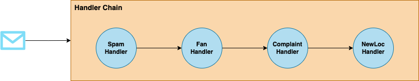
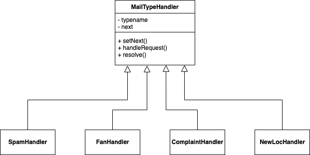

## 책임 연쇄 패턴  

인형 뽑기를 운영하는 업체에서 메일을 분류하는 작업을 가정해보자. 
해당 업체로 메일은 여러 유형으로 들어오며 아래와 같이 존재할 수 있다. 

- 스팸 메일
- 재미 좀 봤다고 만족하는 고객의 메일
- 욕설 및 항의 메일
- 신규 설치를 요청하는 메일
- ....

이들을 분류하는 코드를 작성해야 하기 위해서는 어떻게 해야될까? 
간단한 수준에서는 하나의 메서드에 구현을 할 수도 있지만 이는 명백한 단일 책임 원칙의 위반이다. 
따라서 좀 더 책임을 분리하여, 특정 메일 종류를 식별할 수 있는 기능을 가진 객체들을 각각 만들어서 체이닝 형태로 구성할 수 있다. 



이렇게 1개의 요청을 2개 이상의 객체에서 처리하는 것에 **책임 연쇄(Chain of Responsibility) 패턴**을 사용할 수 있다.
각 객체는 체인에 포함된 다른 객체의 레퍼런스를 직접 가지지 않고, 체인의 구조 또한 몰라도 되기에 간단한 형태로 유지할 수 있다. 
그리고 체인에 순서를 바꾸거나 분기 처리를 한다거나 동적으로 제어하는 것도 가능하다. 

### 패턴 적용  

Mail Type을 구분하는 하나의 Abstact Handler를 구현학고 이를 상속하여 각각의 Handler를 구현한다. 



``` java
public abstract class MailTypeHandler {
	private final String typeName;

	private MailTypeHandler next;

	protected MailTypeHandler(String typeName) {
		this.typeName = typeName;
	}

	public MailTypeHandler setNext(MailTypeHandler next) {
		this.next = next;
		return next;
	}

	public void handleRequest(String message) {
		if (resolve(message)) {
			System.out.println("Email Type: " + typeName);
		}

		if (next != null) {
			next.handleRequest(message);
		}
	}

	protected abstract boolean resolve(String message);
}
```

``` java
public class SpamHandler extends MailTypeHandler {
	public SpamHandler(String typeName) {
		super(typeName);
	}

	@Override
	protected boolean resolve(String message) {
		return message.contains("광고");
	}
}

--------------------------------------------------

public class FanHandler extends MailTypeHandler {
	public FanHandler(String typeName) {
		super(typeName);
	}

	@Override
	protected boolean resolve(String message) {
		return message.contains("사랑해");
	}
}
--------------------------------------------------

public class ComplaintHandler extends MailTypeHandler {
	public ComplaintHandler(String typeName) {
		super(typeName);
	}

	@Override
	protected boolean resolve(String message) {
		return message.contains("씨발");
	}
}

--------------------------------------------------

public class NewLocHandler extends MailTypeHandler {
	public NewLocHandler(String typeName) {
		super(typeName);
	}

	@Override
	protected boolean resolve(String message) {
		return message.contains("설치");
	}
}
```

``` java
public class Client {
	public static void main(String[] args) {
		MailTypeHandler baseHandler = new SpamHandler("spam");

		baseHandler
			.setNext(new FanHandler("fan"))
			.setNext(new ComplaintHandler("complaint"))
			.setNext(new NewLocHandler("new location"));

		baseHandler.handleRequest("광고임");
		baseHandler.handleRequest("사랑해");
		baseHandler.handleRequest("씨발아");
		baseHandler.handleRequest("설치 해주세요");
		baseHandler.handleRequest("일반");
	}
}
```

### Example  

스프링에서 흔히 볼 수 있는 패턴이다. 
요청을 처리하는 서블릿 ```Filter```, 스프링 시큐리티의 Filter Chain 
그리고 ```Interceptor```까지 모두 해당 패턴으로 설명 가능하다.

<br/>

참고
- 에릭 프리먼, 엘리자베스 롭슨, 키이시 시에라, 버트 베이츠, 헤드 퍼스트 디자인 패턴, 서환수, 한빛미디어