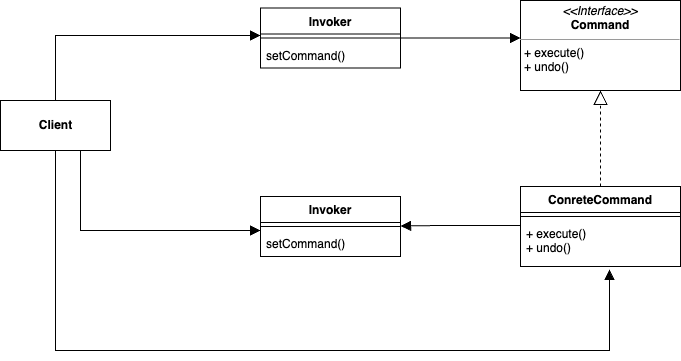
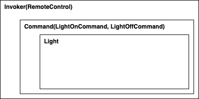

## Command Pattern

on/off 두 개의 버튼을 가진 리모컨이 있다. 
이 리모컨은 집안의 가전을 키고 끄는 역할을 가진다. 
예를 들어, 전등 객체가 있고 이를 제어하는 리모컨은 아래와 같이 구현할 수 있다. 

``` java
public class Light {
	private String location = "";

	public Light(String location) {
		this.location = location;
	}

	public void on() {
		System.out.println(location + " light is on");
	}

	public void off() {
		System.out.println(location + " light is off");
	}
}
```

``` java
public class RemoteControl {
	private Light light;

	public RemoteControl(Light light) {
		this.light = light;
	}

	public void on() {
		light.on();
	}

	public void off() {
		light.off();
	}
}
```

그런데 사실 이 리모컨이 다목적 리모콘이여서 사용자의 설정에 따라 동작을 바꿀 수 있다고 해보자. 
전등을 키고 끄는 리모컨에서 티비를 키고 끄는 리모컨으로 바꿀 수 있는 것이다. 
그런데 현재 구현으로는 ```RemoteControl```과 ```Light```는 강하게 결합되어 있다. 
기능을 변경하기 위해서는 소스 코드 자체를 수정할 수 밖에 없고 이를 동적으로 이루어내기 위해서는 둘 사이를 디커플링해야 한다. 

**커맨트 패턴**은 명령을 수행하기 위한 요청 내역을 객체로 캡슐화해서 매개변수화한다. 
위에서 언급한 결합도를 줄임과 동시에 로깅이나 작업 취소 같은 부가 기능을 구현하는데도 유용하다. 



패턴에서는 요청을 하는 Invoker와 요청을 수행하는 Receiver 사이에 Command 객체를 둠으로써 둘 사이를 분리한다. 
그리고 다이어그램 상 Command 객체는 단순히 지정된 동작을 실행하는 메서드만을 가지고 있으며 자바의 ```Runnable``` 인터페이스와 동일하나 필요한 부가 기능을 구현할 수도 있다. 
Command는 재사용 가능하며, 새로운 동작이 추가되더라도 Invoker의 코드 변경 없이 기능 추가가 가능하다. 



### 패턴 적용

``` java
public class Light {
	private String location = "";

	public Light(String location) {
		this.location = location;
	}

	public void on() {
		System.out.println(location + " light is on");
	}

	public void off() {
		System.out.println(location + " light is off");
	}
}
```

``` java
public class Tv {
	private String location = "";

	public Tv(String location) {
		this.location = location;
	}

	public void on() {
		System.out.println("TV is on");
	}

	public void off() {
		System.out.println("TV is off");
	}
}
```

``` java
public interface Command {
	void execute();
}
```

``` java
public class LightOnCommand implements Command {
	private Light light;

	public LightOnCommand(Light light) {
		this.light = light;
	}

	public void execute() {
		light.on();
	}
}
```

``` java
public class LightOffCommand implements Command {
	private Light light;

	public LightOffCommand(Light light) {
		this.light = light;
	}

	public void execute() {
		light.off();
	}
}
```

``` java
public class TvOnCommand implements Command {
	private Tv tv;

	public TvOnCommand(Tv tv) {
		this.tv = tv;
	}

	@Override
	public void execute() {
		tv.on();
	}
}
```

``` java
public class TvOffCommand implements Command {
	private Tv tv;

	public TvOffCommand(Tv tv) {
		this.tv = tv;
	}

	@Override
	public void execute() {
		tv.off();
	}
}
```

``` java
public class NoCommand implements Command {
	public void execute() { }
}
```

``` java
public class RemoteControl {
	private Command onCommand;
	private Command offCommand;

	// 리모컨 버튼에 동작을 명시적으로 지정하기 전에는 아무 동작 하지 않음
	// NoCommand는 여기서 의미상 null과 동일하다
	public RemoteControl() {
		this.onCommand = new NoCommand();
		this.offCommand = new NoCommand();
	}

	public void setCommand(Command onCommand, Command offCommand) {
		this.onCommand = onCommand;
		this.offCommand = offCommand;
	}

	public void on() {
		onCommand.execute();
	}

	public void off() {
		offCommand.execute();
	}
}
```

``` java
public class RemoteControlTestDrive {
	public static void main(String[] args) {
		RemoteControl remoteControl = new RemoteControl();

		Light light = new Light("toilet");
		LightOnCommand lightOnCommand = new LightOnCommand(light);
		LightOffCommand lightOffCommand = new LightOffCommand(light);

		remoteControl.setCommand(lightOnCommand, lightOffCommand);
		remoteControl.on();
		remoteControl.off();

		Tv tv = new Tv("living room");
		TvOnCommand tvOnCommand = new TvOnCommand(tv);
		TvOffCommand tvOffCommand = new TvOffCommand(tv);

		remoteControl.setCommand(tvOnCommand, tvOffCommand);
		remoteControl.on();
		remoteControl.off();
	}
}
```

> Command에 ```undo```와 같은 실행 취소 같은 기능을 추가할 수도 있다. 

> Command의 동작이 execute 하나라고 가정하면 Functional Interface이기에 람다로 간결하게 표현할 수도 있다.

<br/>

참고
- 에릭 프리먼, 엘리자베스 롭슨, 키이시 시에라, 버트 베이츠, 헤드 퍼스트 디자인 패턴, 서환수, 한빛미디어
- https://github.com/bethrobson