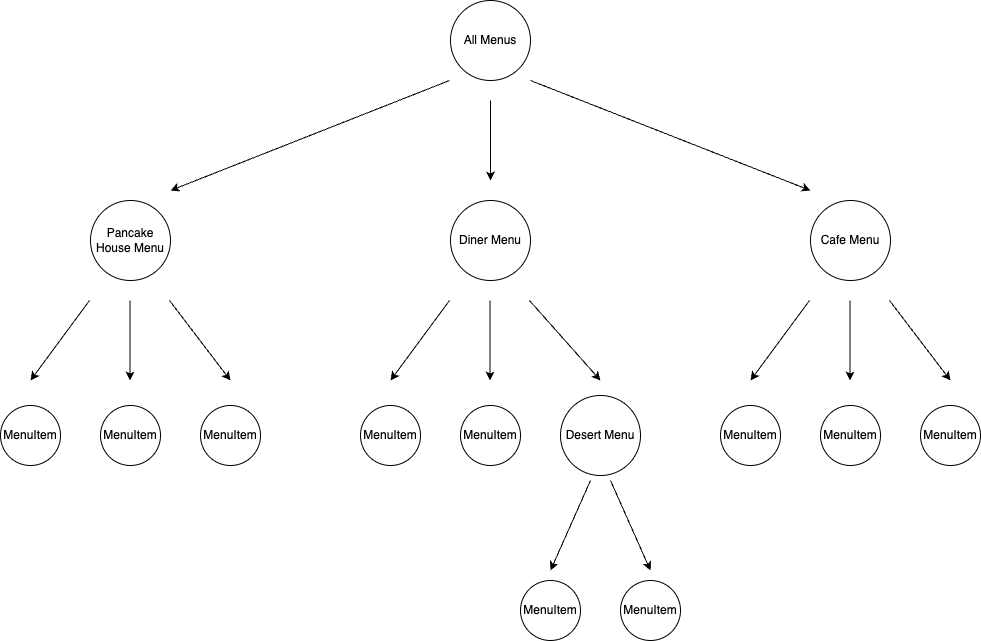
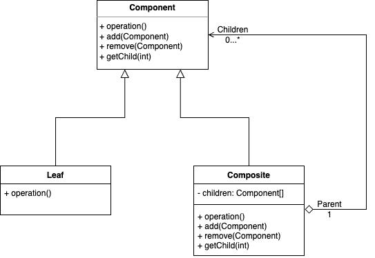

## Composite Pattern  

어떤 식당에서 판매하고 있는 메뉴들을 담는 ```Menu``` 객체가 있다. 
그리고 실제 품목을 의미하는 ```MenuItem``` 객체가 있고, ```Menu``` 객체 안에서는 ```MenuItem```을 Collection으로 담고 있다고 해보자.  

``` java
public class PancakeHouseMenu implements Menu {
	private final ArrayList<MenuItem> menuItems;

	public PancakeHouseMenu() {
		menuItems = new ArrayList<>();
	}

	public void addItem(String name, String description, boolean vegetarian, double price) {
		MenuItem menuItem = new MenuItem(name, description, vegetarian, price);
		menuItems.add(menuItem);
	}
}
```

그런데 여기서 메뉴 내부에 존재하는 서브 메뉴를 추가해서 아래와 같이 계층 구조로 표현해야하는 요구사항이 생겼다. 



``` java
public class DinerMenu implements Menu {
  private final List<MenuItem> menuItems = new ArrayList<>();
  private final List<Menu> menus = new ArrayList<>();
  
  public void addItem(String name, String description, boolean vegetarian, double price) {
		MenuItem menuItem = new MenuItem(name, description, vegetarian, price);
		menuItems.add(menuItem);
	}

  public void addMenu(Menu menu) {
    menus.add(menu);
  }
}
```

위 코드로도 계층적인 구조를 표현할 수 있다. 
하지만 문제점이라고 하면 ```addMenu``` 메서드가 추가되어 메뉴에 새로운 것을 추가하는 행위가 2가지로 구분되었다는 것이다. 
이는 만약 메뉴 내부의 요소들을 가져온다거나, 메뉴 내용을 출력한다거나 하는 새로운 기능이 필요할 때 항상 ```MenuItem```과 ```Menu``` 두 객체 모두 고려하여 구현해야 한다. 
이는 클라이언트 입장에서는 각 메뉴는 아이템과 서브 메뉴로 구성되어 있음을 알고 적절한 메서드를 호출해줘야함을 의미한다.

여기서 **컴포지트 패턴**을 적용할 수 있다. 
컴포지트 패턴 또한 트리 구조를 사용하여 계층 구조를 표현하는 패턴이다. 
그런데 여기서 추가적으로 **복합 객체**(e.g. Menu)와 **개별 객체**(e.g. MenuItem)을 동일한 인터페이스로 처리하여 같은 방법으로 다룰 수 있는 **part-whole hierachy**를 구성한다. 
해당 패턴을 통해 구현하면 클라이언트 입장에서 ```Menu```와 ```MenuItem```을 별개로 취급하지 않아도 된다. 



### 패턴 적용

``` java
public interface MenuComponent {
	default void add(MenuComponent menuComponent) {
		throw new UnsupportedOperationException();
	}

	default void remove(MenuComponent menuComponent) {
		throw new UnsupportedOperationException();
	}

	default MenuComponent getChild(int i) {
		throw new UnsupportedOperationException();
	}

	default String getName() {
		throw new UnsupportedOperationException();
	}

	default String getDescription() {
		throw new UnsupportedOperationException();
	}

	default double getPrice() {
		throw new UnsupportedOperationException();
	}

	default boolean isVegetarian() {
		throw new UnsupportedOperationException();
	}

	default void print() {
		throw new UnsupportedOperationException();
	}
}
```

``` java
public class Menu implements MenuComponent {
	private final List<MenuComponent> menuComponents = new ArrayList<>();

	private final String name;
	private final String description;

	public Menu(String name, String description) {
		this.name = name;
		this.description = description;
	}

	@Override
	public void add(MenuComponent menuComponent) {
		menuComponents.add(menuComponent);
	}

	@Override
	public void remove(MenuComponent menuComponent) {
		menuComponents.remove(menuComponent);
	}

	@Override
	public MenuComponent getChild(int i) {
		return menuComponents.get(i);
	}

	@Override
	public String getName() {
		return name;
	}

	@Override
	public String getDescription() {
		return description;
	}

	@Override
	public void print() {
		System.out.print("\n" + getName());
		System.out.println(", " + getDescription());
		System.out.println("---------------------");

		Iterator<MenuComponent> iterator = menuComponents.iterator();
		while (iterator.hasNext()) {
			MenuComponent menuComponent = iterator.next();
			menuComponent.print();
		}
	}
}
```

``` java
public class MenuItem implements MenuComponent {
	private final String name;
	private final String description;
	private final boolean vegetarian;
	private final double price;

	public MenuItem(String name, String description, boolean vegetarian, double price) {
		this.name = name;
		this.description = description;
		this.vegetarian = vegetarian;
		this.price = price;
	}

	@Override
	public String getName() {
		return name;
	}

	@Override
	public String getDescription() {
		return description;
	}

	@Override
	public double getPrice() {
		return price;
	}

	@Override
	public boolean isVegetarian() {
		return vegetarian;
	}

	@Override
	public void print() {
		System.out.print("  " + getName());
		if (isVegetarian()) {
			System.out.print("(v)");
		}
		System.out.println(", " + getPrice());
		System.out.println("     -- " + getDescription());
	}
}
```

``` java
public class Waitress {
	private MenuComponent allMenus;

	public Waitress(MenuComponent allMenus) {
		this.allMenus = allMenus;
	}

	public void printMenu() {
		allMenus.print();
	}
}
```

구현을 살펴보면 ```MenuComponent```는 ```Menu```, ```MenuItem```의 기능 모두를 정의하고 있다. 
명백한 단일 책임 원칙의 위반이지만 이같은 경우 원칙을 포기한 대신, 클라이언트에서 하나의 인터페이스로 모두 처리할 수 있도록 **투명성**을 확보한 경우로 볼 수 있다. 
따라서 ```Menu``` 객체에서 ```MenuItem```에 사용되는 메서드를 클라이언트에서 호출하는 등 안정성이 떨어질 수는 있다.

<br/>

참고
- 에릭 프리먼, 엘리자베스 롭슨, 키이시 시에라, 버트 베이츠, 헤드 퍼스트 디자인 패턴, 서환수, 한빛미디어
- https://github.com/bethrobson/Head-First-Design-Patterns