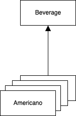
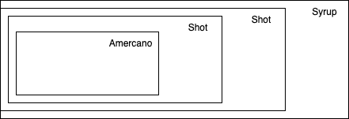
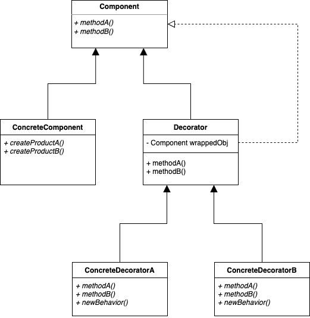

## Decorator Pattern   

음료 매장에서 관리하는 시스템을 생각해보자. 
이 시스템에서 각 음료는 ```Beverage```라는 상위 클래스 형태로 관리된다. 



여기서 새로운 신규 기능이 필요하다. 각 음료에 샷 추가와 같은 퍼스널 옵션의 관리이다. 
기능 구현을 위해서 아래와 같이 추상 클래스에 옵션을 관리할 수 있는 필드들을 생성할 수 있다.

``` java
public abstract class Beverage {
	// personal option 관리
	boolean shot;
	boolean syrup;
	boolean whip;

	public double cost() {
		double cost = 0;

		cost += shot ? 0.5 : 0.0;
		cost += syrup ? 0.1 : 0.0;
		cost += whip ? 0.2 : 0.0;

		return cost;
	}

	public boolean isShot() {
		return shot;
	}

	public void setShot(boolean shot) {
		this.shot = shot;
	}

	public boolean isSyrup() {
		return syrup;
	}

	public void setSyrup(boolean syrup) {
		this.syrup = syrup;
	}

	public boolean isWhip() {
		return whip;
	}

	public void setWhip(boolean whip) {
		this.whip = whip;
	}
}
```

위 같이 구현했을 때에는 여러 문제점이 있다. 
슈퍼 클래스의 ```cost``` 메서드는 엑스트라의 가격을 결정하고 있는데 만약 엑스트라가 추가되거나 수정될 경우 이 메서드는 항상 함께 수정하여 대응되야 한다는 점이다. 

그리고 다른 문제점은 모든 음료에 같은 엑스트라 옵션이 적용된다는 것이다. 
예를 들어, 레몬에이드가 있다고 했을 때 여기다 샷 추가를 하는 이상한 사람은 없을 것이다. 
하지만, 상위 클래스에서 공통 관리되는 내용이기 때문에 음료의 종류와 상관 없이 엑스트라 내용의 관리는 불가능하다. 
이 외에도 만약 휘핑 크림을 2번 추가 하고 싶다거나 하는 기능을 구현할 수 없는 구조이다.

> 변경에는 닫혀 있고, 확장에는 열려 있어야 한다는 OCP(Open-Closed Principle)과는 반대되는 구조가 된다. 

그렇다면 기존 코드를 수정하지 않고 기능은 확장할 수 있게 하려면 어떻게 구현할 수 있을까. 
아래 그림과 같이 아메리카노라는 음료를 샷, 시럽과 같은 옵션 값으로 wrapping하는 형식으로 구현할 수 있다. 
여기서 이 감싸는 객체를 **데코레이터**라고 부르는데, 
데코레이터는 감싸고 있는 객체의 슈퍼 클래스과 같은 타입이며 이러한 특성으로 하나의 객체를 몇 번이고 감쌀 수 있다. 




이를 **데코레이터 패턴**이라고 하며 객체에 추가적인 요소를 동적으로 부여할 수 있다. 
데코레이터는 자신이 장식하고 있는 객체에게 어떤 행동을 위임하는 일 말고도 추가적인 작업 또한 부여할 수 있으므로 
상속을 통한 서브클래스 구현보다 유연하게 기능 확장을 할 수 있다. 



### 패턴 적용  

``` java
public interface Beverage {
	double cost();
}
```

``` java
public class Americano implements Beverage {
	@Override
	public double cost() {
		return 1.99;
	}
}
```

``` java
public abstract class CondimentDecorator implements Beverage {
	Beverage beverage;
}
```

``` java
public class Shot extends CondimentDecorator {
	public Shot(Beverage beverage) {
		this.beverage = beverage;
	}

	@Override
	public double cost() {
		return .5 + beverage.cost();
	}
}
```

``` java
public class Syrup extends CondimentDecorator {
	public Syrup(Beverage beverage) {
		this.beverage = beverage;
	}

	@Override
	public double cost() {
		return .1 + beverage.cost();
	}
}
```

``` java
public class Whip extends CondimentDecorator {
	public Whip(Beverage beverage) {
		this.beverage = beverage;
	}

	@Override
	public double cost() {
		return .2 + beverage.cost();
	}
}
```

``` java
public static void main(String[] args) {
  Beverage americano = new Americano();
  System.out.println(americano.cost()); // 1.99

  Beverage doubleShotAndSyrupAmericano = new Americano();
  doubleShotAndSyrupAmericano = new Shot(doubleShotAndSyrupAmericano);
  doubleShotAndSyrupAmericano = new Shot(doubleShotAndSyrupAmericano);
  doubleShotAndSyrupAmericano = new Syrup(doubleShotAndSyrupAmericano);
  System.out.println(doubleShotAndSyrupAmericano.cost()); // 3.09
}
```

<br/>

참고
- 에릭 프리먼, 엘리자베스 롭슨, 키이시 시에라, 버트 베이츠, 헤드 퍼스트 디자인 패턴, 서환수, 한빛미디어
- https://github.com/bethrobson/Head-First-Design-Patterns