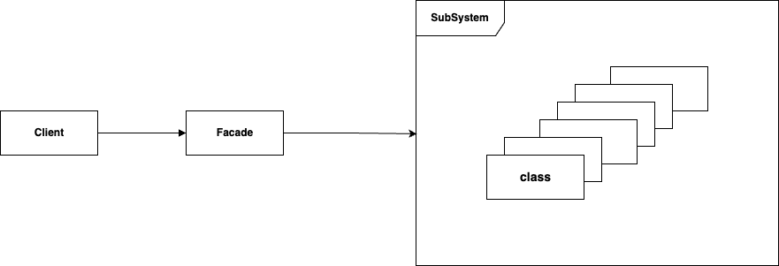
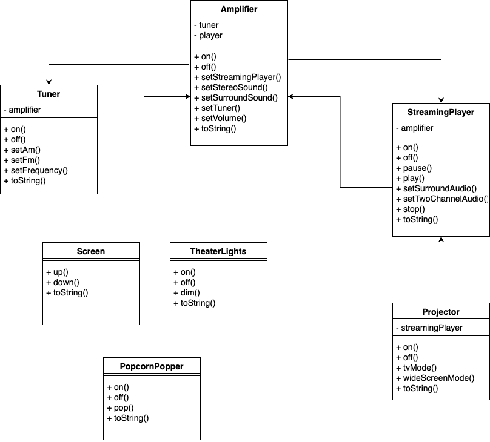

## Facade Pattern  

퍼사드 패턴은 인터페이스를 단순하게 바꾸기 위한 용도이다. 
서브시스템의 수 많은 인터페이스들을 직접 복잡하게 사용하는 것이 아니라 통합 인터페이스로 만들게 되며, 
또한 최소 지식 원칙에 의해 고수준의 인터페이스를 정의하므로 서브시스템을 더 편리하게 사용할 수 있게 된다. 



먼저 홈시어터 기능을 구현하려 하고 아래와 같이 서브시스템이 제공된다고 가정하자. 
그리고 이들을 사용해서 영화를 보기 위해서는 아래와 같은 일련의 작업을 정의해야 한다. 



1. 팝콘 기계를 켠다.
2. 팝콘을 튀기기 시작한다.
3. 조명을 어둡게 조절한다.
4. 스크린을 내린다.
5. 프로젝터를 켠다.
6. 프로젝터 입력을 스트르밍 플레이어로 설정한다.
7. 프로젝터를 와이드 스크린 모드로 전환한다.
8. 앰프를 켠다.
9. 앰프 입력을 스트리밍 플레이어로 설정한다.
10. 앰프를 서라운드 음향 모드로 전환한다.
11. 앰프 볼륨을 중간으로 설정한다.
12. 스트리밍 플레이어를 켠다.
13. 영화를 재생한다.

클라이언트가 홈시어터 기능을 구현하기 위해서는 서브 시스템의 모듈을 속속들이 알고 있어야 하고 일련의 작업 또한 직접 정의해야 한다. 
이 때, 퍼사드를 둔다면 클라이언트는 좀 더 편리한 인터페이스로 구현을 간소화할 수 있다. 

### 패턴 적용  

좀 더 서브시스템 모듈을 사용하기 쉽게 ```HomeTheaterFacade```를 구현할 수 있다. 

``` java
public class HomeTheaterFacade {
	Amplifier amp;
	Tuner tuner;
	StreamingPlayer player;
	Projector projector;
	TheaterLights lights;
	Screen screen;
	PopcornPopper popper;

	public HomeTheaterFacade(Amplifier amp,
		Tuner tuner,
		StreamingPlayer player,
		Projector projector,
		Screen screen,
		TheaterLights lights,
		PopcornPopper popper) {

		this.amp = amp;
		this.tuner = tuner;
		this.player = player;
		this.projector = projector;
		this.screen = screen;
		this.lights = lights;
		this.popper = popper;
	}

	public void watchMovie(String movie) {
		System.out.println("Get ready to watch a movie...");
		popper.on();
		popper.pop();
		lights.dim(10);
		screen.down();
		projector.on();
		projector.wideScreenMode();
		amp.on();
		amp.setStreamingPlayer(player);
		amp.setSurroundSound();
		amp.setVolume(5);
		player.on();
		player.play(movie);
	}


	public void endMovie() {
		System.out.println("Shutting movie theater down...");
		popper.off();
		lights.on();
		screen.up();
		projector.off();
		amp.off();
		player.stop();
		player.off();
	}

	public void listenToRadio(double frequency) {
		System.out.println("Tuning in the airwaves...");
		tuner.on();
		tuner.setFrequency(frequency);
		amp.on();
		amp.setVolume(5);
		amp.setTuner(tuner);
	}

	public void endRadio() {
		System.out.println("Shutting down the tuner...");
		tuner.off();
		amp.off();
	}
}
```

<br/>

참고
- 에릭 프리먼, 엘리자베스 롭슨, 키이시 시에라, 버트 베이츠, 헤드 퍼스트 디자인 패턴, 서환수, 한빛미디어
- https://github.com/bethrobson/Head-First-Design-Patterns