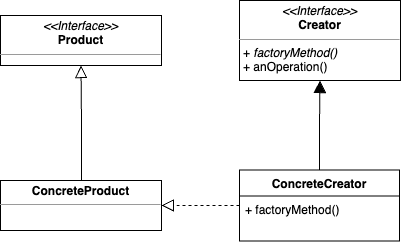

## Factory Method Pattern   

피자 가게를 나타내는 클래스가 있고 여기에 피자를 주문하는 메서드가 있다고 가정해보자. 

``` java
Pizza orderPizza(String type) {
	Pizza pizza;

	if (type.equals("cheese")) {
		pizza = new CheesePizza();
	} else if (type.equals("greek")) {
		pizza = new GreekPizza();
	} else if (type.equals("pepperoni")) {
		pizza = new PepperoniPizza();
	}

	pizza.prepare();
	pizza.bake();
	pizza.cut();
	pizza.box();

	return pizza;
}
```

만약 이 상태에서 신규 피자 메뉴인 "clam", "veggie"가 생겼고, 
잘 팔리지 않는 "greek" 피자는 제거한다고 가정하면 코드는 아래와 같이 변경 된다.

``` java
Pizza orderPizza(String type) {
	Pizza pizza;

	if (type.equals("cheese")) {
		pizza = new CheesePizza();
	} else if (type.equals("pepperoni")) {
		pizza = new PepperoniPizza();
	} else if (type.equals("clam")) {
		pizza = new ClamPizza();
	} else if (type.equals("veggie")) {
		pizza = new VeggiePizza();
	}

	pizza.prepare();
	pizza.bake();
	pizza.cut();
	pizza.box();

	return pizza;
}
```

문제점은 피자 주문 메서드에서 ```Pizza```를 구현한 구상 클래스들을 직접 사용하는 것인데, 이러면 피자의 종류가 바뀔 때 마다 피자 주문 메서드의 변경이 뒤따르게 된다. 
즉, **변경에 닫혀 있는 코드**가 되는 것이다. 
그래서 피자의 생성 부분을 추상화하기 위해 피자 생성 코드를 별도의 클래스로 뺄 수 있다. 
클래스는 객체 생성을 처리한다고 해서 **팩토리**라고 부른다. 

``` java
public class SimplePizzaFactory {
	public Pizza createPizza(String type) {
		Pizza pizza = null;

		if (type.equals("cheese")) {
			pizza = new CheesePizza();
		} else if (type.equals("pepperoni")) {
			pizza = new PepperoniPizza();
		} else if (type.equals("clam")) {
			pizza = new ClamPizza();
		} else if (type.equals("veggie")) {
			pizza = new VeggiePizza();
		}

		return pizza;
	}
}
```

``` java
public class PizzaStore {
	SimplePizzaFactory factory;

	public PizzaStore(SimplePizzaFactory factory) {
		this.factory = factory;
	}

	Pizza orderPizza(String type) {
		Pizza pizza = factory.createPizza(type);

		pizza.prepare();
		pizza.bake();
		pizza.cut();
		pizza.box();

		return pizza;
	}
}
```

그러나 여기서 정의한 ```SimplePizzaFactory```는 디자인 패턴이라고 보기는 어렵고, 그냥 프로그래밍에서 사용되는 관용구 정도로 볼 수 있다. 
만약에 위 코드 처럼 하나의 ```PizzaStore```가 아니라 뉴욕 스타일 피자(```NY---Pizza```)만을 취급하는 가게가 있고 시카고 스타일 피자(```Chicago---Pizza```)만을 취급하는 가게가 있다고 생각해보자. 
각각 ```NYPizzaFactory```, ```ChicagoPizzaFactory```를 만들어서 사용할 수도 있으나 또 한 가지 방법은 피자의 생성을 ```PizzaStore```에 위임하여 하나로 묶는 것이다. 

``` java
public interface PizzaStore {
	Pizza createPizza(String item);

	default Pizza orderPizza(String type) {
		Pizza pizza = createPizza(type);
		System.out.println("--- Making a " + pizza.getName() + " ---");
		pizza.prepare();
		pizza.bake();
		pizza.cut();
		pizza.box();
		return pizza;
	}
}
```

``` java
public class ChicagoPizzaStore implements PizzaStore {
	@Override
	public Pizza createPizza(String item) {
		if (item.equals("cheese")) {
			return new ChicagoStyleCheesePizza();
		} else if (item.equals("veggie")) {
			return new ChicagoStyleVeggiePizza();
		} else if (item.equals("clam")) {
			return new ChicagoStyleClamPizza();
		} else if (item.equals("pepperoni")) {
			return new ChicagoStylePepperoniPizza();
		} else return null;
	}
}
```

``` java
public class NYPizzaStore implements PizzaStore {
	@Override
	public Pizza createPizza(String item) {
		if (item.equals("cheese")) {
			return new NYStyleCheesePizza();
		} else if (item.equals("veggie")) {
			return new NYStyleVeggiePizza();
		} else if (item.equals("clam")) {
			return new NYStyleClamPizza();
		} else if (item.equals("pepperoni")) {
			return new NYStylePepperoniPizza();
		} else return null;
	}
}
```

이렇게 피자의 생성을 담당하는 부분을 스토어 안으로 다시 넣고 인터페이스 또는 추상클래스로 선언하면 피자의 생성을 ```PizzaStore```에서 담당하면서 각 지점의 스타일을 살릴 수 있게 된다. 
위 구현 방식을 **팩토리 메서드 패턴**이라고 정의 한다. 
객체를 생성할 때 필요한 인터페이스를 만들고, 어떤 클래스의 인스턴스를 만들지는 서브클래스에서 결정하는 방식을 따르게 된다. 
위 예제를 일반화하여 나타내면 아래와 같은 형태를 가지는데 ```PizzaStore```은 ```Creator```에 해당하고, ```Pizza```는 ```Product```에 해당한다. 



<br/>

참고
- 에릭 프리먼, 엘리자베스 롭슨, 키이시 시에라, 버트 베이츠, 헤드 퍼스트 디자인 패턴, 서환수, 한빛미디어
- https://github.com/bethrobson/Head-First-Design-Patterns