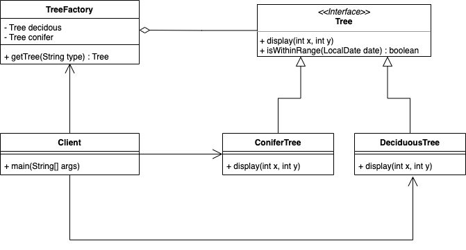

## Flyweight Pattern  

플라이웨이트 패턴은 성능 상 이점을 가져오기 위한 디자인 패턴이다. 
만약 어떤 클래스의 인스턴스가 아주 많이 필요하지만, 모두 같은 방식으로 제어된다면 사용할 수 있다. 다음과 같이 나무를 표현하는 인터페이스가 있고, 두 가지 나무의 종류가 있다고 가정해보자. 

``` java
public interface Tree {
	public void display(int x, int y);
	public default boolean isWithinRange(LocalDate aDate) {
		Month month = aDate.getMonth();
		return (month.getValue() > 2) && (month.getValue() < 11);
	}
}
```

``` java
public class ConiferTree implements Tree {
	// Complex trunk, branch, needle graphic data
	public void display(int x, int y) {
		System.out.println("Conifer tree is located at " + x + ", " + y);
	}
}
```

``` java
public class DeciduousTree implements Tree {
	// complex trunk, branch, leaf graphic data
	public void display(int x, int y) {
		System.out.println("Deciduous tree is located at " + x + ", " + y);
		if (!this.isWithinRange(LocalDate.now())) {
			System.out.println("The tree currently has no leaves");
		}
	}
}
```

이 객체들로 숲을 표현하기 위해 나무 인스턴스들을 수천, 수만개를 생성한다고 하면 성능 상 이슈가 생길 수도 있다. 
하지만 잘 생각해보면 각 객체들마다 고유한 속성이 없고, 주요 기능인 ```display``` 메서드 또한 좌표 값을 받아 위치를 표현해줄 뿐이다. 
플라이웨이트 패턴에서는 각 타입의 나무 인스턴스를 하나만 생성하고, 이를 재사용하여 클라이언트에게는 가상의 인스턴스를 제공함으로써 메모리 사용을 대폭 줄일 수 있다.

### 패턴 적용



``` java
public class TreeFactory {
	Tree d, c = null;
	public TreeFactory() {
		this.d = new DeciduousTree();
		this.c = new ConiferTree();
	}
	public Tree getTree(String type) throws Exception {
		if (type.equals("deciduous")) {
			return this.d;
		} else if (type.equals("conifer")) {
			return this.c;
		} else {
			throw new Exception("Invalid kind of tree");
		}
	}
}
```

``` java
public class Client {
	public static void main(String[] args) {
		int[][] deciduousLocations = {{1, 1}, {33, 50}, {100, 90}};
		int[][] coniferLocations = {{10, 87}, {24, 76}, {2, 64}};
		TreeFactory treeFactory = new TreeFactory(); // creates the two flyweights
		Tree d, c;
		try {
			d = treeFactory.getTree("deciduous");
			c = treeFactory.getTree("conifer");
			for (int[] location : deciduousLocations) {
				d.display(location[0],  location[1]);
			}
			for (int[] location : coniferLocations) {
				c.display(location[0],  location[1]);
			}
		} catch (Exception e) {
			e.printStackTrace();
		}
	}
}
```

> flyweight 패턴으로 제공되는 인스턴스의 속성들은 반드시 immutable한 상태로 제공되어야 한다. 

### Example

이 패턴은 자바에서 ```String```에서 사용된다. 
자바의 ```String```은 **String Constant Pool**이라는 특수한 형태로 관리된다. 
```String```은 보통 literal을 사용하여 선언하게 되는데, 플라이웨이 패턴을 적용하여 String Constant Pool에 존재하는 문자열이면 그 인스턴스를 반환하고 그게 아니라면 생성해서 반환해준다. 

``` java
@Test
void literalString() {
  String s1 = "hello";
  String s2 = "hello";

  assertThat(s1).isSameAs(s2);
}

@Test
void newString() {
  // String은 이런 식으로 생성하면 매번 같은 객체가 생성되며 이런 식의 코드는 지양한다.
  String s1 = new String("hello");
  String s2 = new String("hello");

  assertThat(s1).isNotSameAs(str2);
}
```

<br/>

참고
- 에릭 프리먼, 엘리자베스 롭슨, 키이시 시에라, 버트 베이츠, 헤드 퍼스트 디자인 패턴, 서환수, 한빛미디어
- https://github.com/bethrobson