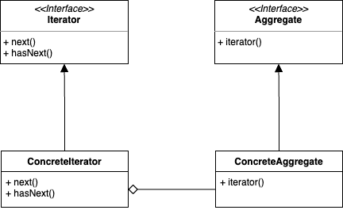

## Iterator Pattern  

반복자 패턴은 데이터 집합의 구현 방법을 직접적으로 노출하지 않으면서 항목들을 순회하는 방법을 제공해준다. 
데이터 집합이 배열로 구현되어 있던, Collection의 List나 Set, Map으로 구현되어 있던 일관된 방식으로 사용할 수 있게 된다. 

식당에서 판매하는 메뉴를 나타내는 클래스가 있고, 팬 케이크를 취급하는 메뉴와 다이너에서 취급하는 메뉴를 나타내는 클래스가 있다고 해보자. 
두 클래스 모두 ```MenuItem```을 통해 메뉴를 취급한다.

``` java
public class MenuItem {
	private final String name;
	private final String description;
	private final boolean vegetarian;
	private final double price;

	public MenuItem(String name, String description, boolean vegetarian, double price) {
		this.name = name;
		this.description = description;
		this.vegetarian = vegetarian;
		this.price = price;
	}

	public String getName() {
		return name;
	}

	public String getDescription() {
		return description;
	}

	public double getPrice() {
		return price;
	}

	public boolean isVegetarian() {
		return vegetarian;
	}
}
```

``` java
public class PancakeHouseMenu {
	private final ArrayList<MenuItem> menuItems;

  public PancakeHouseMenu() {
		menuItems = new ArrayList<MenuItem>();

		addItem(
			"K&B's Pancake Breakfast",
			"Pancakes with scrambled eggs and toast",
			true,
			2.99
		);

		addItem(
			"Regular Pancake Breakfast",
			"Pancakes with fried eggs, sausage",
			false,
			2.99
		);

		addItem(
			"Blueberry Pancakes",
			"Pancakes made with fresh blueberries and blueberry syrup",
			true,
			3.49
		);

		addItem(
			"Waffles",
			"Waffles with your choice of blueberries or strawberries",
			true,
			3.59
		);
	}

	public void addItem(String name, String description, boolean vegetarian, double price) {
		MenuItem menuItem = new MenuItem(name, description, vegetarian, price);
		menuItems.add(menuItem);
	}

	public ArrayList<MenuItem> getMenuItems() {
		return menuItems;
	}
}
``` 

``` java
public class DinerMenu {
	private static final int MAX_ITEMS = 6;
	private int numberOfItems = 0;
	private final MenuItem[] menuItems;

	public DinerMenu() {
		menuItems = new MenuItem[MAX_ITEMS];

		addItem(
			"Vegetarian BLT",
			"(Fakin') Bacon with lettuce & tomato on whole wheat",
			true,
			2.99
		);

		addItem(
      "BLT",
			"Bacon with lettuce & tomato on whole wheat",
			false,
			2.99
		);

		addItem(
			"Soup of the day",
			"Soup of the day, with a side of potato salad",
			false,
			3.29
		);

		addItem(
			"Hotdog",
			"A hot dog, with sauerkraut, relish, onions, topped with cheese",
			false,
			3.05
		);

		addItem(
			"Steamed Veggies and Brown Rice",
			"A medly of steamed vegetables over brown rice",
			true,
			3.99
		);

		addItem(
			"Pasta",
			"Spaghetti with Marinara Sauce, and a slice of sourdough bread",
			true,
			3.89
		);
	}

	public void addItem(String name, String description, boolean vegetarian, double price) {
		MenuItem menuItem = new MenuItem(name, description, vegetarian, price);
		if (numberOfItems >= MAX_ITEMS) {
			System.err.println("Sorry, menu is full!  Can't add item to menu");
		} else {
			menuItems[numberOfItems] = menuItem;
			numberOfItems = numberOfItems + 1;
		}
	}

	public MenuItem[] getMenuItems() {
		return menuItems;
	}
}
```

만약 이 두 가게가 합병되어 모든 메뉴를 한 번에 다뤄야한다면 어떻게 될까? 
```PancakeHouseMenu```의 ```ArrayList<>```를 반환하고 있고, ```DinerMenu```에서는 ```MenuItem[]```이라는 배열을 반환하고 있다. 
클라이언트에서 이들을 모두 순회하려면 리스트의 순회 방법과 배열의 순회 방법 모두를 파악해서 아래와 같이 순회하는 수 밖에 없다. 

``` java
List<MenuItem> pancakeMenus = pancakeHouseMenu.getItems();
for (int i = 0 ; i < pancakeMenus.size() ; i++) {
  MenuItem menuItem = pancakeMenus.get(i);
  ...
}

MenuItem[] dinerMenus = dinerHouseMenu.getItems();
for (int i = 0 ; i < dinerMenus.length ; i++) {
  MenuItem menuItem = dinerMenus[i];
  ...
}
```

클라이언트를 배려하기 위해서는, 메뉴의 집합을 저장하는 실제 구현체와는 무관하게 캡슐화하여 일관된 방법을 제공하는 것이 좋다. 
그리고 이 반복 작업을 캡슐화하는 방법이 바로 **반복자 패턴**이 된다. 



<br/>

### 패턴 적용  

``` java
public interface Iterator {
  boolean hasNext();
  MenuItem next();
}
```

반복자 인터페이스는 보통 다음 요소가 존재하는지 확인하는 ```hasNext()``` 메서드와 다음 요소를 반환하는 ```next()``` 메서드로 이루어진다. 
직접 정의해서 사용해도 되나 언어 차원에서 지원하는 경우가 많으며 자바에서는 ```java.util.Iterator```를 제공하고 있다. 
특히, Collection의 경우에는 이미 메서드를 제공하기에 별도 구현 없이 ```Iterator```를 그냥 받아 사용할 수 있다. 

> 흔히 사용하는 enhanced-for 구문이나 Collection의 ```forEach``` 메서드도 이를 기반으로 한다. 
> 엄밀히 말하면 Collection 객체는 ```Iterator```를 반환하는 메서드를 가진 ```Iterable```을 구현한다. 

``` java
public class DinerMenuIterator implements Iterator<MenuItem> {
	private final MenuItem[] list;
	private int position = 0;

	public DinerMenuIterator(MenuItem[] list) {
		this.list = list;
	}

	@Override
	public MenuItem next() {
		if (!hasNext()) {
			throw new NoSuchElementException();
		}

		return list[position++];
	}

	@Override
	public boolean hasNext() {
		return position < list.length && list[position] != null;
	}

	@Override
	public void remove() {
		if (position <= 0) {
			throw new IllegalStateException("You can't remove an item until you've done at least one next()");
		}
		if (list[position - 1] != null) {
			if (list.length - 1 - (position - 1) >= 0)
				System.arraycopy(
					list,
					position - 1 + 1, list,
					position - 1,
					list.length - 1 - (position - 1)
				);
			list[list.length - 1] = null;
		}
	}
}
```

그리고 각 식당의 메뉴를 나타내는 클래스는 인터페이스를 추가하여 적용한다. 

``` java
public interface Menu {
	public Iterator<MenuItem> createIterator();
}
```

``` java
public class DinerMenu implements Menu {
	private static final int MAX_ITEMS = 6;
	private int numberOfItems = 0;
	private final MenuItem[] menuItems;

  ...

	public Iterator<MenuItem> createIterator() {
		return new DinerMenuIterator(menuItems);
	}
}
```

``` java
public class PancakeHouseMenu implements Menu {
	private final ArrayList<MenuItem> menuItems;

	...

	public Iterator<MenuItem> createIterator() {
		return menuItems.iterator();
	}
}
```

<br/>

참고
- 에릭 프리먼, 엘리자베스 롭슨, 키이시 시에라, 버트 베이츠, 헤드 퍼스트 디자인 패턴, 서환수, 한빛미디어
- https://github.com/bethrobson/Head-First-Design-Patterns