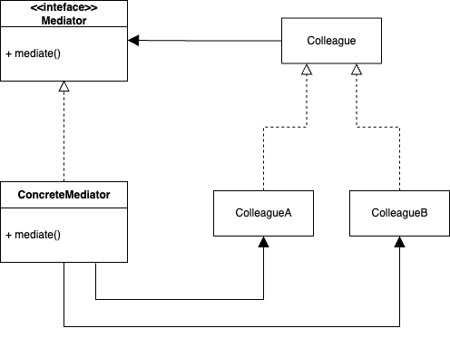

## Mediator Pattern  

미래지향적인 스마트홈을 생각해보자. 
모든 살림살이에 소프트웨어가 내장되어 있으며, 그렇기에 다음과 같은 시나리오가 있을 수 있다. 
만약, 평일이라면 아침에 알람이 울린다. 
그리고 알람이 종료되는 시점이 되면 커피포트에서 커피를 끓이기 시작하고 잔디밭에는 스프링쿨러가 동작한다.

``` java
public class Alarm {
	private Calendar calendar;
	private CoffeePot coffeePot;
	private Sprinkler sprinkler;

	public Alarm(Calendar calendar, CoffeePot coffeePot, Sprinkler sprinkler) {
		this.calendar = calendar;
		this.coffeePot = coffeePot;
		this.sprinkler = sprinkler;
	}

	@Override
	public void doEvent() {
		if (!calendar.isWeekend()) {
			this.doAlarm();
			coffeePot.extract();
			sprinkler.spray();
		}
	}

	public void doAlarm() {
		System.out.println("beep. beep.");
	}
}
```

알람 객체를 위와 같이 구성할 수도 있지만 기능 구현을 위해서 다른 모든 객체를 알고 있어야 한다. 
나머지 ```CoffeePot```, ```Calandar```, ```Sprinkler```도 같은 상황일 것이다. 
이는 객체 간의 결합도가 너무 높으며, 이는 수정이 어려운 코드로 나아갈 확률이 크다.

**중재자 패턴**은 이처럼 서로 관련된 객체들이 결합하여 복잡하게 상호작용할 때 이 제어를 한 곳으로 집중하기 위해 사용한다. 
필요한 다른 객체들을 직접적으로 의존하는 것이 아니라, 일종의 컨트롤 타워를 두고 한 곳에서 제어하는 것이다.



중자재 패턴을 적용하면 먼저 각 컴포넌트를 간결하게 유지할 수 있으며, 객체와 시스템을 분리하여 재사용성을 올릴 수 있다. 
그리고 제어 로직을 한 군데로 몰았기 때문에 관리하기가 좀 더 쉬워진다. 
물론, 이 경우 중재자 역할을 하는 객체는 모든 객체를 의존할 수 밖에 없으며 디자인을 잘못하는 경우 중재자 객체가 심하게 복잡해질 수도 있다.

### 패턴 적용

``` java
public interface Colleague {
	void doEvent();
}
```

``` java
public class Alarm implements Colleague {
	private Mediator mediator;

	public Alarm(Mediator mediator) {
		this.mediator = mediator;
	}

	@Override
	public void doEvent() {
		mediator.alarmOperation();
	}

	public void doAlarm() {
		System.out.println("beep. beep.");
	}
}
```

``` java
public class Calendar implements Colleague {
	...
}
```

``` java
public class CoffeePot implements Colleague {
	...
}
```

``` java
public class Sprinkler implements Colleague {
	...
}
```

``` java
public interface Mediator {
	void alarmOperation();
}
```

``` java
public class SmartHomeMediator implements Mediator {
	private Calendar calendar;
	private Alarm alarm;
	private CoffeePot coffeePot;
	private Sprinkler sprinkler;

	public SmartHomeMediator(Calendar calendar, Alarm alarm, CoffeePot coffeePot, Sprinkler sprinkler) {
		this.calendar = calendar;
		this.alarm = alarm;
		this.coffeePot = coffeePot;
		this.sprinkler = sprinkler;
	}

	@Override
	public void alarmOperation() {
		if (!calendar.isWeekend()) {
			alarm.doAlarm();
			coffeePot.extract();
			sprinkler.spray();
		}
	}
}
```

<br/>

참고
- 에릭 프리먼, 엘리자베스 롭슨, 키이시 시에라, 버트 베이츠, 헤드 퍼스트 디자인 패턴, 서환수, 한빛미디어