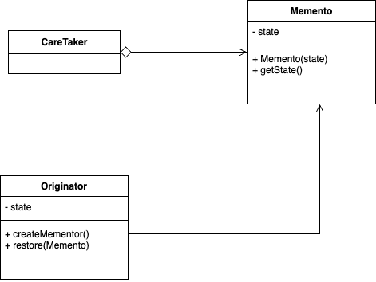

## Memento Pattern  

RPG 게임을 생각해봤을 때 하드코어 모드가 아니라면 캐릭터가 죽었을 때 **복구할 수 있는 저장** 기능이 있어야 한다. 
특정 세이브 포인트로 진입한다거나 명시적으로 저장을 한다거나 하는 방식은 대부분의 게임에서 구현되어 있다. 

메멘토 패턴은 객체를 이전 상태로 복구하기 위한 목적을 가진 패턴이며, 시스템에서 핵심적인 기능을 담당하는 객체의 상태를 저장한다. 
그리고 이 때 저장과 복구가 필요한 클라이언트 코드에서 객체의 내부 구조를 알 수 없도록 캡슐화하는 역할도 가진다. 

아래 그림에서 ```Originator```은 저장을 하고자 하는 객체이며 ```Memento```는 그 객체의 특정 상태를 나타낸다. 
```Memento``` 객체를 둠으로써 통해 캡슐화를 유지할 수 있는 것이다. 



> 직렬화와 비슷한 개념으로 보면 된다. 자바를 사용할 때는 사실 그냥 직렬화를 사용하면 된다. 

### 패턴 적용

``` java
public class Game {
	private int level;
	private int score;

	public int getLevel() {
		return level;
	}

	public void setLevel(int level) {
		this.level = level;
	}

	public int getScore() {
		return score;
	}

	public void setScore(int score) {
		this.score = score;
	}

	public GameMemento createMemento() {
		return new GameMemento(level, score);
	}

	public void restore(GameMemento gameMemento) {
		this.level = gameMemento.getLevel();
		this.score = gameMemento.getScore();
	}
}
```

``` java
public class GameMemento {
	private final int level;
	private final int score;

	public GameMemento(int level, int score) {
		this.level = level;
		this.score = score;
	}

	public int getLevel() {
		return level;
	}

	public int getScore() {
		return score;
	}
}
```

``` java
public class GameTestDrive {
	public static void main(String[] args) {
		Game game = new Game();
		game.setLevel(1);
		game.setScore(0);

		// 현재 상태 저장
		GameMemento memento = game.createMemento();

    ... // 캐릭터 사망
		
		// 복구
		game.restore(memento);

    ...
	}
}
```

<br/>

참고
- 에릭 프리먼, 엘리자베스 롭슨, 키이시 시에라, 버트 베이츠, 헤드 퍼스트 디자인 패턴, 서환수, 한빛미디어