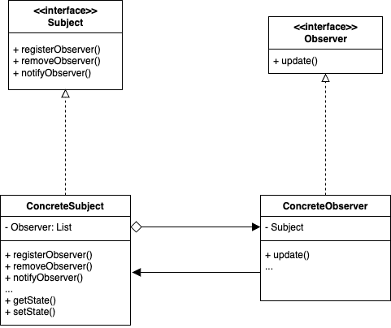

## Observer Pattern  

온도, 습도, 기압 3개의 날씨 관련 정보를 가지고 있는 ```WheatherData```라는 객체가 있다. 
날씨에 변화가 있을 때 마다 이 객체의 ```measurementsChanged()``` 메서드가 호출된다고 한다. 
그리고 이 객체의 내용을 기반으로 날씨 정보를 표시하는 Display 객체들이 여러 개 있다고 해보자. 
날씨 변화가 있을 때 마다 이 Display들을 갱신하려면 어떻게 해야할까? 

``` java
public class NaiveWeatherData {
	private double temperature;
	private double humidity;
	private double pressure;

	private DisplayElement currentConditionsDisplay;
	private DisplayElement statisticsDisplay;
	private DisplayElement forecastDisplay;

  ...

	public void measurementChanged() {
		currentConditionsDisplay.update(temperature, humidity, pressure);
		statisticsDisplay.update(temperature, humidity, pressure);
		forecastDisplay.update(temperature, humidity, pressure);
	}
}
```

``` java
public interface DisplayElement {
	void display();
  void update(float temp, float humidity, float pressure);
}
```

위 구현은 확실히 확장에 닫혀 있는 구조이다. 
```DisplayElement```를 구현하는 구현체들을 하나하나 명시적으로 작성하여 호출하고 있는걸 볼 수 있다. 
만약 새로운 디스플레이가 추가되거나, 특정 디스플레이를 제거해야한다면 ```WeatherData``` 객체도 수정되야하며 이는 동적으로는 구성될 수 없는 구조이다. 

**옵저버 패턴**은 위 상황과 같이 특정 객체의 상태가 바뀌면, 그 객체에 의존하고 있는 다른 객체에게 연락을 주어 내용을 갱신하도록 하는 형태의 패턴이다. 
```WeatherData```와 같이 주요 데이터를 관리하고 있는 객체를 ```Subject```라고 하고, 
이 객체의 변경 사항을 확인하고자 하는 객체들을 ```Observer```라고 한다. 
그리고 하나의 ```Subject```에는 여러 ```Observer```가 존재할 수 있는 일대다 구조를 가지게 된다. 



이 다이어그램만이 옵저버 패턴은 아니다. 
옵저버 패턴은 여러가지 방법으로 구현될 수 있으나, ```Subject```와 ```Observer``` 인터페이스를 두고 구현하는 방법이 보편적이긴 하다. 
옵저버 패턴의 또 다른 장점은 느슨한 결합에 있다. 
위 코드에서는 ```update``` 메서드가 ```DisplayElement```에 구현되어 있는데, 만약 디스플레이가 아닌 다른 객체도 내용을 수신하고 싶다면 어떻게될까? 
새로운 객체 타입에 따라 별도로 핸들링해주거나, 디스플레이가 아님에도 ```DisplayElement```를 강제로 구현시키거나 해야 한다. 
하지만 옵저버 패턴을 오직 ```Observer```를 구현했는지만을 확인하기에 구상 클래스가 무엇이되든 상관 없이 적용할 수 있다.

> 자바에는 옵저버 패턴을 위한 ```Observable```(Subject 역할)와 ```Observer``` 인터페이스를 제공했으나 자바 9 이후로는 Deprecated 되었다.

### 패턴 적용

``` java
public interface Subject {
	void registerObserver(Observer o);
	void removeObserver(Observer o);
	void notifyObservers();
}
```

``` java
public class WeatherData implements Subject {
	private final List<Observer> observers;
	private float temperature;
	private float humidity;
	private float pressure;

	public WeatherData() {
		observers = new ArrayList<>();
	}

	public void registerObserver(Observer o) {
		observers.add(o);
	}

	public void removeObserver(Observer o) {
		observers.remove(o);
	}

	public void notifyObservers() {
		for (Observer observer : observers) {
			observer.update(temperature, humidity, pressure);
		}
	}

	public void measurementsChanged() {
		notifyObservers();
	}

	public void setMeasurements(float temperature, float humidity, float pressure) {
		this.temperature = temperature;
		this.humidity = humidity;
		this.pressure = pressure;

		measurementsChanged();
	}
}
```

``` java
public interface Observer {
	void update(float temp, float humidity, float pressure);
}
```

``` java
public interface DisplayElement {
	void display();
}
```

``` java
public class CurrentConditionsDisplay implements Observer, DisplayElement {
	private float temperature;
	private float humidity;
	private WeatherData weatherData;

	public CurrentConditionsDisplay(WeatherData weatherData) {
		this.weatherData = weatherData;
		weatherData.registerObserver(this);
	}

	public void update(float temperature, float humidity, float pressure) {
		this.temperature = temperature;
		this.humidity = humidity;
		display();
	}

	public void display() {
		System.out.println("Current conditions: " + temperature + "F degrees and " + humidity + "% humidity");
	}
}
```

``` java
public class ForecastDisplay implements Observer, DisplayElement {
	private float currentPressure = 29.92f;
	private float lastPressure;
	private WeatherData weatherData;

	public ForecastDisplay(WeatherData weatherData) {
		this.weatherData = weatherData;
		weatherData.registerObserver(this);
	}

	public void update(float temp, float humidity, float pressure) {
		lastPressure = currentPressure;
		currentPressure = pressure;

		display();
	}

	public void display() {
		System.out.print("Forecast: ");
		if (currentPressure > lastPressure) {
			System.out.println("Improving weather on the way!");
		} else if (currentPressure == lastPressure) {
			System.out.println("More of the same");
		} else if (currentPressure < lastPressure) {
			System.out.println("Watch out for cooler, rainy weather");
		}
	}
}
```

``` java
public class StatisticsDisplay implements Observer, DisplayElement {
	private float maxTemp = 0.0f;
	private float minTemp = 200;
	private float tempSum= 0.0f;
	private int numReadings;
	private WeatherData weatherData;

	public StatisticsDisplay(WeatherData weatherData) {
		this.weatherData = weatherData;
		weatherData.registerObserver(this);
	}

	public void update(float temp, float humidity, float pressure) {
		tempSum += temp;
		numReadings++;

		if (temp > maxTemp) {
			maxTemp = temp;
		}

		if (temp < minTemp) {
			minTemp = temp;
		}

		display();
	}

	public void display() {
		System.out.println("Avg/Max/Min temperature = " + (tempSum / numReadings) + "/" + maxTemp + "/" + minTemp);
	}
}
```

<br/>

참고
- 에릭 프리먼, 엘리자베스 롭슨, 키이시 시에라, 버트 베이츠, 헤드 퍼스트 디자인 패턴, 서환수, 한빛미디어
- https://github.com/bethrobson/Head-First-Design-Patterns