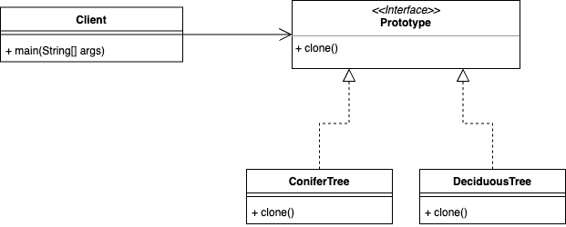

## Prototype Pattern  

프로토타입 패턴은 이미 존재하는 인스턴스를 복제하는 방법을 제공한다. 



특히, 객체를 생성하는데 있어 데이터베이스나 네트워크 사용이 필요한 경우에는 이 패턴을 이용하면 성능상 이점을 얻을 수도 있다. 
그리고 사용하는 클라이언트 입장에서는 객체를 생성하는 구체적인 방법을 몰라도 새로운 인스턴스를 생성할 수 있다는 장점이 있다. 
객체의 구성 요소가 flat한 데이터들이라면 무관하지만 참조 데이터들이 엮여 있다면 shallow, deep copy 등을 결정하는 것이 필요하고, 
특히 순환 참조가 있는 경우에는 복사 객체를 만드는게 상당히 어려워질 수 있다는 단점이 있다. 

자바에서는 ```Clonable``` 인터페이스를 사용하여 ```Object```에 정의된 ```clone```을 오버라이딩하는 방식으로 구현할 수 있다. 

### 패턴 적용

게임 속에서 등장하는 몬스터를 생각했을 때, 같은 종류의 몬스터라면 내부 데이터는 아마 같을 것이다. 
그 때 해당 패턴을 사용하면 몬스터들을 쉽게 복사하여 젠 시킬 수 있다. 

``` java
public abstract class Monster implements Cloneable {
	boolean eatsChildren = true;
	boolean hasWings = false;
	int numHeads = 1;
	boolean canBreatheFire = false;
	String name;

	public Monster(String name) {
		this.name = name;
	}

	public void spitPoison() {
	} // default is do nothing

	public void setName(String name) {
		this.name = name;
	}

	public abstract Monster copy() throws CloneNotSupportedException;

	@Override
	public String toString() {
		StringBuffer s = new StringBuffer("I'm a monster named " + this.name + " with " + this.numHeads + " head(s). ");
		if (this.canBreatheFire) {
			s.append("I can breathe fire. ");
		}
		if (this.eatsChildren) {
			s.append("I eat children. ");
		}
		if (this.hasWings) {
			s.append("I have wings. ");
		}
		return s.toString();
	}
}
```

``` java
public class Dragon extends Monster {
	public Dragon(String name, boolean hasWings) {
		super(name);
		this.hasWings = hasWings;
		this.canBreatheFire = true;
	}

	// Each concrete monster could determine how best to clone itself
	public Monster copy() throws CloneNotSupportedException {
		return (Monster)this.clone();
	}
}
```

<br/>

참고
- 에릭 프리먼, 엘리자베스 롭슨, 키이시 시에라, 버트 베이츠, 헤드 퍼스트 디자인 패턴, 서환수, 한빛미디어
- https://github.com/bethrobson