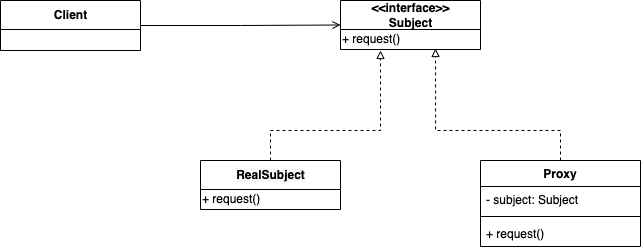
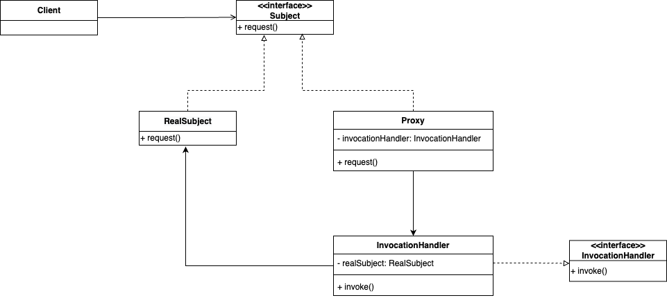

## Proxy Pattern  



프록시 패턴은 특정 객체로 접근을 제어하는 대리인 즉, 프록시를 제공한다. 
실제 접근의 대상이 되는 ```RealSubject```와 ```Proxy```는 동일한 ```Subject``` 인터페이스를 구현한다. 
그래서 클라이언트 입장에서는 ```RealSubject```와 ```Proxy```를 구분하지 않고 동일하게 사용할 수 있다. 
실제 기능들은 ```RealSubject```에서 처리하며, ```Proxy```에는 이 ```RealSubject```의 레퍼런스가 들어있다. 
클라이언트에는 ```Proxy``` 객체가 제공되며 이를 호출한다. 
피호출되면 ```Proxy```에서는 필요한 제어를 한 뒤 ```RealSubject```의 메서드를 호출한다.


프록시를 사용해 접근 제어를 하는데는 여러 이유가 있을 수 있다. 
예를 들면 **원격 프록시**는 다른 JVM에 있는 객체를 호출하기 위해 사용 된다. 
프록시 메서드를 네트워크를 통해 원격에 존재하는 객체를 호출하는 역할을 담당하게 된다. 

**가상 프록시**는 생성 비용이 많이 드는 객체를 대신한다. 
애플리케이션의 시작부터 존재하는 것이 아니라 클라이언트가 진짜 해당 객체를 사용할 때까지 기다렸다가 생성하는 **Lazy Initialization**을 구현할 수 있다.
또한, 비슷한 의도로 캐싱에 사용하면 **캐싱 프록시**가 된다. 

**보호 프록시**는 말 그대로 누가 접근하는가를 확인해서 접근 권한이 있는지 등을 제어하며, 리소스로의 접근을 통제할 수 있다. 
위 나열한 것만이 프록시 패턴을 사용한 것은 아니다. 다양한 변형이 있을 수 있으며 해당 형태로 접근을 제어한다면 전부 프록시 패턴이라고 볼 수 있다. 

### Reflection을 사용한 프록시 생성

```java.lang.relfect``` 패키지에서는 리플렉션을 통해 프록시를 만들어주는 기능을 제공한다. 
인터페이스를 구현하고 있는 클래스라면 모두 프록시 클래스를 만들 수 있다. 
직접 프록시 코드를 작성하는 것이 아니라 런타임에 동적으로 생성되기에 **Dynamic Proxy**라고도 한다.

> 인터페이스를 구현하지 않고 구체 클래스만 존재한다면 **CGLIB**을 사용하여 프록시를 생성할 수 있다. 



### 패턴 적용

데이트 앱을 구현하며 사용자의 점수를 매기는 기능을 구현한다. 
사용자는 이름, 성별 같은 프로필과 점수 속성을 가진다. 
그런데 본인이 아닌 다른 사람이 내 프로필을 수정한다거나, 본인이 본인 점수를 왕창 올린다하거나 하는 경우는 발생하며 안되며 사용자 객체를 조작하는 것은 접근 제어가 필요하다. 
프로필 내용의 수정은 본인만이 접근할 수 있으며 점수는 본인 이외의 사람들만 접근할 수 있어야하며 이를 동적 프록시를 통해 구현한다. 


``` java
public interface Person {
	String getName();

	String getGender();

	String getInterests();

	int getGeekRating();

	void setName(String name);

	void setGender(String gender);

	void setInterests(String interests);

	void setGeekRating(int rating);
}
```

``` java
public class PersonImpl implements Person {
	String name;
	String gender;
	String interests;
	int rating;
	int ratingCount = 0;

	public String getName() {
		return name;
	}

	public String getGender() {
		return gender;
	}

	public String getInterests() {
		return interests;
	}

	public int getGeekRating() {
		if (ratingCount == 0)
			return 0;

		return (rating / ratingCount);
	}

	public void setName(String name) {
		this.name = name;
	}

	public void setGender(String gender) {
		this.gender = gender;
	}

	public void setInterests(String interests) {
		this.interests = interests;
	}

	public void setGeekRating(int rating) {
		this.rating += rating;
		ratingCount++;
	}
}
```

``` java
public class OwnerInvocationHandler implements InvocationHandler {
	Person person;

	public OwnerInvocationHandler(Person person) {
		this.person = person;
	}

	public Object invoke(Object proxy, Method method, Object[] args) throws IllegalAccessException {
		try {
			if (method.getName().startsWith("get")) {
				return method.invoke(person, args);
			} else if (method.getName().equals("setGeekRating")) {
				throw new IllegalAccessException();
			} else if (method.getName().startsWith("set")) {
				return method.invoke(person, args);
			}
		} catch (InvocationTargetException e) {
			e.printStackTrace();
		}

		return null;
	}
}
```

``` java
public class NonOwnerInvocationHandler implements InvocationHandler {
	Person person;

	public NonOwnerInvocationHandler(Person person) {
		this.person = person;
	}

	public Object invoke(Object proxy, Method method, Object[] args) throws IllegalAccessException {
		try {
			if (method.getName().startsWith("get")) {
				return method.invoke(person, args);
			} else if (method.getName().equals("setGeekRating")) {
				return method.invoke(person, args);
			} else if (method.getName().startsWith("set")) {
				throw new IllegalAccessException();
			}
		} catch (InvocationTargetException e) {
			e.printStackTrace();
		}

		return null;
	}
}
```

``` java
public class MatchMakingTestDrive {
	HashMap<String, Person> datingDB = new HashMap<>();

	public static void main(String[] args) {
		MatchMakingTestDrive test = new MatchMakingTestDrive();
		test.drive();
	}

	public MatchMakingTestDrive() {
		initializeDatabase();
	}

	public void drive() {
		Person joe = getPersonFromDatabase("Joe Javabean");
		Person ownerProxy = getOwnerProxy(joe);

		System.out.println("Name is " + ownerProxy.getName());
		ownerProxy.setInterests("bowling, Go");
		System.out.println("Interests set from owner proxy");
		try {
			ownerProxy.setGeekRating(10);
		} catch (Exception e) {
			System.out.println("Can't set rating from owner proxy");
		}
		System.out.println("Rating is " + ownerProxy.getGeekRating());

		Person nonOwnerProxy = getNonOwnerProxy(joe);
		System.out.println("Name is " + nonOwnerProxy.getName());
		try {
			nonOwnerProxy.setInterests("bowling, Go");
		} catch (Exception e) {
			System.out.println("Can't set interests from non owner proxy");
		}
		nonOwnerProxy.setGeekRating(3);
		System.out.println("Rating set from non owner proxy");
		System.out.println("Rating is " + nonOwnerProxy.getGeekRating());
	}

	Person getOwnerProxy(Person person) {
		return (Person) Proxy.newProxyInstance(
			person.getClass().getClassLoader(),
			person.getClass().getInterfaces(),
			new OwnerInvocationHandler(person));
	}

	Person getNonOwnerProxy(Person person) {
		return (Person) Proxy.newProxyInstance(
			person.getClass().getClassLoader(),
			person.getClass().getInterfaces(),
			new NonOwnerInvocationHandler(person));
	}

	Person getPersonFromDatabase(String name) {
		return datingDB.get(name);
	}

	void initializeDatabase() {
		Person joe = new PersonImpl();
		joe.setName("Joe Javabean");
		joe.setInterests("cars, computers, music");
		joe.setGeekRating(7);
		datingDB.put(joe.getName(), joe);

		Person kelly = new PersonImpl();
		kelly.setName("Kelly Klosure");
		kelly.setInterests("ebay, movies, music");
		kelly.setGeekRating(6);
		datingDB.put(kelly.getName(), kelly);
	}
}
```

<br/>

참고
- 에릭 프리먼, 엘리자베스 롭슨, 키이시 시에라, 버트 베이츠, 헤드 퍼스트 디자인 패턴, 서환수, 한빛미디어
- https://github.com/bethrobson/Head-First-Design-Patterns