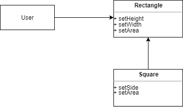

# SOLID  

SOLID란 Robert Martin이 명명한 객체 지향 프로그래밍과 설계에 있어 지켜야할 5가지 원칙이다.
아래 내용을 항상 염두하며 코딩을 하도록 하자.

## 단일 책임 원칙(SRP : Single Response Principle)  

**"하나의 모듈은 하나의 Actor에 대한 책임만을 져야 한다."**

단일 책임 원칙이라는 말만 듣는다면, 하나의 함수가 하나의 기능만을 해야한다는 원칙과 혼동하기 쉽다. 하지만, 이는 SOLID에서 다루는 모듈의 레벨이 아니라, 커다란 함수를 리팩토링을 한다던지 할 때 나타나는 좀 더 저수준의 원칙이라는 것을 상기하자. 

SRP를 위반한 사례를 확인해보자.

 

- ```calculatePay()``` : 회계팀에서 기능을 정의
- ```reportHours()``` : 인사팀에서 기능을 정의
- ```save()``` : 데이터베이스 관리자가 기능을 정의

클래스를 이와 같이 구성함으로써 세 액터에 대한 기능이 결합되었다. 
높은 결합도로 인해 서로 간의 기능 수정이 영향을 미친다. 

예를 들어, 초과 근무를 제외한 업무 시간을 계산하는 메소드를 구하는 ```getRegularHours()```를 
```calculatePay()```, ```reportHours()```에서 공통으로 사용하고 있다고 가정하자.  

이 때 인사팀에서 초과 근무 시간에 대한 변경을 요청한다. 
하지만 이는 인사팀 내부적으로 확인을 위함이기에 회계팀 입장에서는 변경 없이 그대로 로직을 가져가야 한다. 
이 때 개발자가 인지를 하고 이를 분리하여 기능을 각각 처리해주는 것이 아니라 
단순히 ```reportHours()``` 만 수정을 한다면, 회계팀에서 사용하는 ```calculatePay()```에 영향을 미치고 프로그램은 제대로 돌지 않는다. 

또한, 이러한 경우에는 Source Conflict가 많이 발생한다. 
만약 인사팀에서 요청한 기능 변경과 DBA가 요청한 기능 변경을 두 명의 개발자가 각각 수행한다고 가정하면, 
이 모듈은 여러 액터가 하나로 묶인 상황이기 때문에 필연적으로 conflict가 발생할 수 밖에 없다.

가장 확실한 해결책은 결국 클래스와 메소드의 분리이다. 

이는 퍼사드 패턴을 적용하여 데이터와 기능들을 모두 분리할 수도 있다.

 

또는, Employee 객체에서 하나의 액터는 그대로 두고 나머지 2개를 퍼사드 패턴으로 분리할 수도 있다.

 

## 개방-폐쇄 원칙(OCP : Open-Closed Principle)  

**"소프트웨어 개체의 행위는 확장할 수 있어야 하지만, 이 때 개체는 변경해서는 안된다."**  

OCP는 시스템을 확장하기 쉬운 동시에 변경으로 인해 시스템이 너무 많은 영향을 받지 않도록하는데 목적이 있다.  

어떤 소프트웨어가 작은 요구 사항을 추가하는데 온갖 모듈을 다 뜯어고쳐야 한다면 그건 실패한 아키텍트라고 볼 수 있다. 
OCP도 마찬가지로 단순히 클래스나 모듈 수준에서 생각하기 쉽다. 
하지만 아키텍처 컴포넌트 수준에서 이를 고려할 때 더 큰 의미를 가진다. 

재무제표를 웹 페이지로 보여주는 시스템이 있다고 하자. 
그런데 여기서 동일한 데이터를 출력하여 볼 수 있는 형태로 나타내는 요구 사항이 발생했다. 
SRP를 만족하도록 요소를 적절하게 분리하고 아래와 같은 의존성을 구현하여 변경되는 코드를 최소화 할 수 있다.

  

화살표는 사용 관계를 의미한다. 
여기서 화살표는 양방향이 존재하지 않고 항상 단방향을 향하며 이는 의존성 계층 구조를 만든다.
이런 식의 구조에서 상위 컴포넌트는 하위 컴포넌트의 존재를 알 수 없으며, 
하위 컴포넌트의 변경이 발생하여도 상위 컴포넌트를 수정하는 일을 피할 수 있다. 
이러한 관점에서 Interactor는 애플리케이션에서 가장 높은 수준의 정책을 가지며, 
관련된 비즈니스 규칙을 포함하고 있다. 

## 리스코프 치환 원칙(LSP : Liskov Substitution Principle)  

**"자료형 S가 있고 이것이 자료형 T의 하위 타입이라면, T를 정의한 모든 프로그램에서 T를 S로 치환해도 기능의 변경이 없어야 한다."**

객체 지향이 처음 등장했을 때는 LSP를 상속을 사용하도록 가이드하는 방법 정도였다. 
하지만 LSP는 인터페이스와 그 구현체에도 적용되는 광범위한 원칙으로 발전되었다. 

여기서 인터페이스과 구현체는 다양한 형태로 나타날 수 있다. 
- 객체 지향 언어, 예를 들어 자바라면 인터페이스와 이를 구현하는 구현체
- REST API를 정의하는 인터페이스와, 실제 구현한 API
- ...

다음은 LSP를 준수하는 예시이다. 

  

```Billing```은 ```Lisense```의 특정 구현체에 의존하지 않으며 이를 구현한 아무것이나 대체해도 동일한 기능을 한다. 

하지만 아래는 LSP는 위반하는 대표적인 예이다.

  

정사각형은 항상 너비와 높이가 같기 때문에 ```Rectangle```의 기능과는 좀 다르다고 할 수 있다. 
그 특성 때문이 ```setW```, ```setH```를 원래 목적에 맞게 사용할 수 없다. 

``` java
Rectangle r = new Squre();
r.setW(5);
r.setH(2);

// 실패
assert(r.area() == 10);
```

## 인터페이스 분리 원칙(ISP : Interface Segregation Principle)  

**"클라이언트는 자신이 사용하지 않는 메서드에는 의존하지 않아야한다."**  

  

위 구조에서는 Client 1, 2, 3이 Operation의 op 1, 2, 3을 사용한다. 
모두 Operation을 사용하고 있지만 하나만 사용하고 둘은 사용하지 않음을 의미한다.  
만약 op2가 수정되었다고 해도 모든 클라이언트는 Operation에 의존하고 있기 때문에 
정적 타입 언어라면 모든 Client를 다시 컴파일하고 배포해야 한다. 

  

위 처럼 각 Client가 사용하는 것만 가지는 인터페이스를 따로 분리하여 구현하면 이러한 문제를 피할 수 있다. 
모든 Client는 실제 사용하는 메서드만 포함하고 있기에 문제가 발생하지 않는다. 

사실 ISP 같은 경우는 언어에 의존적이다. 
정적 타입 언어 같은 경우에는 ```include```, ```import```, ```use``` 등으로 인해 의존성이 발생하므로 재컴파일, 배포가 발생한다. 
하지만, 언어적 특성에 따라 분명히 다른 부분이 존재한다. 
자바 같은 경우에는 위의 예제에서 op2가 변경됬을 때, op1과 op3의 시그니처가 변경되지 않았으면 따로 client1, client3을 다시 컴파일할 필요가 없다.
마찬가지로 op2도 기능적인 부분만 변경되고 시그니처가 변경되지 않으면 client2도 다시 컴파일할 필요가 없다. 

동적 타입 언어인 파이썬, 루비 같은 언어는 이로한 의존성이 존재하지 않는다. 
따라서 이러한 언어는 정적 타입 언어보다 좀더 유연한 프로그래밍이 가능하다. 

## 의존성 역전 원칙(DIP : Dependency Inversion Principle)   

**"시스템의 의존성이 abstraction에 의존하며 concretion에는 의존하지 않는 것"**  

모든 부분에서 DIP를 지키는 것은 실현 불가능하다. 
예를 들어, Java에서 문자열을 사용할 때 따로 인터페이스에 의존하는 것이 아니고 그냥 구현체인 String class를 사용한다. 
String class는 매우 안정적이며 내부의 기능이 변하지도 구현체를 바꾸는 케이스가 거의 존재하지 않기 때문이다. 

이처럼 DIP는 안정성이 보장된 환경에서 다루는 주제는 아니고, 
변동성이 큰 구체적인 요소를 사용할 때 다루게 된다. 

- 변동성이 큰 구체 클래스를 직접 참조하지 말고, 추상 인터페이스를 참조한다. 
- 변동성이 큰 구체 클래스에서 파생 클래스를 만들지 말자. 상속은 큰 의존성을 가지고 신중하게 사용해야 한다.
- 구체 함수를 오버라이드 하지 말자. 차라리 추상 함수를 구현하고 이를 구현체에서 각각 구현한다. 

  

Application에서는 어떤 식으로든 Service 구현체를 생성해야 한다. 
Service는 변동이 클 확률이 높기 때문에 Application에서 직접 생성하는 것이 아니라 팩토리를 사용하여 생성한다. 
그러면 Application에서는 Service의 구현체에 의존하지 않고 오직 인터페이스만 의존하게 되어 좀 더 유연해진다. 

일반적으로 Application을 시작으로 프로그램의 흐름이 시작되는데 
팩토리를 구현함으로써 팩토리가 주는대로 Service 구현체를 사용하게 된다. 
이렇게 제어 흐름과 의존성이 반대가 되기에 이를 의존성 역전이라고 한다.  

<br/>

참고
- Robert C. Martin, Clean Architecture, 송준이, 인사이트