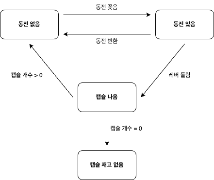
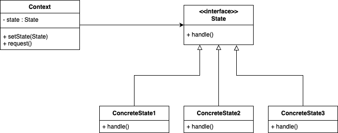

## State Pattern  

문방구 앞에 동전을 넣고 돌리면 장난감이 들어있는 캡슐 뽑기 기계를 생각해보자. 
이 기계를 소프트웨어적으로 표현하려면 아래와 같이 몇 가지 상태와 상황에 맞는 전이를 거치게 된다. 



상수 값으로 상태를 정의하고 코드로 표현한다면 아래와 같이 작성할 수 있다. 

``` java
public class NaiveToyCapsuleMachine {
	private State state;
	private int count;

	public NaiveToyCapsuleMachine() {
		count = 0;
		state = State.SOLD_OUT;
	}

	public NaiveToyCapsuleMachine(int count) {
		this.count = count;
		this.state = count > 0 ? State.NO_COIN : State.SOLD_OUT;
	}

	public void insertCoin() {
		if (state == State.HAS_COIN) {
			System.out.println("동전은 하나만 넣어주세요.");
		} else if (state == State.NO_COIN) {
			state = State.HAS_COIN;
			System.out.println("동전을 넣었습니다.");
		} else if (state == State.SOLD_OUT) {
			System.out.println("다 팔렸습니다.");
		} else if (state == State.SOLD) {
			System.out.println("캡슐이 나오는 중입니다.");
		}
	}

	public void ejectCoin() {
		if (state == State.HAS_COIN) {
			state = State.NO_COIN;
			System.out.println("동전을 반환합니다.");
		} else if (state == State.NO_COIN) {
			System.out.println("동전이 없습니다.");
		} else if (state == State.SOLD_OUT) {
			System.out.println("동전이 없습니다?");
		} else if (state == State.SOLD) {
			System.out.println("이미 뽑으셨어요.");
		}
	}

	public void turnCrank() {
		if (state == State.HAS_COIN) {
			state = State.SOLD;
			System.out.println("손잡이를 돌립니다.");
			dispense();
		} else if (state == State.NO_COIN) {
			System.out.println("동전이 없습니다.");
		} else if (state == State.SOLD_OUT) {
			System.out.println("매진 상태입니다.");
		} else if (state == State.SOLD) {
			System.out.println("손잡이는 한 번만 돌려주세요.");
		}
	}

	private void dispense() {
		if (state == State.HAS_COIN) {
			System.out.println("캡슐을 내보낼 수 없습니다.");
		} else if (state == State.NO_COIN) {
			System.out.println("동전이 없습니다.");
		} else if (state == State.SOLD_OUT) {
			System.out.println("다 팔렸습니다.");
		} else if (state == State.SOLD) {
			System.out.println("캡슐을 내보내는 중입니다.");

			if (--count == 0) {
				state = State.SOLD_OUT;
				System.out.println("다 털었습니다.");
			} else {
				state = State.NO_COIN;
			}
		}
	}

	private enum State {
		SOLD_OUT, NO_COIN, HAS_COIN, SOLD
	}
}
```

그러나 이 코드에는 상당히 많은 문제점이 있다. 
먼저, 다이어그램에서 나타나는 것과는 달리 상태와 관계 없이 모든 상태 전이 동작들을 수행할 수가 있다. 
모든 조합을 고려해야 되기 때문에 대충 훑어봐도 사실 읽기 쉬운 코드가 아니다. 
그리고 만약 신규 기능으로 인해 새로운 상태가 추가된다고 해보자. 
위 구조에서 상태가 하나 더 추가된다면 클래스 전면 수정이 불가피하다. 
위 코드는 OCP를 위반함은 물론이고 객체지향 디자인이라고 보기 힘들다. 
수정이 매우 어려운 코드이며 아마 버그 유발로 이어질 가능성이 굉장히 큰 것이다. 

문제가 되는 것은 내부 상태에 따라 모든 메서드를 if, eles로 제어한다는 것이다. 
여기서 상태를 별도의 클래스로 캡슐화하고, 이 상태를 나타내는 객체에게 행동을 위임함으로써 복잡한 조건 제어를 제거할 수 있다. 
이를 **상태 패턴**이라고하며 객체의 내부 상태가 바뀜에 따라 객체의 행동을 바꾸는 방식으로 동작하게 된다. 



해당 패턴을 적용하게 되면 각 상태의 동작들이 별도의 클래스로 구분되기에 가독성이 좋아진다. 
그리고 새로운 상태를 추가하더라도 기존의 컴포넌트들의 행동에 영향을 주지 않으므로 OCP를 만족할 수 있게 된다. 

### 패턴 적용

``` java
public interface State {
	void insertCoin();
	void ejectCoin();
	void turnCrank();
	void dispense();
}
```

``` java
public class HasCoinState implements State {
	private final ToyCapsuleMachine toyCapsuleMachine;

	public HasCoinState(ToyCapsuleMachine toyCapsuleMachine) {
		this.toyCapsuleMachine = toyCapsuleMachine;
	}

	@Override
	public void insertCoin() {
		System.out.println("동전은 하나만 넣어주세요.");
	}

	@Override
	public void ejectCoin() {
		System.out.println("동전을 반환합니다.");
		toyCapsuleMachine.setState(toyCapsuleMachine.getNoCoinState());
	}

	@Override
	public void turnCrank() {
		System.out.println("손잡이를 돌립니다.");
		toyCapsuleMachine.setState(toyCapsuleMachine.getSoldState());
	}

	@Override
	public void dispense() {
		throw new UnsupportedOperationException();
	}
}
```

``` java
public class NoCoinState implements State {
	private final ToyCapsuleMachine toyCapsuleMachine;

	public NoCoinState(ToyCapsuleMachine toyCapsuleMachine) {
		this.toyCapsuleMachine = toyCapsuleMachine;
	}

	@Override
	public void insertCoin() {
		System.out.println("동전을 넣었습니다.");
		toyCapsuleMachine.setState(toyCapsuleMachine.getHasCoinState());
	}

	@Override
	public void ejectCoin() {
		System.out.println("동전이 없습니다.");
	}

	@Override
	public void turnCrank() {
		System.out.println("동전이 없습니다.");
	}

	@Override
	public void dispense() {
		System.out.println("동전이 없습니다.");
	}
}
```

``` java
public class SoldState implements State {
	private final ToyCapsuleMachine toyCapsuleMachine;

	public SoldState(ToyCapsuleMachine toyCapsuleMachine) {
		this.toyCapsuleMachine = toyCapsuleMachine;
	}

	@Override
	public void insertCoin() {
		System.out.println("캡슐이 나오는 중입니다.");
	}

	@Override
	public void ejectCoin() {
		System.out.println("이미 뽑으셨어요.");
	}

	@Override
	public void turnCrank() {
		System.out.println("손잡이는 한 번만 돌려주세요.");
	}

	@Override
	public void dispense() {
		System.out.println("캡슐을 내보내는 중입니다.");
		toyCapsuleMachine.releaseCapsule();

		if (toyCapsuleMachine.getCount() > 0) {
			toyCapsuleMachine.setState(toyCapsuleMachine.getNoCoinState());
		} else {
			toyCapsuleMachine.setState(toyCapsuleMachine.getSoldOutState());
		}
	}
}
```

``` java
public class SoldOutState implements State {
	@Override
	public void insertCoin() {
		System.out.println("다 팔렸습니다.");
	}

	@Override
	public void ejectCoin() {
		throw new UnsupportedOperationException();
	}

	@Override
	public void turnCrank() {
		throw new UnsupportedOperationException();
	}

	@Override
	public void dispense() {
		throw new UnsupportedOperationException();
	}
}
```

``` java
public class ToyCapsuleMachine {
	private final State soldOutState;
	private final State noCoinState;
	private final State hasCoinState;
	private final State soldState;

	private State state;
	private int count;

	public ToyCapsuleMachine(int initCapsuleCount) {
		this.soldOutState = new SoldOutState();
		this.noCoinState = new NoCoinState(this);
		this.hasCoinState = new HasCoinState(this);
		this.soldState = new SoldState(this);

		this.count = initCapsuleCount;
		if (initCapsuleCount > 0) {
			state = noCoinState;
		} else {
			state = soldOutState;
		}
	}

	public void insertCoin() {
		state.insertCoin();
	}

	public void ejectCoin() {
		state.ejectCoin();
	}

	public void turnCrank() {
		state.turnCrank();
		state.dispense();
	}

	public void releaseCapsule() {
		if (count > 0) {
			count--;
		}
	}

	public State getSoldOutState() {
		return soldOutState;
	}

	public State getNoCoinState() {
		return noCoinState;
	}

	public State getHasCoinState() {
		return hasCoinState;
	}

	public State getSoldState() {
		return soldState;
	}

	public State getState() {
		return state;
	}

	public void setState(State state) {
		this.state = state;
	}

	public int getCount() {
		return count;
	}
}
```

<br/>

참고
- 에릭 프리먼, 엘리자베스 롭슨, 키이시 시에라, 버트 베이츠, 헤드 퍼스트 디자인 패턴, 서환수, 한빛미디어
- https://github.com/bethrobson/Head-First-Design-Patterns