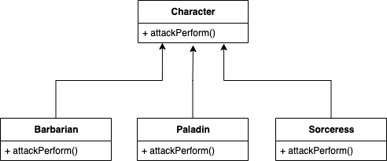
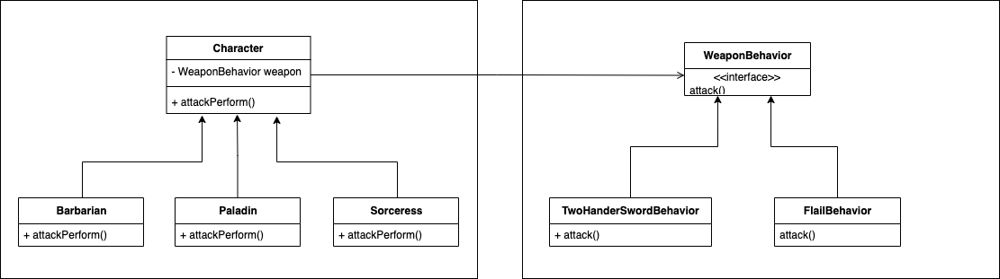
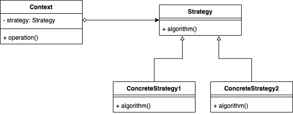

## Example 

게임 캐릭터를 표현하는 클래스를 구현한다고 해보자. 
캐릭터의 직업은 여러 개 존재하며 공격 행동을 할 수 있다. 
심플하게 생각해보면 ```Character```라는 부모 추상 클래스를 둠으로써 객체지향스럽게 구현할 수 있다. 



``` java
public abstract class Character {
	abstract void attackPerform();
}

------------------------------------------------

public class Barbarian extends Character{
	@Override
	void attackPerform() {
		System.out.println("양손검으로 얍");
	}
}

------------------------------------------------

public class Paladin extends Character{
	@Override
	void attackPerform() {
		System.out.println("도리깨로 얍");
	}
}
```

하지만 이처럼 상속을 통한 구현에는 2가지 문제점이 존재한다. 
첫 번째 문제점은 공격에 대한 코드 재사용을 전혀 할 수 없다는 점이다. 
양손검을 사용하는 다른 직업이 있을 수도 있는데 이를 구현하려면 바바리안에 구현한 메서드를 그대로 중복 구현해야 한다. 
그리고 양손검을 사용한 공격 행동 자체에 변경점이 생긴다면 양손검을 사용하는 모든 부분을 함께 수정해줘야 한다. 
만약 직업의 종류가 한 두개가 아니라면 이는 코드 관리에 문제가 생길 수 밖에 없다. 

두 번째 문제점은 공격 행동에 대한 동적 변경이 불가능하다는 것이다. 
직업과 상관 없이 다양한 무기를 장착할 수 있어야하는데 위 방식이라면 바바리안은 일단 생성되면 평생 양손검만 사용해야 한다는 것이다. 



``` java
public abstract class Character {
	WeaponBehavior weapon;

	public void attackPerform() {
		weapon.attack();
	}

	public void setWeapon(WeaponBehavior weapon) {
		this.weapon = weapon;
	}
}

------------------------------------------------

public class Barbarian extends Character {}

------------------------------------------------

public class Paladin extends Character {}
```

``` java
public interface WeaponBehavior {
	void attack();
}

------------------------------------------------

public class TwoHandedSwordBehavior implements WeaponBehavior{
	@Override
	public void attack() {
		System.out.println("양손검으로 얍");
	}
}

------------------------------------------------

public class FlailBehavior implements WeaponBehavior{
	@Override
	public void attack() {
		System.out.println("도리깨로 얍");
	}
}
```

``` java
Character barbarian = new Barbarian();
barbarian.setWeapon(new TwoHandedSwordBehavior());
barbarian.attackPerform(); // 양손검으로 얍
```

변경 가능성이 있다면 따로 뽑아서 캡슐화하는 것이 필요하다. 
이 처럼 공격 행동을 캐릭터 내부에서 구현하는 것이 아니라, 
```WeaponBehavior```를 필드로 가지고 공격 행동에 대한 정의를 외부에 위임한다. 
이런 식으로 두 클래스를 합치는 것을 **composition**을 이라고 한다. 

## Strategy Pattern  



위 방식의 구현이 바로 **전략 패턴**이다. 
여러 알고리즘을 정의하고 캡슐화해서, 
상호 교환 가능하도록 만드는 패턴으로써 Context에서 사용할 알고리즘을 클라이언트가 선택한다.  
```Character```는 변경되지 않는 부분으로써 **Context** 영역이 되고, 
```WeaponBehavior```은 변경되는 부분으로써 특수한 **Startegy**가 된다. 

전략 패턴을 사용함으로써 얻을 수 있는 장점은 전략이 변경되거나 새로운게 생기더라도 기존 코드의 변경이 없다는 점, 그리고 동적으로 전략을 변경할 수 있다는 점이다. 
단점으로는 클라이언트가 사용할 구체적인 전략에 대해서 알아야 한다는 것이다. 

자바에서도 이러한 전략 패턴이 많이 사용된다. 
대표적으로는 컬렉션을 정렬하는 ```Collections.sort``` 메서드이며, 
클라이언트가 선택한 임의의 전략인 ```Comparator```에 대해 정렬을 수행한다.   

<br/>

참고
- 에릭 프리먼, 엘리자베스 롭슨, 키이시 시에라, 버트 베이츠, 헤드 퍼스트 디자인 패턴, 서환수, 한빛미디어