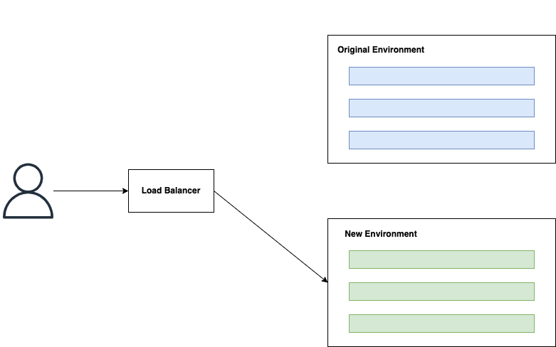
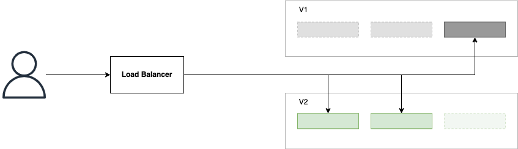
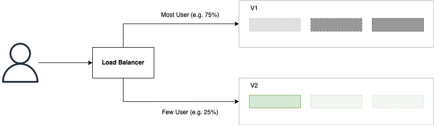

## 배포 전략

### Blue-Green Deployment

기존에 트래픽을 받아 서비스하고 있는 환경을 **Blue Environment**라고 한다. 
그리고 배포를 시작하면 기존의 환경과 완전히 동일하지만 새로운 애플리케이션의 버전을 담고 있는데 환경을 생성하는데 이를 **Green Environment**라고 한다. 

신규 버전의 배포 작업이 완료되면 이제 트래픽을 green으로 일괄 전환한다. 
트래픽 전환은 찰나에 이루어지기 때문에 사용자들은 다운타임 없이 서비스를 계속 사용할 수 있다. 

만약 신규 버전에 이슈가 있을 시 롤백이 상당히 용이한 구조이다. 
그냥 다시 트래픽을 blue로 전환하면 된다. 
그리고 신규 버전으로 서비스가 가능하다고 판단되면 그 때는 blue를 제거한다. 
단점으로는 배포 시 동일한 환경을 생성해야하기 때문에 리소스 소비가 2배가 되며, 구성하는데 있어 시간이 많이 소비될 수도 있다는 것이다. 

### Rolling Update Deployment

롤링 업데이트는 인스턴스가 여러 개인 경우에만 사용할 수 있다. 
전체 인스턴스를 일괄 업데이트하는 것이 아니라, 인스턴스를 하나씩 배포하는 방식이다. 
하나의 인스턴스가 배포 중이라해도 다른 인스턴스들이 트래픽을 받아 처리함으로 다운타임 없이 서비스를 계속 사용할 수 있다. 

배포 중에 사용자 트래픽은 기존 버전, 신규 버전 중 랜덤으로 라우팅 된다. 
따라서 두 버전이 호환될 필요가 있는데 예를 들어 기존 버전에서 저장하는 데이터를 신규 버전에서 읽고 처리할 수 있어야 한다. 
그리고 배포가 점진적으로 이루어지는 것처럼 롤백을 진행하면 신규 버전을 기존 버전으로 내리는 것이 점진적으로 수행된다. 
즉, 완전한 롤백을 하기 위해서는 시간이 걸린다는 것이다.

-------  

## 테스트 전략

### Shadow Deployment  

Shadow 배포는 블루-그린 배포에서 파생된 방식으로 볼 수 있다. 
이 패턴에서는 기존 환경(블루)에 들어오는 모든 트래픽이 미러링되어 새로운 환경(그린)에서도 실행된다. 
이렇게 하면 기존 운영 환경에 전혀 영향을 미치지 않으면서, 새로운 버전에서 트래픽, 버그에 대한 테스트를 동시에 진행할 수 있다. 
하지만 설정 자체가 매우 복잡하고 리소스를 상당히 소비하게 된다. 
또한 외부 서비스와 인터페이스되어 있는 경우 중복 요청이 발생하는 등 여러 고려해야할 상황이 존재한다. 

### Canary Deployment

Canary 배포는 롤링 업데이트에서 파생된 방식으로 볼 수 있다. 
일부 인스턴스에 새로운 버전을 배포하고, 특정 그룹 사용자의 트래픽만 할당한다. 
그리고 애플리케이션이 제대로 동작하는지 모니터링하며 버그가 발생하더라도 일부 사용자만 확인할 수 있다. 
만약 업데이트 버전이 안정적이라고 판단하면 roll-out하여 점점더 많은 사용자들에게 공개한다. 

 

참고  
- [애플리케이션 배포 및 테스트 전략](https://cloud.google.com/architecture/application-deployment-and-testing-strategies?hl=ko)
- [Deployment Strategies | Baeldung](https://www.baeldung.com/ops/deployment-strategies)