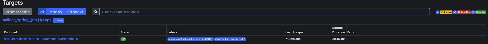
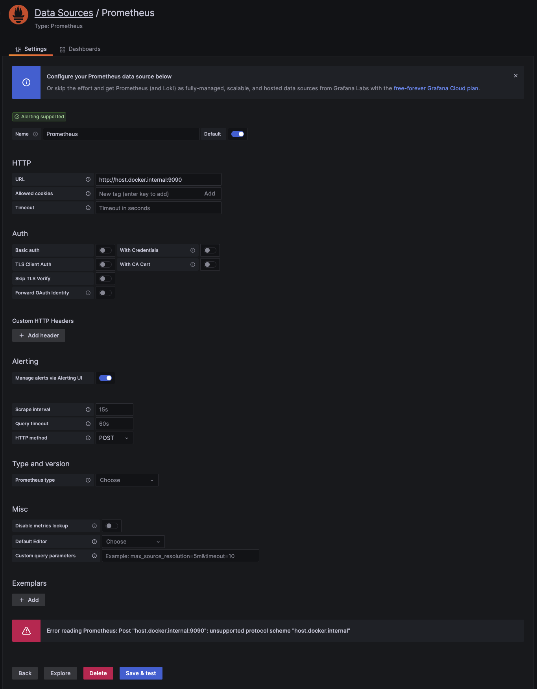
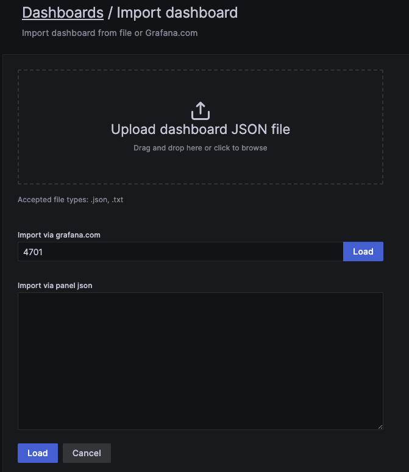
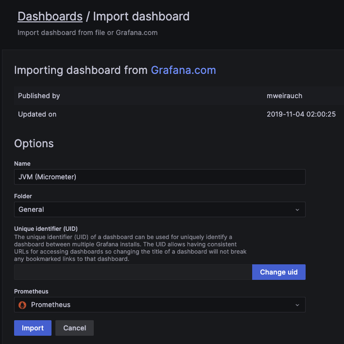
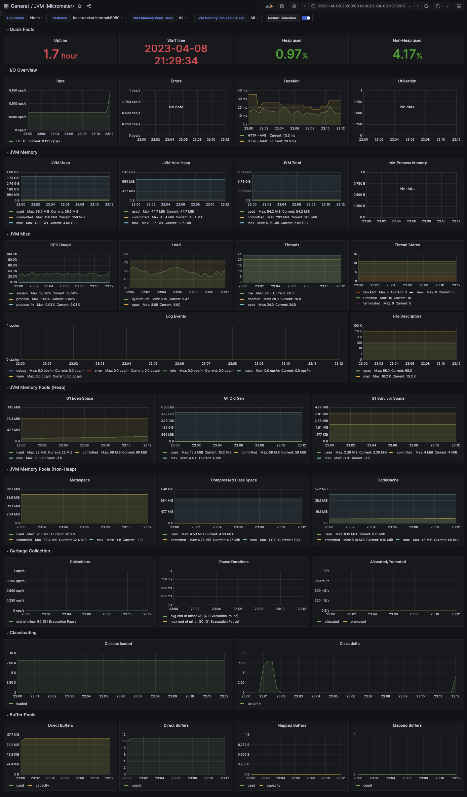

## Prometheus

프로메테우스는 모니터링을 위한 시스템이며, time series 데이터를 수집한다. 
수집되는 메트릭은 메트릭의 이름과 부가적인 key-value를 가지는 형태이다.  
기본적으로는 메트릭을 프로메테우스로 쏘는 것이 아니라, 애플리케이션에 특정 엔드포인트에 관련된 데이터를 노출하고 있으면 프로메테우스가 polling하여 가져가는 형태이다.


### 설치

프로메테우스를 기동하는데 있어서는 메트릭을 수집할 엔드포인트, 주기 등을 나타내는 파일을 전달해야 한다.

``` yml
# prometheus.yml

global:
    scrape_interval: 15s
    evaluation_interval: 15s

rule_files:
    # - "first.rules"
    # - "second.rules"

scrape_configs:
    - job_name: 'collect_spring_job'
      metrics_path: '/actuator/prometheus'
      static_configs:
      - targets: ['host.docker.internal:8080']
```

``` 
docker run -d \
-p 9090:9090 \
-v /Users/song/git/prometheus-settings/prometheus.yml:/etc/prometheus/prometheus.yml \
--add-host host.docker.internal:host-gateway \
--name prometheus prom/prometheus
```

> 테스트를 위해 container 내에서 머신의 localhost에 접근할 수 있도록 설정이 추가되었다.

지정한 대상을 정상적으로 스크랩하는 것을 확인할 수 있다.



### Metric Type

프로메테우스에서는 네 가지 메트릭 타입을 제공한다. 

#### Counter

Counter는 단순히 값이 누적하여 증가하는 형태를 가진다. 
처리한 요청의 수, 누적된 에러 수 등을 표현할 수 있으며 감소할 수 있는 지표에는 사용할 수 없다.

#### Gauge

Guage는 시간의 흐름에 따라 증감할 수 있는 형태를 가진다. 
메모리 사용량, 활성화된 스레드 수 등을 표현할 수 있다.

#### Summary

Summary는 **분포**에 대한 지표를 나타낸다. 
Summary는 값의 샘플 수, 합계, 평균, 분산, 표준편차 등을 가지는데, 이를 기반으로 Quantile 값을 계산할 수 있다. 
이는 값이 몇 분위에 있는지를 나타낸다. 
예를 들어, Quantile이 0.5라면 중간 값을 나타낸다. 
이 타입은 요청을 처리하는데 걸린 시간 등을 모니터링할 때 사용할 수 있다. 
평균적으로 요청을 처리하는데 얼마나 걸렸는지, 극단적인 케이스에서는 얼마나 걸렸는지 등을 파악할 수 있기 때문이다.

#### Histogram

Histogram도 Summary와 유사하며 분포에 대한 지표를 나타낸다. 
데이터를 **버킷**으로 구분하여 버킷마다 수가 얼마나되는지를 수집한다. 
예를 들면 이 타입은 요청의 크기를 구분하는데 사용할 수 있다. 
크기에 따라 버킷을 0 ~ 100KB, 100KB ~ 200KB와 같이 잡는다면 크기 별로 요청이 어떻게 들어왔는지 파악할 수 있다. 


## Spring 설정

스프링부트에서는 spring actuator를 사용해서 간단하게 기본적인 지표들을 모두 제공할 수 있다.

> [Spring Actuator](https://stalker5217.netlify.app/spring/actuator/)

``` groovy
// build.gradle
dependencies {
  implementation 'org.springframework.boot:spring-boot-starter-actuator'
  runtimeOnly 'io.micrometer:micrometer-registry-prometheus'
}
```

``` yml
# application.yml
management:
  endpoints:
    web:
      exposure:
        include: "prometheus"
```

위와 같이 설정을 잡고 '/actuator/pprometheus'에 접근해보면 아래와 같은 내용들을 확인할 수 있으며 이 엔드포인트를 프로메테우스가 수집하게 된다.

```
# HELP jvm_gc_overhead_percent An approximation of the percent of CPU time used by GC activities over the last lookback period or since monitoring began, whichever is shorter, in the range [0..1]
# TYPE jvm_gc_overhead_percent gauge
jvm_gc_overhead_percent 0.0
# HELP application_started_time_seconds Time taken (ms) to start the application
# TYPE application_started_time_seconds gauge
application_started_time_seconds{main_application_class="com.example.springmonitoring.SpringMonitoringApplication",} 2.893
# HELP executor_pool_max_threads The maximum allowed number of threads in the pool
# TYPE executor_pool_max_threads gauge
executor_pool_max_threads{name="applicationTaskExecutor",} 2.147483647E9
# HELP tomcat_sessions_rejected_sessions_total  
# TYPE tomcat_sessions_rejected_sessions_total counter
tomcat_sessions_rejected_sessions_total 0.0
# HELP jvm_buffer_memory_used_bytes An estimate of the memory that the Java virtual machine is using for this buffer pool
# TYPE jvm_buffer_memory_used_bytes gauge
...
```

### Custom Metrics

이제 커스텀한 메트릭을 생성하는 방법을 알아보자. 

#### Counter

몇 개의 요청이 발생했는지 Counter로 기록한다. 

``` java
@Slf4j
@RestController
@RequiredArgsConstructor
public class CounterController {
    private final Counter requestCounter = Metrics.counter("request_count");

    @GetMapping("/counter")
    public String counter() {
        requestCounter.increment();
      
        return "hello prometheus!";
    }
}
```

#### Gauge

```Executor```에서 현재 활성화된 스레드 수가 몇개인지 기록한다. 

``` java
@Slf4j
@RestController
@RequiredArgsConstructor
public class GaugeController {
    private final Executor executorForGauge;

    @GetMapping("/gauge")
    public String gauge() {
        for (int i = 0 ; i < 10 ; i++) {
            executorForGauge.execute(() -> {
                try {
                    log.info("sleep!");
                    Thread.sleep(1000L);
                } catch (InterruptedException e) {
                    throw new RuntimeException(e);
                }
            });
        }

        return "hello prometheus!";
    }
}
```

``` java
@Configuration
public class GaugeWorkerConfig {
	@Bean
	public Executor executorForGauge() {
		ThreadPoolTaskExecutor executor = new ThreadPoolTaskExecutor();

		executor.setCorePoolSize(5);
		executor.setMaxPoolSize(10);
		executor.setDaemon(true);
		executor.setThreadNamePrefix("gauge");
		executor.initialize();

		Metrics.gauge(
			"thread_gauge",
			executor,
			ThreadPoolTaskExecutor::getActiveCount
		);

		return executor;
	}
}
```

#### Summary

요청을 처리하는데 시간이 얼마나 걸리는지 측정한다. 

``` java
@Slf4j
@RestController
public class SummaryController {
	private static final DistributionSummary requestLatency = Metrics.summary("request_latency_1");

	private static final RandomGenerator randomGenerator = RandomGenerator.getDefault();

	@Timed(value = "request_latency_2")
	@GetMapping("/summary")
	public String summary() {
		Long startTime = System.currentTimeMillis();
		long sleep = randomGenerator.nextLong(3000);
		try {
			Thread.sleep(sleep);
		} catch (Exception e) {
			log.error("exception is occurred.", e);
		} finally {
			Long endTime = System.currentTimeMillis();
			requestLatency.record(endTime - startTime);
		}

		return "hello prometheus!";
	}
}
```

``` java
@Configuration
public class TimedConfig {
	// @Timed 사용을 위함
  @Bean
	public TimedAspect timedAspect(MeterRegistry registry) {
		return new TimedAspect(registry);
	}
}
```

> 예시들은 로우 레벨로 작성되었지만 ```@Timed``` 처럼 목적에 맞게 추상화된 다양한 메트릭 수집법을 제공한다.

## Grafana

그라파나는 메트릭 시각화 도구이다. 
프로메테우스에 의해 수집된 메트릭만이 아니라 여러 데이터소스를 사용할 수 있으며, 각 metrics에 threshold를 지정해서 슬랙이나 이메일 등으로 노티하는 기능 등을 제공하고 있다.

### 설치

```
docker run -d \
-p 3000:3000 \
--add-host host.docker.internal:host-gateway \
--name grafana grafana/grafana-oss
```

> 테스트를 위해 container 내에서 머신의 localhost에 접근할 수 있도록 설정이 추가되었다.

### 대시보드 생성

프로메테우스를 데이터 소스로 등록한다.



그리고 이 데이터 소스를 기반으로 대시보드를 등록한다. 
커스텀하게 만들 수도 있지만 기본적으로 제공하는 템플릿을 활용할 수도 있다. 




그러면 아래와 같이 그럴싸한 대시보드를 얻을 수 있다.



참고
- [Pronetheus documentation](https://prometheus.io/docs/introduction/overview/)
- [Grafana documentation](https://grafana.com/docs/grafana/latest/)