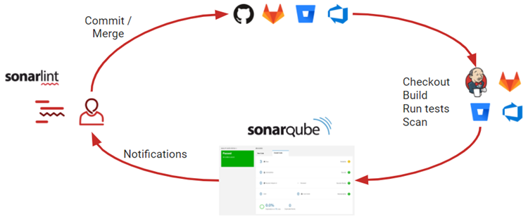
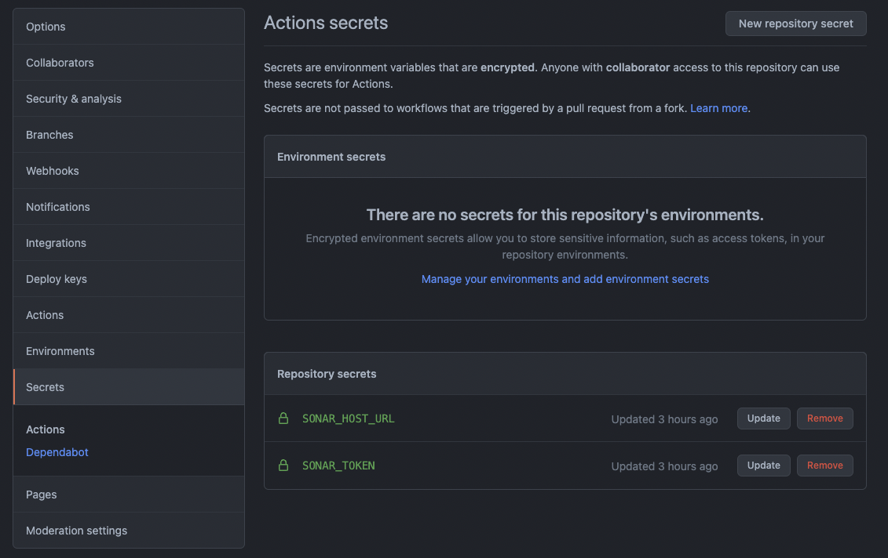
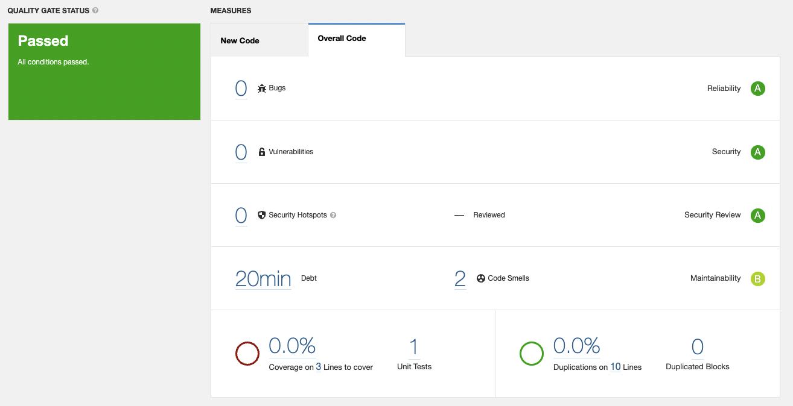

## Sonarqube  

소나큐브는 좀 더 깔끔하고 안전한 코드를 만들기 위한 코드 정적 분석 도구이다. 
소스 상에 존재하는 버그, 취약점, 코드 스멜, 코드 중복, 테스트 커버리지 등에 대한 리포트를 생성할 수 있다. 



### Sonarqube Set up 

소나큐브에 사용될 데이터베이스도 하나 필요하므로, docker-compose를 통해 구성한다. 
소나큐브를 구동하고 처음 접속하게되면 로그인 페이지로 이동하는데 이 때 초기 계정은 admin/admin이다. 

> 소나큐브를 구동하기 위해서는 최소 2GB, 그리고 1GB 정도의 여유 RAM이 필요하다. 치명적이게도 AWS EC2 프리티어로는 돌릴 수가 없다. 그래서 개인적인 용도로 가볍게 사용한다면 불필요한 서버 세팅 없이 [SonarCloud](https://sonarcloud.io/)를 사용해도 좋다. 

``` yml
# docker-compose.yml

version: "3"

services:
  sonarqube:
    image: sonarqube:community
    depends_on:
      - db
    environment:
      SONAR_JDBC_URL: jdbc:postgresql://db:5432/sonar
      SONAR_JDBC_USERNAME: sonar
      SONAR_JDBC_PASSWORD: sonar
    volumes:
      - sonarqube_data:/opt/sonarqube/data
      - sonarqube_extensions:/opt/sonarqube/extensions
      - sonarqube_logs:/opt/sonarqube/logs
    ports:
      - "9000:9000"

  db:
    image: postgres
    environment:
      POSTGRES_USER: sonar
      POSTGRES_PASSWORD: sonar
    volumes:
      - postgresql:/var/lib/postgresql
      - postgresql_data:/var/lib/postgresql/data

volumes:
  sonarqube_data:
  sonarqube_extensions:
  sonarqube_logs:
  postgresql:
  postgresql_data:

```

### github 연동  

소스 변경 발생 시 자동으로 리포트를 생성하기 위하여 CI/CD 파이프라인에 분석 작업을 포함 시킬 수 있다. 여기서는 gradle 기반 스프링부트 프로젝트를 분석하고, 그리고 ci툴로 github action을 사용한다고 가정한다. 

먼저, 소나큐브가 설정된 서버의 URL을 나타내는 ```SONAR_TOKEN```, 접근을 위한 인증 토큰을 나타내는 ```SONAR_URL``` 값을 생성해야 한다.



build.gradle에 소나큐브에서 생성한 프로젝트의 키 값을 프로퍼티로 추가한다. 

``` groovy
// build.gradle

plugins {
  id "org.sonarqube" version "3.3"
}

sonarqube {
  properties {
    property "sonar.projectKey", "sonarqube-settings"
  }
}
```

github action workflow는 main 브랜치에 push가 발생할 때마다 job을 실행하도록 작성한다.

``` yml
# /.github/workflows/sonar.yml
name: Build
on:
  push:
    branches:
      - main # or the name of your main branch

jobs:
  build:
    name: Build
    runs-on: ubuntu-latest
    steps:
      - uses: actions/checkout@v2
        with:
          fetch-depth: 0  # Shallow clones should be disabled for a better relevancy of analysis
      - name: Set up JDK 17
        uses: actions/setup-java@v1
        with:
          java-version: 17
      - name: Cache SonarQube packages
        uses: actions/cache@v1
        with:
          path: ~/.sonar/cache
          key: ${{ runner.os }}-sonar
          restore-keys: ${{ runner.os }}-sonar
      - name: Cache Gradle packages
        uses: actions/cache@v1
        with:
          path: ~/.gradle/caches
          key: ${{ runner.os }}-gradle-${{ hashFiles('**/*.gradle') }}
          restore-keys: ${{ runner.os }}-gradle
      - name: Build and analyze
        env:
          GITHUB_TOKEN: ${{ secrets.GITHUB_TOKEN }}  # Needed to get PR information, if any
          SONAR_TOKEN: ${{ secrets.SONAR_TOKEN }}
          SONAR_HOST_URL: ${{ secrets.SONAR_HOST_URL }}
        run: ./gradlew build sonarqube --info
```

> PR에 분석 결과가 나타나는 pull request decoration 기능은 유료 버전인 Developer Edition에서 부터 제공한다.



<br/>

참고
- [Sonarqube Documentation](https://docs.sonarqube.org/latest/)