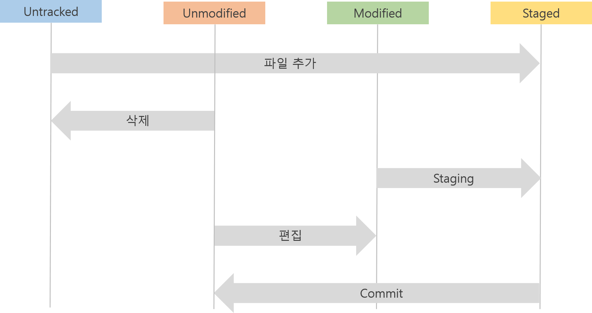

## 1. 저장소 생성

1. 버전 관리를 하고 있지 않은 새로운 디렉토리를 git으로 관리하고 싶은 경우
~~~
git init
~~~
위의 명령어는 '.git' 이라는 동작에 필요한 skeleton file을 생성한다.

2. 이미 존재하는 저장소를 복사하는 방법
~~~
git clone <url>
~~~

## 2. 파일 수정 및 저장

Working Directory의 file의 상태는 다음과 같이 나타낼 수 있다.

 
* Untracked
: version 관리 대상이 아님
* Tracked
  : version 관리 대상
  * Unmodified
    : 수정되지 않은 상태
  * Modified
    : 수정된 상태
  * Staged
    : Commit 대기 중인 상태

file의 상태를 확인하기 위한 명령어는 아래와 같다.
~~~
git status [-s || --short]
~~~

새롭게 생성되거나 Untracked 상태이거나, 수정된 파일들을 staged 상태로 만들면 commit을 진행할 수 있다.
~~~
git add <file_name>
git commit
~~~

 
※ 추적 관리를 하지 않는 파일  
일반적으로 로그 파일이나 자동 생성 파일 등은 추적 관리가 불필요할 수도 있다.
만약 그러한 파일들이 존재한다면 '.gitignore' 파일을 만들어 패턴을 지정하면 된다.

 

## 3. commit log

다음과 같은 명령어로 Commit History를 조회할 수 있다.
~~~
git log [-p] [-num]
~~~
 

## 4. rollback

여러 작업을 하다보면 수정, 스테이징, 커밋을 다시 이전 상태로 돌려야할 필요가 존재한다.

- 수정으로 Modified 상태인 파일을 복구하기

~~~
git checkout -- [file]  # 지정한 파일을 복구
git checkout commitHash # 저장소를 지정한 commit hash 상태로 복구
~~~

***※복구된 파일은 원래 상태로 되돌릴 수없으니 주의***
 
- Staged 상태로 올린 파일을 Unstaged로 내리기

~~~
git reset HEAD [file]
~~~
 
- commit 취소

~~~
git reset --soft HEAD^  # 가장 최근 commit을 하기 전 상태로 돌림
git reset HEAD^         # 가장 최근 commit, staging을 하기 이전 상태로 돌림
git reset --hard HEAD^  # 가장 최근 commit, staging, file 수정을 하기이전 상태로 돌림

git reset commitHash    # 지정한 commit hash 상태로 복구
git revert commitHash   # 현재 커밋 상태를 삭제하지 않고, 지정한 commit hash 상태로 복구
~~~
