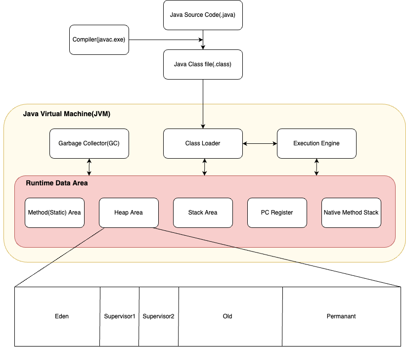
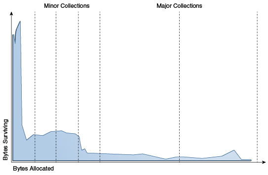

## 자바 메모리 구조 



<br/>

자바 프로그램은 컴파일러에 의해 ```.class``` 파일로 변환되어 JVM 위로 올라간다. 

**JVM**  

- Class Loader : .class 파일을 JVM 상으로 로드한다.  
- Execution Engine : Runtime Data Area에 있는 바이트 코드를 실행하는 역할을 한다.  
- Garbage Collector : 필요 없는 객체의 메모리를 정리한다.   
- Runtime Data Area : 현재 실행 중인 데이터가 메모리에 올라가 있다.  
	- Method(static) Area : 클래스의 인스턴스 변수, 메소드 등의 클래스 정보를 담고 있는 영역.
	- Heap Area : 동적으로 할당되는 변수를 담는 영역. new로 새로운 객체 생성 시 이 영역으로 들어간다.
	- Stack Area : 메소드 호출 시 발생하는 지역 변수, 매개 변수 등의 데이터가 포함된다.
	- PC Register : 현재 수행 중인 JVM의 명령 주소(Program Counter)를 갖는다.
	- Native Method Stack Area : 자바 이외의 네이티브 코드를 담는 영역이다.


## Garbage Collector  

자바의 garbage collectiond은 힙 메모리에서 사용중인 오브젝트와 사용하지 않는 오브젝트를 구분하여, 
미사용 오브젝트를 삭제하는 것을 말한다.  

 

위 그래프처럼 경험적으로 봤을 때, 대부분의 객체는 할당되고 짧은 시간 안에 사용불가능 상태가 되고 소수의 객체만이 유지된다. 
이러한 관점에서 만들어진지 얼마되지 않는 젊은 객체와 오래된 객체를 구분하여 두 종류의 GC를 수행한다. 

  

**Young Generation**  

1. 먼저 새롭게 생성되는 객체는 **Eden** 영역에 할당된다.
2. Eden이 가득차면 **Minor Garbage Collection**이 트리거되며, 마킹되어 살아남은 객체들은 Survivor1으로 이동한다. 그리고 Eden은 삭제된다.
3. 다시 Eden이 가득차면 Minor Garbage Collection이 트리거 된다. 이 과정에서 살아남은 객체들은 Survivor2로 이동한다. 그리고 기존에 Survivor1에 있던 객체들도 마킹되지 않은 객체는 삭제되고 살아남은 객체들은 aging 되어 Survivor2로 이동한다.
4. 위 과정을 통해 Eden에서 살아남는 객체와 Survivor에 존재하는 객체가 Survivor1과 Survivor2를 왔다 갔다한다. 그리고 이 중 특정 임계값을 넘도록 aging된 객체는 **Old Generation** 영역으로 이동한다. Old Generation 영역은 **Major Garbage Collectin**에 의해 관리된다. 

> Major GC는 Old Generation이 가득 찼을 때 트리거 된다.  

> Survivor 영역에서 오버플로우가 발생한다면 Eden 영역에서 살아남은 객체들은 Old Generation으로 바로 이동한다.


## Garbage Collector의 종류  

1. **The Serial GC**  

	말 그대로 직렬으로 싱글 코어로 GC를 수행한다. GC는 **Stop the World**라고 하여 GC 작업 중에는 다른 모든 스레드가 중지된다. 
	Java SE 5, 6의 예전에 구현된 GC이며 Major GC는 **Mark-Sweep-Compact** 알고리즘에 따라 동작한다.

	> Mark-Sweep-Compact
	> 1. Mark : 살아있는 즉, 레퍼런스가 존재하는 객체 식별
	> 2. Sweep : 마킹되지 않은 객체를 삭제
	> 3. Compact : 효율적인 메모리 공간 사용을 위해 살아남은 객체들을 한 곳으로 모으는 압축 과정

2. **The Parallel GC**

	Serial GC과 다른 점은 Minor GC를 수행할 때 병렬적으로 즉, 다중 스레드를 사용하여 처리함으로써 throughput을 끌어올렸다.
	Major GC의 실행의 알고리즘은 동일하다.

3. **The Concurrent Mark Sweep (CMS) Collector**  

	비교적 최신의 GC로 GC의 **Stop the World** 시간을 최소화하기 위한 알고리즘을 사용한다. 
	Initial Mark → Concurrent Mark → Remark → Concurrent Sweep 과정을 거친다.

	> 1. Initial Mark : Stop the World가 발생하는 구간이다. 살아 남는 객체를 탐색하는 과정에서 살아 남은 객체를 하나를 찾으면 종료한다. 매우 짧은 시간 동안 동작한다.
	> 2. Concurrent Mark : Stop the World 없이 스레드와 병렬적으로 1 단계에서 찾은 객체를 기반으로 추적하며 살아남은 객체를 식별한다.
	> 3. Remark : 2 단계에서 스레드가 동작하면서 변경된 사항을 체크한다.
	> 4. Concurrent Sweep : 마킹이 없는 객체들을 삭제한다.

<br/>

참고 
- [Java Garbage Collection Basics](https://www.oracle.com/webfolder/technetwork/tutorials/obe/java/gc01/index.html)
- [Java Platform, Standard Edition HotSpot Virtual Machine Garbage Collection Tuning Guide](https://docs.oracle.com/javase/8/docs/technotes/guides/vm/gctuning/generations.html)
- [Java의 GC는 어떻게 동작하나?](https://mirinae312.github.io/develop/2018/06/04/jvm_gc.html)