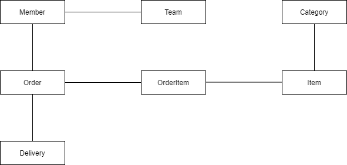

## SQL 중심 개발의 문제점  

데이터는 애플리케이션에서 가장 중요한 요소 중 하나이며, 현존하는 많은 애플리케이션들은 관계형 데이터베이스를 사용하고 있다. 

국내의 Enterprise Java Application에서는 SQL Mapper인 iBatis, MyBatis를 사용한 경우가 많다. 
순수 JDBC만을 사용해 구현하는 것에 비해서는 편리하지만, 결국 Entity 하나가 발생하면 거기에 대응하는 CRUD 쿼리를 모두 작성해야한다. 
그리고 이 Entity 명세에 변경이 발생하면 관련된 모든 쿼리를 수정해야하는 반복적인 작업이 발생이한다. 

이러한 문제점은 둘 사이의 지향점이 다르다는 것에서 발생한다. 
관계형 데이터베이스는 오직 데이터를 중심으로 구조화되어 있으며, 객체지향이 추구하는 바에 있어 패러다임의 불일치가 발생한다. 

1. 상속  

관계형 데이터베이스에는 객체지향에서의 '상속' 개념이 존재하지 않는다. 
상속 관계는 객체 지향에서는 다형성 등과 연관되어 매우 유용한 도구이지만, 이를 관계형 데이터베이스에 표현해야하면 골치 아파진다. 

예를 들어, ```Item```이라는 부모 객체가 있고, 이를 상속하는 3개의 자식 객체 ```Album```, ```Movie```, ```Book``` 자식 객체가 존재한다고 하자. 
논리적 데이터 모델링에서 나타나는 Super, Sub Type 관계를 통해 이를 표현하면 Item, Album, Mobie, Book 4개의 테이블이 나타난다. 
이러면 이에 대한 CRUD 쿼리 복잡도는 더욱 증가한다. 
값을 저장하기 위해서는 자식 객체의 타입을 구분해서 ```Item``` 객체의 속성 값을 추출해서 Item 테이블에 삽입하고, 또 자식의 속성 값을 따로 추출해서 각 테이블에 저장해야한다. 
값을 읽기 위해서는 Item 테이블을 기반으로, 적절한 테이블을 찾아 JOIN으로 가져와야 한다. 

2. 연관 관계  

객체지향에서는 객체 사이의 연관 관계를 표현하기 위해서 레퍼런스를 사용하며, 
관계형 데이터베이스에서는 테이블 사이의 연관 관계를 표현하기 위해 외래키를 사용한다. 

어떤 테이블의 FK를 객체 필드로 그대로 사용하는 것은 레퍼런스를 통해 연관된 객체의 참조를 찾는 이점을 포기해야하고, 
FK가 실제 가리키는 객체를 레퍼런스로 갖도록 설계한다면 FK를 레퍼런스로 변환하는 작업을 개발자가 하나하나 구현해야 한다. 

3. 객체 그래프 탐색  

  

객체 연관 관계가 위 그림과 같다고 하자. 
SQL을 직접 다루면 이런 연관 관계들이 작성한 SQL만큼만 표현된다. 
여러 비즈니스 로직에서 ```Member```를 조회한다고 가정하자. 
어떤 비즈니스에서는 팀 정보가 부가적으로 필요할 수도 있고, 어떤 비즈니스에서는 주문 목록 정보가 추가로 필요할 수 있다. 

이를 범용적으로 사용할 수 있게 ```Member```를 조회하는 쿼리 하나에 join으로 모든 연관 관계를 줄줄이 연결하기에는 너무 오버헤드가 크다. 
그렇다면 해결책은 결국 각 비즈니스의 필요에 맞게 ```getMemberWithTeam```, ```getMemberWithOrder``` 등의 쿼리를 개발자가 매번 작성을 해줘야 한다. 

**결론**  

SQL을 직접 사용한다고해서 어떤 기능의 구현이 불가능한 것은 아니다. 
하지만 이처럼 객체지향과 데이터베이스의 패러다임 불일치로 인해 중간에 개발자가 고생해야하는 부분이 너무 많다. 
객체지향적 설계를 하면 할 수록 그 비용은 커지며, 결국 객체 모델링을 포기하고 많은 프로젝트가 데이터 중심의 모델로 변해간다.  

## JPA  

JPA는 **Java Persistence API**의 약자이며 자바 ORM의 표준 기술 스펙이며, 구현체는 주로 하이버네이트가 많이 사용된다. 
ORM은 **Object-Relational Mapping**의 약자인데 객체와 데이터베이스 사이에서 매핑 역할을 해주어 앞 선 불일치 문제를 해결해준다.
결론적으로 데이터베이스는 데이터베이스대로 설계하고 객체는 객체대로 설계하면 되는 것이다. 

``` java
jpa.persist(member); // 저장
jpa.find(memberId); // 조회
```

상속이나 연관 관계를 표현하기 위해 복잡한 JOIN 쿼리나 여러 개의 INSERT를 작성해야 하는 것을 간단한 메서드로 추상화 해준다. 
그리고 객체 그래프 탐색에서 나타났던 문제점은 지연 로딩을 통해 해결한다. 
이는 실제 객체를 사용하는 시점까지 데이터베이스 조회를 미루는 방법이다.

``` java
Member member = jpa.find(Member.class, memberId);

Order order = member.getOrder();
order.getOrderDate(); // 실제 Order 객체를 사용하는 시점에 비로소 관련 데이터를 가져오는 쿼리가 발생
```

JPA는 러닝커브가 높은 편이다. 하지만 잘 익히고 나면 생산성, 유지보수에 큰 도움이 될 것이다. 

<br/>

참고  
- 김영한, 자바 ORM 표준 JPA 프로그래밍, 에이콘