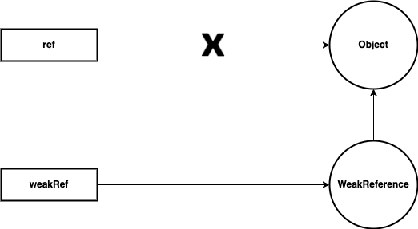

## Reference와 GC

우리가 일반적으로 작성하는 코드에서 레퍼런스는 ```Object ref = new Object()```와 같이 할당을 통해 관계가 형성된다. 
이처럼 대입 연산자를 통해 만들어지는 레퍼런스를 **Strong Reference**라고 하며, 이 강한 레퍼런스가 있는한 객체는 절대 GC의 대상이 될 수 없다. 
그리고 모종의 이유로 이런 레퍼런스가 끊겼을 때 비로소 GC에 의해 객체가 수거된다. 

``` java
@Test
@DisplayName("Strong reference")
void strongReference() {
  // Object는 gc의 대상이 될 수 없음
  Object ref = new Object();
  System.gc();
  
  // 레퍼런스를 잃는다면 gc의 대상이 됨
  ref = null;
  System.gc();
}
```

아마 절대 다수가 이런 Strong Reference로 구성된다. 
하지만 특수한 경우 사용할 수 있는 레퍼런스를 ```java.lang.ref``` 패키지에서 제공하고 있으며, 이는 개발자가 제한적으로 GC와 직접 상호작용할 수 있는 수단을 제공한다.

### Weak Reference

``` java
@Test
@DisplayName("Weak reference")
void weakReference() {
  Object ref = new Object();
  WeakReference<Object> weakRef = new WeakReference<>(ref);

  ref = null;

  System.gc();
  Thread.sleep(3000L);

  assertThat(weakRef.get()).isNull();
}
```

위 코드와 같이 ```ref```를 가리키는 ```WeakReference``` 객체를 생성하고 기존 강한 레퍼런스를 제거한다. 
그러면 ```Object``` 인스턴스는 ```WeakReference``` 내부에서 가리키는 레퍼런스만을 가지게 되는데 이 상황에서 ```Object``` 인스턴스는 **Weak Reachable** 상태라고 한다. 



이 상태에서 GC가 트리거된다면 GC는 ```Object```는 수거해버린다. 
따라서 위 테스트 코드는 명시적인 gc 호출이 즉시 실행됐을 경우 성공한다. 
이를 사용하는 대표적인 기능에는 ```WeakHashMap```이 있다. 
이 자료구조 같은 경우에는 키에 해당하는 인스턴스가 어딘가에서 참조되고 있을 때만 엔트리가 유지되며 키에 대한 레퍼런스를 잃으면 gc의 대상이 된다.

``` java
@Test
@DisplayName("WeakHashMap")
void weakHashMap() throws InterruptedException {
  WeakHashMap<Key, String> weakHashMap = new WeakHashMap<>();

  Key key = new Key("my key");
  weakHashMap.put(key, "my value");
  assertThat(weakHashMap).hasSize(1);

  key = null;
  System.gc();
  Thread.sleep(3000L);
  assertThat(weakHashMap).hasSize(0);
}

private static class Key {
  private String key;

  public Key(String key) {
    this.key = key;
  }
}
```

### Soft Reference

``` java
@Test
@DisplayName("Soft Reference")
void softReference() throws InterruptedException {
  Object ref = new Object();
  SoftReference<Object> softRef = new SoftReference<>(ref);

  ref = null;

  System.gc();
  Thread.sleep(3000L);

  assertThat(softRef.get()).isNotNull();
}
```


객체의 레퍼런스가 ```SoftReference```에 의한 참조만 존재하는 경우인 Soft Reachable 상태도 마찬가지로 GC의 대상이다. 
그러나 위 테스트는 GC 이 후에도 여전히 참조를 가지고 있는데 이는 GC의 시점이 좀 다르다. 
```SoftReference``` 같은 경우에는 실제 메모리가 부족하다고 판단될 때 수거되며 그 전까지 객체는 수거되지 않는다. 

### Phantom Reference

``` java
@Test
@DisplayName("Phantom Reference")
void phantomReference() throws InterruptedException {
  Object ref = new Object();
  ReferenceQueue<Object> referenceQueue = new ReferenceQueue<>();
  PhantomReference<Object> phantomRef = new PhantomReference<>(ref, referenceQueue);

  ref = null;

  System.gc();
  Thread.sleep(5000L);

  assertThat(phantomRef.refersTo(null)).isTrue();
  assertThat(referenceQueue.poll()).isEqualTo(phantomRef);
}
```

```PhantomReference```는 성격이 조금 다르다. 
앞서 ```ReferenceQueue```에 대한 정의가 필요하다. 
레퍼런스 객체 내에서 참조하고 있는 객체가 GC에 의해 수거되면, 레퍼런스 객체들이 해당 큐에 삽입되게 된다. 
```SoftReference```와 ```WeakReference```에서는 이 큐에 대한 지정을 할 수 있다. 
그러나 어디까지나 선택적이며 사용하지 않을 수도 있는 반면, ```PhantomReference```에서는 강제되어 반드시 사용해야 선언할 수 있다. 

동작도 좀 다른데 ```SoftReference```와 ```WeakReference```는 GC에 의해 참조하고 있는 객체가 수거되면 바로 ```null```로 변환되지만, ```PhantomReference``` 같은 경우에는 객체를 Phantomly Reachable 상태로 만들게 된다. 
이 타입만 성격이 다른 것은 GC의 처리 순서와 관련이 있다.

1. Strong Reachable
2. Soft Reachable
3. Weak Reachable
4. ```finalize``` 수행
5. Phantom Reachable
6. 메모리 회수

위와 같은 순서로 처리되기 때문에 ```PhantomReference```를 사용하는 경우에는 ```finalize```가 수행되고 후처리 작업을 진행할 수 있다.
이처럼 ```PhantomReference``` 같은 경우에는 메모리에서 삭제되는 시점에 특정한 작업을 하기 위한 목적이 강하다.

> ```System.gc()```를 호출한다고 해서 gc가 즉시 트리거됨은 보장 못하므로 위 테스트들은 실패할 수 있다.

<br/>

참고
- [Java Reference와 GC](https://d2.naver.com/helloworld/329631)
- [Soft, Weak and Phantom references in Java](http://antkorwin.com/concurrency/weakreference.html)