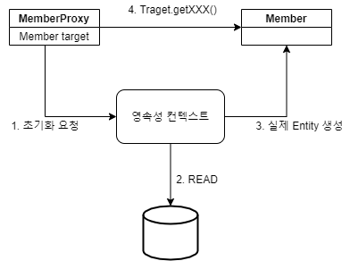

## Proxy  

``` java
@Test
public void proxyTest() {
    ...

    Member member1 = entityManager.find(Member.class, 1L);
    Member member2 = entityManager.getReference(Member.class, 2L);
    System.out.println("run~");

    System.out.println(member1.getName());
    System.out.println(member2.getName());
    ...
}
```

```EntityManager```를 통해 하나의 엔티티를 조회할 때는 ```find()``` 또는 ```getReference()```를 사용할 수 있다. 
둘의 차이점은 실제 SELECT 쿼리가 발생하는 시점이다. 
일단 찾으려는 객체가 영속성 컨텍스트에 존재하지 않는다고 가정한다. 
```find()``` 같은 경우에는 메서드를 호출한 그 순간에 쿼리가 발생하며, 
```getReference()```는 실제 객체의 내용에 접근하는 시점에 발생한다. 

이 때, **프록시** 객체가 사용된다. 
실제 엔티티 생성과 데이터베이스 쿼리는 ```getReference```를 호출하는 시점에 발생하지 않고, 
이 때는 JPA 내부에서 ```Member```를 상속하여 만든 프록시 객체만 만들어 반환해준다. 
그리고 이 객체는 진짜 엔티티에 대한 참조를 가지고 있다. 
그리고 실제 접근이 일어날 때 아래와 같은 동작을 한다.  



프록시 객체는 아래와 같은 특징을 가진다.

- 처음 접근할 때 한 번만 초기화 된다. 
- 실제 엔티티가 초기화되었다고 갑자기 프록시 객체가 실제 엔티티 객체로 바뀌는건 아니고 엔티티에 객체에 대한 참조가 생성될 뿐이다. 
- 프록시 객체와 실제 엔티티 객체의 타입은 다르므로 타입 비교는 ```instace of``` 연산으로 이루어져야 한다.
- 만약 조회하고자 하는 엔티티가 이미 영속성 컨텍스트에서 관리되고 있다면 프록시 객체가 아니라 실제 엔티티 객체를 반환한다. 
- 초기화 과정은 영속성 컨텍스트가 필요하며, 준영속 상태에서의 초기화는 예외를 발생시킨다. 

## 즉시 로딩, 지연 로딩  

실제 데이터들 사이에는 연관 관계가 반드시 존재할 수 밖에 없다. 
만약 ```Member``` 객체가 있을 때, 멤버가 속한 ```Team``` 팀 등의 엔티티와 관계를 맺을 것이다. 
이 때 ```Member```를 조회할 때 연관된 엔티티의 내용을 **즉시 가져오는 로딩 전략**이 있고, 
위의 프록시 개념을 사용하여  **실제 사용이 일어날 때 가져오는 지연 로딩 전략**이 존재한다. 

``` java
@Entity
@Getter @Setter
@NoArgsConstructor
public class Member {
    ...

    // @ManyToOne(fetch = FetchType.EAGER) // 즉시 로딩
    // @ManyToOne(fetch = FetchType.LAZY) // 지연 로딩
    @ManyToOne // 기본 전략은 즉시 로딩
    @JoinColumn(name = "TEAM_ID")
    private Team team;

    ...
}
```

기본적으로 연관된 하나의 엔티티를 가져오는 ```@ManyToOne```, ```@OneToOne```의 디폴트 전략은 EAGER이고, 
연관된 여러 개의 엔티티를 컬렉션으로 가져오는 ```@OneToMany```, ```@ManyToMany```의 디폴트 전략은 LAZY이다.
연관된 엔티티가 여러 개(컬렉션)으로 표현된다면 이들을 모두 한 번에 로드하는 것은 오버헤드가 크기 때문이다.  

데이터의 수, 그리고 비즈니스 로직을 고려하여 적절하게 전략을 선택하면 가장 좋겠지만 즉시 로딩 전략의 사용은 발생할 쿼리가 거의 예측 불가능하며, 사실 상 실무에서는 사용하는 경우는 없다고 한다. 

## 영속성 전이  

``` java
@Entity
@Table(name = "ORDERS")
@Getter @Setter
@NoArgsConstructor
public class Order {
    ...
    
    @OneToOne(fetch = FetchType.LAZY, cascade = CascadeType.PERSIST)
    @JoinColumn(name = "DELIVERY_ID")
    private Delivery delivery;

    ...
}
```

JPA에서 엔티티를 저장하기 위해서는 관련된 모든 엔티티가 영속 상태여야 한다. 
Order 엔티티를 생성하고 이에 연관된 Delivery 엔티티가 있을 때는 둘 다 각각 영속 상태로 등록해줘야 함을 의미한다. 
Casecade 옵션은 어떤 엔티티를 영속 상태로 만들 때, 이에 연관된 엔티티 또한 자동으로 영속 상태로 만들어 주는 옵션이다. 그리고 상황에 따른 Cascade 옵션은 아래와 같다. 

``` java
public enum CascadeType {
    ALL,
    PERSIST,
    MERGE,
    REMOVE,
    REFRESH,
    DETACH;

    private CascadeType() {
    }
}
```

## 고아 객체  

``` java
@Entity
@Table(name = "ORDERS")
@Getter @Setter
@NoArgsConstructor
public class Order {
    ...
    
    @OneToOne(fetch = FetchType.LAZY, orphanRemoval = true)
    @JoinColumn(name = "DELIVERY_ID")
    private Delivery delivery;

    ...
}
```

부모로부터의 레퍼런스가 끊어진 것을 **고아 객체**라고 한다.
위 코드에서 Order 엔티티에서 Delivery 엔티티의 참조를 끊어버리면 Delivery 엔티티가 자동으로 삭제된다. 

이 옵션은 주의하여 사용해야 한다. 
참조가 제거된 엔티티는 다른 곳에서도 참조하지 않는 것으로 간주한다. 
따라서 이 기능은 자식 엔티티가 여러 곳에서 참조하는 경우에는 절대 사용해서는 안되고, 
엔티티 하나가 홀로 보유하는 엔티티에만 사용해야 한다. 
이런 이유로 ```@OneToOne```, ```OneToMany```만 이 옵션을 제공한다. 

또한, 부모 엔티티를 아예 삭제하는 경우에도 자식 엔티티는 고아가 된다. 
이 때도 자식 엔티티가 삭제되며 결국 ```CascadeType.REMOVE```를 설정한 것과 동일하게 동작한다. 

<br/>

참고  
- 김영한, 자바 ORM 표준 JPA 프로그래밍, 에이콘