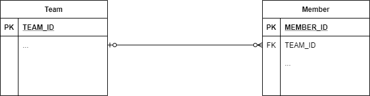
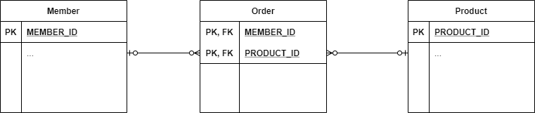

## Entity 연관 관계  

데이터 모델링에서 연관 관계는 빠질 수 없다. 



예를 들어 다음과 같은 모델은 아래 처럼 JPA Entity로 나타낼 수 있다. 

``` java
@Entity
@Getter @Setter
@NoArgsConstructor
public class Member {
    @Id @GeneratedValue
    @Column(name = "TEAM_ID")
    private Long id;
}
```

``` java
@Entity
@Getter @Setter
@NoArgsConstructor
public class Member {
    @Id @GeneratedValue
    @Column(name = "MEMBER_ID")
    private Long id;

    @Column(name = "TEAM_ID")
    private Long teamId;
}
```

하지만 이는 관계형 데이터베이스에서 FK를 기반으로하는 연관 관계를 그대로 코드로 옮긴 것일 뿐이다. 
전혀 자바의 객체지향적 특성을 살리지 못했으며, ```Member```를 통해 ```Team``` 정보를 참조하기 위해서는 teamId를 가지고 데이터베이스 조회를 한 번 더 해야한다. 
객체지향의 특성을 살리기 위해서는 아래와 같은 구조가 필요하다. 

``` java
@Entity
@Getter @Setter
@NoArgsConstructor
public class Member {
    @Id @GeneratedValue
    @Column(name = "MEMBER_ID")
    private Long id;

    // Object Oriented.
    @ManyToOne
    @JoinColumn(name = "TEAM_ID")
    private Team team;
}
```

### 방향에 따른 연관 관계  

두 엔티티 A, B에서 'A -> B' 또는 'B -> A' 처럼 한 쪽에서만 상대를 참조 가능한 것을 **단방향 관계**라고 하며, 
'A <-> B'와 같이 서로 상대를 참조 가능한 것을 **양방향 관계**라고 한다. 

기본적으로 FK를 이용하면 하면 항상 서로에 대한 내용을 참조를 할 수 있다. 
하지만 객체지향에서는 이 관계를 레퍼런스로 표현하기 때문에 기본적으로는 단방향 관계일 수 밖에 없다. 
따라서, JPA에서는 단방향 관계 두 개로 양방향 관계를 표현한다. 

``` java
@Entity
@Getter @Setter
@NoArgsConstructor
public class Member {
    @Id @GeneratedValue
    @Column(name = "MEMBER_ID")
    private Long id;

    @ManyToOne
    @JoinColumn(name = "TEAM_ID")
    private Team team;
}
```

``` java
@Entity
@Getter @Setter
@NoArgsConstructor
public class Team {
    @Id @GeneratedValue
    @Column(name = "TEAM_ID")
    private Long id;

    @OneToMany(mappedBy = "team")
    private List<Member> members = new ArrayList<>();
}
```

그런데 여기서 모호함이 발생할 수 있다. 
위와 같이 객체로 표현할 때에는 멤버에서 팀을 참조하는 레퍼런스와 팀에서 멤버를 참조하는 레퍼런스 두 가지가 존재한다. 
만약 어떤 회원의 팀 정보를 수정하고자 할 때는 ```Member```의 ```team```을 수정해야할까, ```Team```의 ```members```에서 수정을 해야할까?
이를 해결하기 위해서는 둘 중 하나를 **연관관계의 주인**으로 지정하는 것이 필요하다. 
주인은 실제 FK를 포함하는 테이블을 표현하는 객체로 선택하는 것이 좋다. 

주인이 아니고 종속되는 객체에서는 ```mappedBy``` 속성을 지정한다. 
그리고 주인이 정해지고 나면 주인만이 FK를 수정할 수 있고 반대쪽은 READ-ONLY가 된다. 
실제 데이터를 수정하기 위해서는 반드시 주인쪽에서 값을 수정해야함을 기억하자. 

``` java
@Test
public void saveTest() {
    Member m = new Member();
    entityManager.persist(m);

    Team t = new Team();
    entityManager.persist(t);
    
    m.setTeam(t); // 이게 없으면 FK의 변경 내용이 저장되지 않음
    t.getMembers().add(m);

    entityTransaction.commit();
}
```

그렇다면 주인 쪽의 데이터만 수정하면 되는 것일까? 
이렇게 양방향 관계가 이루어진 상태에서는 JPA에 의해 사용되는 엔티티라는 측면 외에도, 테스팅 등에 사용할 것을 대비한 순수 자바 객체 측면도 고려할 필요가 있다.
그러면 당연히 둘 다 수정해주는 것이 좋다. 
이 때는 별도의 getter, setter를 통한 수정이 아니라 엔티티 내부에 수정을 위한 메서드를 별도로 두는 것이 좋다. 

``` java
@Entity
@Getter @Setter
@NoArgsConstructor
public class Member {
    @Id @GeneratedValue
    @Column(name = "MEMBER_ID")
    private Long id;

    @ManyToOne
    @JoinColumn(name = "TEAM_ID")
    private Team team;

    public void changeTeam(Team team) {
        if(this.team != null) {
            this.team.getMembers().remove(this);
        }

        this.team = team;
        team.getMembers().add(this);
    }
}
```

### 다중성에 따른 연관 관계  

#### 다대일, 일대다 관계  

Team의 입장에서는 하나의 팀에 여러 명의 멤버가 존재할 수 있고, Member 입장에서는 하나의 멤버는 최대 하나의 팀까지 가질 수 있는 구조이다. 
이 때 위의 예시처럼 Member를 연관 관계의 주인으로 표현하는 것이 다대일 관계를 표현하는 것이다. 

``` java
@Entity
@Getter @Setter
@NoArgsConstructor
public class Member {
    @Id @GeneratedValue
    @Column(name = "MEMBER_ID")
    private Long id;

    @ManyToOne
    @JoinColumn(name = "TEAM_ID")
    private Team team;
}
```

``` java
@Entity
@Getter @Setter
@NoArgsConstructor
public class Team {
    @Id @GeneratedValue
    @Column(name = "TEAM_ID")
    private Long id;

    @OneToMany(mappedBy = "team")
    private List<Member> members = new ArrayList<>();
}
```

둘 사이의 관계를 나타내는 FK가 Member에 존재하기 때문에 대다수의 케이스에서는 위처럼 구현하는 것이 맞다. 
하지만 연관 관계의 주인을 반대로하여 일대다 관계를 표현할 수도 있다.  

``` java
@Entity
@Getter @Setter
@NoArgsConstructor
public class Team {
    @Id @GeneratedValue
    @Column(name = "TEAM_ID")
    private Long id;

    @OneToMany
    @JoinColumn(name = "TEAM_ID")
    private List<Member> members = new ArrayList<>();
}
```

이렇게 구현되면 ```members``` 리스트를 수정하면 MEMBER 테이블이 업데이트된다. 
그러나 이는 양방향 구현을 할 수 없다. 
일대일 관계가 아니라, 다대일 관계에서는 테이블 설계상 다수 쪽에 FK가 존재할 수 밖에 없고 양방향 관계라면 FK가 있는 쪽이 주도권을 가져야하기 때문이다. 
그렇기에 ```@ManyToOne``` 에는 ```mappedBy``` 속성이 아예 존재하지 않는다. 

#### 일대일 관계  

어떤 Member가 하나의 Locker를 사용하고, Locker도 한 명의 Member에만 할당된다면 이는 일대일 관계이다. 
주의할 점은 일대다 관계에서는 FK가 존재하지 않는 테이블에서의 단방향 참조가 구현 가능하지만, 일대일 관계에서는 지원하지 않는다는 점이다.

``` java
@Entity
@Getter @Setter
@NoArgsConstructor
public class Member {
    @Id @GeneratedValue
    @Column(name = "MEMBER_ID")
    private Long id;

    @OneToOne
    @JoinColumn(name = "LOCKER_ID")
    private Locker locker;
}
```

``` java
@Entity
@Getter @Setter
@NoArgsConstructor
public class Locker {
    @Id @GeneratedValue
    @Column(name = "LOCKER_ID")
    private Long id;

    @OneToMany(mappedBy = "locker")
    private Member member;
}
```

#### 다대다 관계  

Member와 Product 테이블이 존재하고, 이들을 참조하여 '상품 주문'을 정보를 만든다고 가정하자. 
하나의 Member는 여러 Product를 주문할 수 있고, 하나의 Product는 또 여러 Member에 의해 주문될 수 있으므로 이는 다대다 관계에 속한다. 하지만 관계형 데이터베이스에서는 이런 다대다 관계를 표현할 수 없기에 중간 테이블을 통해 이를 표현한다. 



하지만 JPA. 즉, 객체 관점에서는 이러한 중간 테이블 없이 바로 다대다 관계를 표현할 수 있다. 

``` java
@Entity
@Getter @Setter
@NoArgsConstructor
public class Member {
    @Id @GeneratedValue
    @Column(name = "MEMBER_ID")
    private Long id;

    @ManyToMany
    @JoinTable(
        name = "Order", 
        joinColumns = @JoinColumn("MEMBER_ID"), 
        inverseJoinColumn = @JoinColumn(name = "PRODUCT_ID")
    )
    private List<Product> orderProducts = new ArrayList<>();
}
```

``` java
@Entity
@Getter @Setter
@NoArgsConstructor
public class Product {
    @Id @GeneratedValue
    @Column(name = "PRODUCT_ID")
    private Long id;

    @OneToMany(mappedBy = "orderProducts")
    private List<Member> orderMembers = new ArrayList<>();
}
```

**하지만 이러한 다대다 관계는 웬만해서는 사용하지 않는 것이 좋다.** 
실제 주문 정보가 만들어진다고하면 주문 일시나 부가적인 정보가 반드시 필요하다. 
하지만 위 처럼 다대다 관계로 만들면 Order 테이블에는 Member ID, Product ID 이외의 정보를 추가하는 것이 구조적으로 불가능하다.  
또한 실제 테이블 모델에서는 중간 테이블이 존재하는데, 코드 상에서는 그렇지 않아 실제 테이블 구조와 발생 쿼리를 예측하기 어렵다는 점도 있다.
따라서 **실제 중간 테이블을 나타내는 엔티티를 만들고 이를 통해 일대다 관계를 구현하는 것이 좋다.** 

``` java
@Entity
@Getter @Setter
@NoArgsConstructor
public class Order {
    // (MEMBER_ID, PRODUCT_ID)로 복합 키를 만들어도 무방하다
    @Id @GeneratedValue
    @Column(name = "ORDER_ID")
    private Long id;

    @ManyToOne
    @JoinColumn(name = "MEMBER_ID")
    private Member member;

    @ManyToOne
    @JoinColumn(name = "PRODUCT_ID")
    private Product product;

    private LocalDateTime orderDate;
}
```

<br/>

참고  
- 김영한, 자바 ORM 표준 JPA 프로그래밍, 에이콘