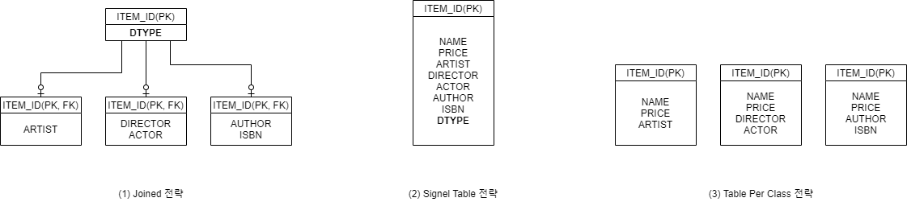

## 상속 관계 Mapping  

관계형 데이터베이스에서 상속이란 개념은 존재하지 않는다. 
여기서 말하는 상속이란, 관계형 데이터베이스에서의 슈퍼-서브 타입의 논리적 설계를 말한다. 


이러한 논리적 모델링에서 실제 물리적 구현은 3가지로 나타날 수 있다. 

1. 구분 컬럼을 가진 슈퍼 테이블이 존재하고, 그 하위 테이블들이 존재하는 경우
2. 하나의 테이블에 모든 속성을 표현하고, 구분 컬럼을 통해 종류를 구분하는 경우
3. 슈퍼 테이블 없이 각각 별개의 테이블로 존재하는 경우

  

그리고 JPA에서는 이 속성을 ```@Inheritance``` 어노테이션을 통해 표현한다. 

``` java
@Entity
@Inheritance(strategy = InheritanceType.JOINED)
@DiscriminatorColumn(name = "DTYPE")
@Getter @Setter
@NoArgsConstructor
public class Item {
    @Id @GeneratedValue
    @Column(name = "ITEM_ID")
    private Long id;

    private String name;
    private int price;
}
```

``` java
@Entity
@DiscriminatorValue("B")
@PrimaryKeyJoinColumn(name = "BOOK_ID")
@Getter @Setter
@NoArgsConstructor
public class Book extends Item{
    private String author;
    private String isbn;
}
```

첫 번째로, Joined 전략을 사용하는 경우 ```InheritanceType.JOINED```를 전략으로 지정한다. 
그리고 하위 타입을 구분하기 위한 컬럼명을 ```@DiscriminatorColumn```으로 지정한다. 
그리고 하위 엔티티에서는 구분 컬럼의 값으로 어떤 것이 들어갈지를 지정해야 한다. 
만약 별도로 지정하지 않으면 기본 값으로 컬럼명은 DTYPE, 구분 값은 테이블 명으로 지정된다.

정규화에 초첨을 맞춘 논리적 모델링을 그대로 따른 모델이며 가장 정석적이다. 
저장 공간의 낭비 없이 깔끔한 설계가 될 수 있다. 
하지만 단점도 존재한다. 
데이터 조회 시에는 JOIN이 포함되어 쿼리가 복잡하고 좀 느릴 수 있으며, 
삽입 시에도 각각의 테이블에 두 번 INSERT가 발생해야 한다는 것이다.  

``` java
@Entity
@Inheritance(strategy = InheritanceType.SINGLE_TABLE)
@DiscriminatorColumn(name = "DTYPE")
@Getter @Setter
@NoArgsConstructor
public class Item {
    @Id @GeneratedValue
    @Column(name = "ITEM_ID")
    private Long id;

    private String name;
    private int price;
}
```

``` java
@Entity
@DiscriminatorValue("B")
@Getter @Setter
@NoArgsConstructor
public class Book extends Item{
    private String author;
    private String isbn;
}
```

이는 Single 테이블 전략이며 사용법 자체는 크게 차이가 없다. 
```Inheritance.SINGLE```를 전략으로 지정하고, ```@Discriminator~```를 통해 구분 값을 지정한다.

JOINED 전략과는 반대의 성격을 가진다. 
데이터 조회의 쿼리가 간단하면서 빠르다. 
하지만 모든 엔티티의 속성을 한 곳으로 다 모았기 때문에 관련된 속성들은 모두 nullable해야 하며, 
이로 인해 데이터베이스 상에서 공간 낭비가 발생할 수 밖에 없다. 
예를 들어, Book의 isbn과 같은 속성은 다른 엔티티에서는 사용하지 않으며 모두 null로 저장되어야 하기 때문이다. 


``` java
@Entity
@Inheritance(strategy = InheritanceType.TABLE_PER_CLASS)
@Getter @Setter
@NoArgsConstructor
public class Item {
    @Id @GeneratedValue
    @Column(name = "ITEM_ID")
    private Long id;

    private String name;
    private int price;
}
```

``` java
@Entity
@Getter @Setter
@NoArgsConstructor
public class Book extends Item{
    private String author;
    private String isbn;
}
```

구분 컬럼도 없고 간단하게 표현할 수 있지만, 이 구조는 데이터베이스 설계자 입장, 개발자 입장 모두에서 딱히 장점이 없다. 
특히, 논리적 연관 관계를 모두 끊어버리고 별도로 관리하기 때문에 여러 하위 테이블들을 동시에 조회해야할 때는 UNION이 사용될 수 밖에 없다. 그리고 이는 성능 하락으로 이어지게 된다. 

## 공통 속성 지정  

데이터를 등록한 등록 시간, 수정한 시간과 같이 많은 테이블에서 공통적으로 존재하는 컬럼이 있을 수 있다. 
이를 모든 엔티티에서 따로 구현하는 것이 아니라, 별도의 클래스로 빼고 상속을 통해서 공통 속성을 표현할 수 있다. 

``` java
@MappedSuperClass
@Getter @Setter
@NoArgsContructor
public abstract class BaseEntity {
    private LocalDateTime createAt;
    private LocalDateTime updateAt;

    @PrePersist
    public void prePersist() {
        LocalDateTime now = LocalDateTime.now();
        createAt = now;
        updateAt = now;
    } 

    @PreUpdate
    public void preUpdate() {
        updateAt = LocalDateTime.now();
    }
}
```

``` java
@Entity
@Getter @Setter
@NoArgsContructor
public class Member extends BaseEntity {
    ...
}
```

<br/>

참고  
- 김영한, 자바 ORM 표준 JPA 프로그래밍, 에이콘