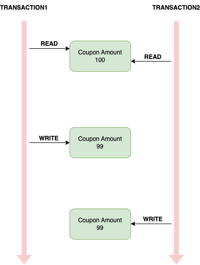
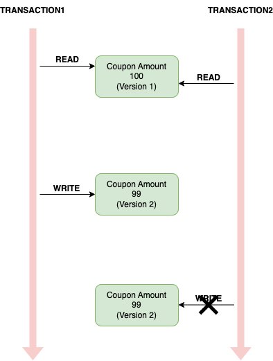
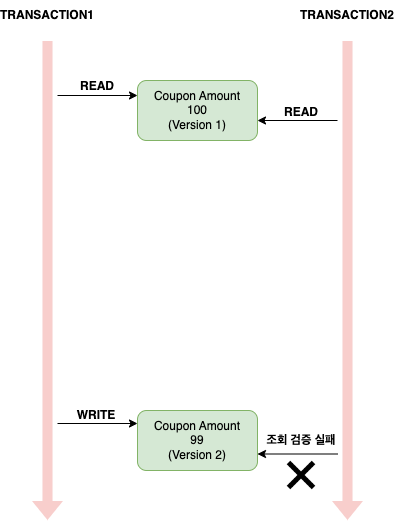

## 동시성 문제

쿠폰 서비스에서 정해진 양만큼 쿠폰을 발급하도록 한다고 가정해보자. 

``` java
@Entity
@Getter
@Setter
@NoArgsConstructor
@AllArgsConstructor
@Table(name = "coupons")
public class Coupon {
    @Id
    private String id;

    private String name;

    private Integer amount;
}
```

``` java
public interface CouponRepository extends JpaRepository<Coupon, String> {
}
```

``` java
@Service
@RequiredArgsConstructor
public class CouponService {
    private final CouponRepository couponRepository;

    @Transactional
    public void issue(String id) {
        Coupon coupon = couponRepository
          .findById(id)
          .orElseThrow(IllegalArgumentException::new);

        coupon.setAmount(coupon.getAmount() - 1);

        couponRepository.save(coupon);
    }
}
```

그리고 아래 코드는 10개의 스레드로 100번의 쿠폰 발급을 시도하고 쿠폰이 모두 소진되었는지를 검증하는 테스트인데 이는 실패한다. 

``` java
@SpringBootTest
class CouponServiceTest {
    @Autowired
    CouponRepository couponRepository;

    @Autowired
    CouponService couponService;

    @Test
    @DisplayName("쿠폰 발급 테스트")
    void issueCouponTest() throws InterruptedException {
        // given
        String couponId = UUID.randomUUID().toString();
        Coupon coupon = new Coupon(
          couponId,
          "테스트 쿠폰",
          100
        );
        couponRepository.save(coupon);

        // when
        int count = 100;
        CountDownLatch latch = new CountDownLatch(count);

        ExecutorService executorService = Executors.newFixedThreadPool(10);
        while (count-- > 0) {
          executorService.submit(() -> {
            try {
              couponService.issue(couponId);
            } finally {
              latch.countDown();
            }
          });
        }

        latch.await();

        Optional<Coupon> result = couponRepository.findById(couponId);

        // then
        assertThat(result).isNotEmpty();
        assertThat(result.get().getAmount()).isZero();
    }
}
```

이는 아래와 같은 race condition이 발생하기 때문이다. 
일반적으로 RDB는 격리 수준을을 serializable로 사용하지 않기 때문에 이런 동시성 이슈는 별도로 처리를 해줘야 한다. 
 


나이브하게 생각하면 언어 레벨에서 메서드를 ```synchronized```로 선언할 수 있다. 
하지만 서비스 코드에 선언된 ```@Transactional```이 프록시 객체 방식을 통해 제어된다는 것을 생각해보면 목적을 이룰 수 없다. 
결국 트랜잭션에 대한 핸들링이 메서드 외부에서 일어나기 때문이다. 
JPA에서는 이 같은 문제 상황을 해결하기 위해 크게 두 가지 락을 제공한다. 

### OPTIMISTIC LOCK

낙관적 락은 트랜잭션 충돌이 가끔씩만 일어날 것으로 가정한다. 
이 방법은 관리하고자 하는 데이터에 버전 정보를 추가하고 이를 통해 제어하게 된다. 



버전은 데이터가 수정될 때 마다 증가된다. 
위 그림에서 트랜잭션1은 버전이 1인 데이터를 읽어 이를 버전 2로 업데이트 하여 커밋한다. 
트랜잭션2는 버전이 1인 데이터를 읽어 버전 2를 만들어 커밋하고자 하나 실패한다. 
트랜잭션을 커밋하는 시점에 데이터베이스에 저장된 버전과 자신이 읽었던 버전이 다르기 때문이다. 

``` java
@Entity
@Getter
@Setter
@NoArgsConstructor
@AllArgsConstructor
@Table(name = "coupons")
public class Coupon {
    @Id
    private String id;

    private String name;

    private Integer amount;

    @Version
    private Long version;
}
```

``` java
public interface CouponRepository extends JpaRepository<Coupon, String> {
    @Lock(LockModeType.NONE)
    Optional<Coupon> findById(String id);
}
```

JPA에서는 위에 설명한 버전을 통한 동시성 제어를 모두 추상화하여 제공한다. 
먼저 엔티티에 버전 정보를 의미하는 ```@Version``` 어노테이션이 존재하며, 낙관적 락 사용 시 필수로 존재해야 한다. 
이 값은 ```Long```, ```Integer```, ```Short```, ```Timestamp```를 사용할 수 있다. 

``` sql
update
    coupons 
set
    amount = ?,
    name = ?,
    version = {버전 + 1} 
where
    id=? 
    and version = {버전}
```

동작에 필요한 쿼리는 실로 단순하다. 
트랜잭션 내에서 읽은 버전과 트랜잭션 커밋 시 데이터베이스에 저장된 버전이 같으면 업데이트가 된다. 
만약 다르다면 아무런 동작을 하지 않으며, 이 때 JPA에서 이를 감지하여 추상화된 예외를 던져 준다. 
이 같은 충돌 발생 시 예외를 던지고 이에 대한 복구 책임은 개발자에게 있다. 

**NONE**  
위에 명시한 내용이 이 옵션이며 명시적으로 락 옵션을 지정하지 않고 ```@Version``` 어노테이션을 적용한 것만으로도 락을 적용할 수도 있다. 
조회한 엔티티 **수정하여 저장하는 시점에 이 엔티티가 다른 트랜잭션에 의해 변경되지 않았음을 보장**한다. 
위에서 설명한 것 처럼 엔티티 내용을 변경할 때 UPDATE 구문을 통해 버전을 증가 시킨다. 
만약 이 때 데이터베이스에 저장된 버전 정보가 읽었던 버전 정보와 다르다면 실패한다.


**OPTIMISTIC**  
마찬가지로 조회한 엔티티가 트랜잭션이 종료될 때까지 다른 트랜잭션에 의해 변경되지 않음을 보장한다. 
트랜잭션을 커밋할 때 버전 정보를 SELECT 구문을 통해 조회해서 현재 엔티티의 버전과 같은지 검증하며 다르면 실패한다. 
이 옵션은 NONE과는 다르게 **조회만해도 버전을 체크**한다. 
만약 트랜잭션 내에서 읽었던 엔티티가 수정되지 않더라도 커밋 시점에 버전 정보가 다르면 실패한다. 



**OPTIMISTIC\_FORCE\_INCREMENT**  
이 옵션은 엔티티 변경이 없어도 트랜잭션을 커밋할 때 **버전 정보를 강제로 증가**시킨다. 
이는 버전 정보를 하나의 엔티티가 아니라 연관 관계에 있는 엔티티 묶음으로 적용하는데 활용할 수 있다. 
예를 들어, 게시글과 게시글에 첨부된 파일이 일대다 관계로 있을 때 단순히 첨부 파일만 변경한다면 게시글의 버전은 변경되지 않는다. 
물리적으로는 변경되지 않았지만 논리적으로는 변경되었다고 볼 수 있으며 이 같은 경우에도 버전을 증가시키고 싶다면 해당 옵션을 사용하면 된다. 

### PESSIMISTIC LOCK

**비관적 락**은 트랜잭션 충돌이 수시로 일어날 것으로 가정한다. 
이 방법은 **데이터베이스 제품에서 제공하는 트랜잭션 락 메커니즘**을 사용한다. 
비관적 락을 사용하면은 데이터를 수정하는 즉시 트랜잭션 충돌을 감지할 수 있으며, 엔티티가 아닌 스칼라 타입을 조회할 때도 사용할 수 있다는 특징을 가진다. 

``` java
public interface CouponRepository extends JpaRepository<Coupon, String> {
	@Lock(LockModeType.PESSIMISTIC_WRITE)
	Optional<Coupon> findById(String id);
}
```

**PESSIMISTIC_WRITE**  
비관적 락이라고 하면 일반적으로 이 옵션을 사용한다. 
**select ... for update 구문**을 사용하여 쓰기 락을 걸며, 해당 락이 잡힌 레코드는 다른 트랜잭션이 수정할 수 없는 상태가 된다. 

**PESSIMISTIC_READ**  
데이터를 수정하지 않고 읽을 때만 사용하며 락을 통해 REPEATABLE READ를 보장할 수 있다. 
자주 사용되는 옵션은 아니다.

**PESSIMISTIC\_FORCE\_INCREMENT**  
이는 데이터베이스 락을 사용하면서 동시에 필드로 버전 정보를 관리한다. 
트랜잭션이 끝날 때 버전 정보를 강제로 증가시킨다.

<br/>

참고  
- 김영한, 자바 ORM 표준 JPA 프로그래밍, 에이콘