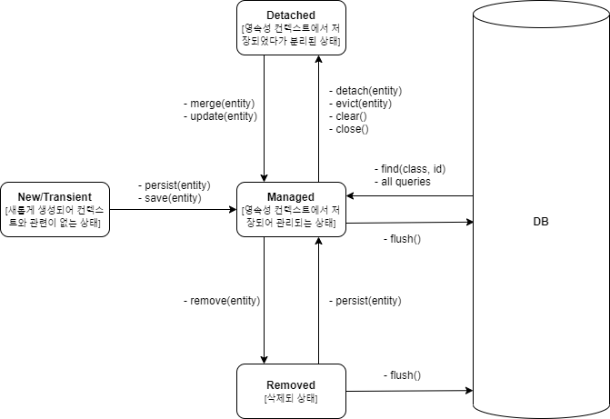

## Persistence Context  

영속성 컨텍스트(Persistence Context)는 엔티티 인스턴의 집합을 가지며 **엔티티를 저장하고 관리하는 환경**이라고 할 수 있다. 
컨텍스트 내부에서는 이 엔티티들의 생명주기가 관리되며, 하나의 ```EntityManager```는 하나의 영속성 컨텍스트와 연관된다. 


### Entity LifeCycle  




### Persistence Context의 특징  

#### Entity 조회  

**1차 캐시 역할**  
영속성 컨텍스트에서 관리되고 있는 엔티티들은 1차 캐시 역할을 한다. 
만약 조회 대상이 현재 컨텍스트에서 관리가 되고 있으면 실제 데이터베이스까지 가지 않고 메모리 캐시로 처리할 수 있다. 

``` java
Member member = new Member();
member.setId("memberId");

// context에 관리되는 상태로 변경.
em.persist(member);

// 1차 캐시에서 조회
Member member = em.find(Member.class, "member1");
```

``` java
// 현재 context에 관리되지 않기에 실제 데이터베이스 쿼리 후 관리 상태로 등록
Member a = em.find(Member.class, "member1");

// 1차 캐시에서 조회
Member b = em.find(Member.class, "member1");
```

> 컨텍스트에 의해 제공되는 캐싱으로 EntityManager과 Persistence Context가 일대일 관계라면 사실상 트랜잭션 단위의 캐시이다. 
> 어플리케이션 전체에서 사용되는 2차 캐시와는 다름을 주의한다. 

**동일성 보장**

``` java
// 현재 context에 관리되지 않기에 실제 데이터베이스 쿼리 후 관리 상태로 등록
Member a = em.find(Member.class, "member1");

// 1차 캐시에서 조회
Member b = em.find(Member.class, "member1");

if(a == b) System.out.print("!");
```

위 케이스에서 ```a```와 ```b```는 동일한 레퍼런스를 가지는 객체임이이 보장된다. 
즉 Repeatable Read 등급의 트랜잭션 격리 수준을 데이터베이스가 아닌 애플리케이션에서 제공함을 의미한다. 

#### Entity 쓰기

**트랜잭션을 지원하는 쓰기 지연**  

``` java
trx.begin(); 

em.persist(memberA);
em.persist(memberB);

trx.commit();
```

위 코드에서 ```EntityManger```에 엔티티를 등록할 때 실제 데이터베이스의 INSERT 쿼리가 발생하지 않는다. 
대신 이를 별도로 컨텍스트 내부에 저장하고 있다가 커밋을 하는 시점에 데이터베이스에 쿼리를 발생시킨다. 
이를 **쓰기 지연(Transactional write-behind)**라고 하며 주로 성능 최적화에 사용된다. 

#### Entity 수정  

**Dirty Checking**  

``` java
trx.begin();

Member memberA = em.find(Member.class, "memberA");

memberA.setUserName("hello");

trx.commit();
```

위 코드에서는 조회한 엔터티의 필드를 수정하고 별도의 업데이트 관련 구문 없이 트랜잭션을 끝낸다. 
여기서 ```em.update(memberA)```와 같은 메서드를 호출하지 않았지만 데이터베이스 상에서 변경 내용이 업데이트 된다. 

```memberA```를 조회하는 시점에 해당 엔티티는 영속성 컨텍스트에 의해 관리되는 엔티티가 된다. 
그리고 컨텍스트는 엔티티가 관리가 되기 시작하는 시점에는 해당 엔티티에 대한 **스냅샷**을 기록하여 보관하게 된다. 
이 후에 해당 트랜잭션이 종료되는 시점에서는 이 최초 스냅샷과 현재 엔티티의 내용에 대한 비교를 진행하게 된다. 
그래서 만약 엔티티에 변경 사항이 존재한다면 자동으로 UPDATE 구문을 통해 변경점을 저장하는 것이다. 
이처럼 별도의 UPDATE 관련 구문 없이도 자동으로 변경 사항을 저장할 수 있는데 이를 **Dirty Checking**이라고 한다. 

#### Entity 삭제

``` java
Member memberA = em.find(Member.class, "memberA");
em.remove(memberA);
```

```remove()```가 호출되면 해당 엔티티는 컨텍스트에서 제거된다. 
그리고 쓰기와 마찬가지로 삭제 쿼리 또한 커밋 시점까지 실제 SQL은 발생하지 않고 지연된다. 


### flush  

위에서 쓰기 지연으로 인한 엔티티 등록 및 삭제, 그리고 Dirty checking으로 인한 엔티티 수정은 트랜잭션 커밋 시점에서 동작했다. 
커밋하는 시점에 ```flush```가 발생하게 되는데 이것이 실제 컨텍스트에 의해 발생한 쿼리들을 데이터베이스에 전달하는 역할을 가진다. 
주의할 점은 단순히 변경 사항을 데이터베이스와 동기화하는 작업이지 컨텍스트 내 관리중인 엔티티들을 삭제하는 것은 아니라는 점이다. 
그리고 ```flush```는 트랜잭션 커밋 이외에도 호출될 수 있다. 

flush 실행 시점
- 트랜잭션 커밋
- JPQL 쿼리 실행
- ```em.flush()``` 명시적 실행

<br/>

참고  
- 김영한, 자바 ORM 표준 JPA 프로그래밍, 에이콘