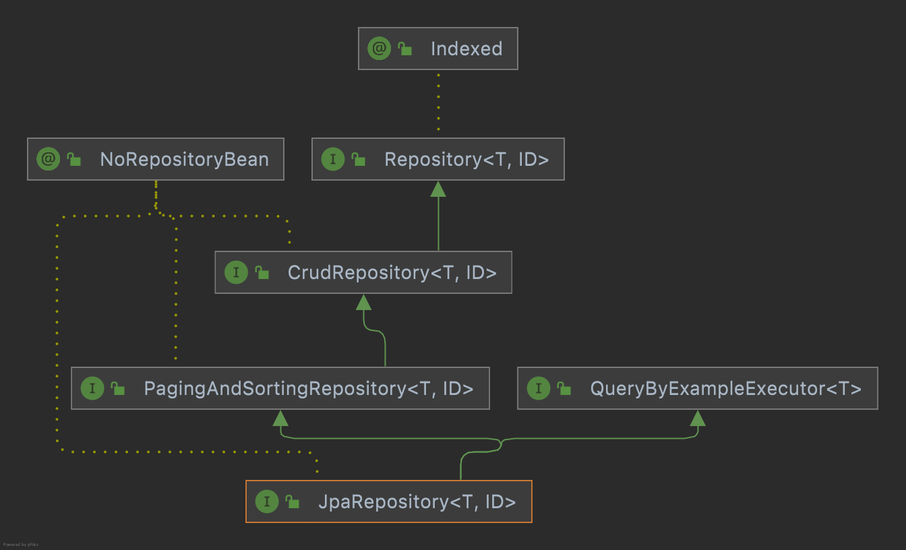
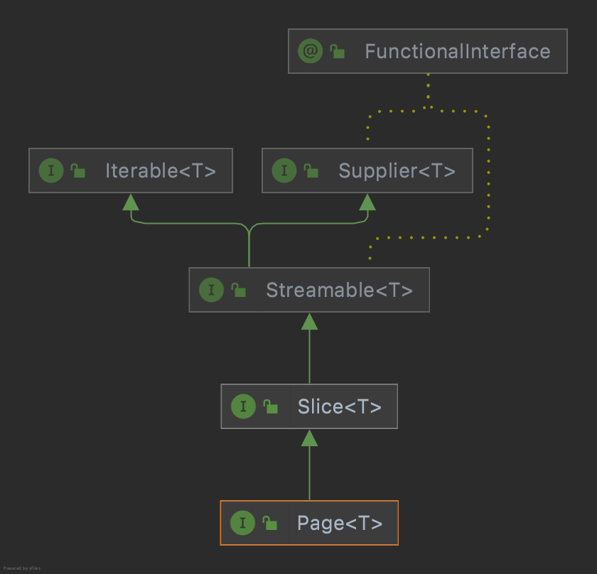

## Spring Data Jpa  

스프링에서는 Spring Data라는 이름으로 관계형 데이터베이스를 비롯하여 NO SQL, Map-Reduce, 클라우드 기반 데이터베이스와 같은 Data Access를 위한 프로그래밍 모델을 제공한다. 
그 중 **Spring Data JPA**는 Spring Data의 하위 모듈로서 말그대로 JPA를 이용한 개발을 쉽게 할 수 있도록 지원한다. 

어떤 테이블이 존재할 때는 기본적으로 이에 대한 CRUD 코드가 필요할 것이다. 
```EntityManager```를 주입 받아 이를 직접 구현할 수도 있지만, 아래와 같이 인터페이스를 정의하는 것만으로도 많은 기능을 사용할 수 있다. 

``` java
public interface UserRepository extends JpaRepository<User, Long> { }
```

  

```Repository<T, ID>``` 인터페이스는 마커 인터페이스 역할이며, 
```CrudRepository<T, ID>``` 인터페이스에는 아래와 같은 기능을 제공한다. 

|Method|Description|
|:---|:---|
|\<S extends T> S save(S entity)|엔터티를 저장|
|Optional\<T> findById(ID primaryKey)|지정한 ID로 식별한 엔터티를 반환|
|Iterable\<T> findAll()|모든 엔터티를 반환|
|long count()|엔터티의 수를 반환|
|void delete(T entity)|지정한 엔터티를 삭제|
|boolean existsById(ID primaryKey)|주어진 ID를 가진 엔터터의 존재 여부 반환|
|...|...|

Spring Data JPA에서는 이렇게 정의한 인터페이스를 보고 구현체를 직접 만들어주며, ```@Repository``` 어노테이션으로 스프링 빈으로도 등록도 한다. 
그리고 정의된 메서드들은 모두 ```@Transactional``` 어노테이션이 적용되어 있으며, READ 관련 연산들은 ```@Transactional(readOnly = true)```가 적용되어 있기에 별도의 트랜잭션 선언 없이도 메서드를 사용할 수 있다.

여기서 주의해야할 점이 하나 있다. 
생성되는 구현체 로직을 담은 ```SimpleJpaRepository```에서 ```save``` 메서드는 아래와 같이 정의되어 있다. 

``` java
@Transactional
@Override
public <S extends T> S save(S entity) {

    Assert.notNull(entity, "Entity must not be null.");

    if (entityInformation.isNew(entity)) {
      em.persist(entity);
      return entity;
    } else {
      return em.merge(entity);
    }
}
```

```save``` 연산은 넘어온 엔티티가 새로운 것이면 ```persist```를, 그게 아니라면 ```merge```를 호출한다. 
여기서 새로운 엔티티인지를 판단하는 ```isNew``` 연산은 식별자 값이 객체 타입일 때는 null 여부로 구분된다.  

만약 새롭게 저장하는 엔티티의 식별자 값이 ```@GeneratedValue```를 통해 생성된다면 문제 없지만, 식별자 값을 다른 어떤 이유로 어플리케이션에서 직접 생성하여 저장하는 경우에는 문제가 있다.
식별자 값이 null이 아니기에 ```merge```를 호출한다는 것이다.

> merge 연산은 이미 존재하는 엔티티를 다시 영속성 컨텍스트로 가져오는 개념이다.
> 그래서 일단 데이터베이스를 조회하여 데이터가 없음을 확인한 뒤에 새로운 엔티티로 인지하므로 비효율적이다. 

그래서 이러한 케이스에서는 엔티티에서 ```isNew()``` 메서드를 오버라이딩하여 직접 새로운 엔티티 여부를 결정해줘야 한다. 

``` java
@MappedSuperclass
public abstract class AbstractEntity<ID> implements Persistable<ID> {

    @Transient
    private boolean isNew = true; 

    @Override
    public boolean isNew() {
      return isNew; 
    }

    @PrePersist 
    @PostLoad
    void markNotNew() {
      this.isNew = false;
    }

    // More code…
}
```

## Query Methods  

엔티티의 단순한 저장, 전체 조회, 식별자를 통한 조희 등은 인터페이스 생성만으로도 사용가능하다. 
그렇다면 이런 공통적인 기능이 아니라 도메인에 의존적인 내용, 
예를들어 User Entity에 존재하는 name을 기반으로 하는 조회는 어떻게 구현할 수 있을까?

### Query Creation from method names  

``` java
public interface UserRepository extends JpaRepository<User, Long> { 
  List<User> findByName(String name);
}
```

첫 번째 방법은 메서드 이름으로부터 쿼리를 자동 생성해주는 기능을 사용하는 것이다. 
이렇게 인터페이스에 메서드 이름을 스펙에 맞게 정의만하면 된다. 
메서드 이름은 **Subject**(find...By, exists...By)와 **Predict** 부분으로 나눠지며 미리 정의된 약속에 따라 작성한다. 간단한 조건 1~2만이 존재하는 경우 유용하게 사용할 수 있다. 

#### Subject

1. **조회**  
  일반적으로 Collection이나 Streamable의 서브 타입 또는 Page, GeoResults와 같은 store-specific result wrapper를 반환
   - find…By
   - read…By
   - get…By
   - query…By
   - search…By
   - stream…By

2. **존재 여부**    
  대상이 존재하는지 boolean 결과를 반환
    - exists…By

3. **개수**    
  대상의 개수를 정수형으로 반환
    - count…By

4. **삭제**  
  대상을 삭제하며 void형 또는 삭제한 대상의 개수를 반환
    - delete…By
    - remove…By

5. **첫 번째 결과**  
  쿼리의 첫 번째 결과를 반환
    - …First\<number>…, …Top\<number>…

6. **중복 없는 데이터**
   데이터를 중복 없이 반환
    - …Distinct…

------

**Predict**  

<table>
  <colgroup>
    <col style="width: 20%">
    <col style="width: 80%">
  </colgroup>
  <tr>
    <td><b>Keyword</b></td>
    <td>Distinct</td>
  </tr>
  <tr>
    <td><b>Sample</b></td>
    <td>findDistinctByLastnameAndFirstname</td>
  </tr>
  <tr>
    <td><b>JPQL Snippet</b></td>
    <td>select distinct …​ where x.lastname = ?1 and x.firstname = ?2</td>
  </tr>
</table>

<table>
  <colgroup>
    <col style="width: 20%">
    <col style="width: 80%">
  </colgroup>
  <tr>
    <td><b>Keyword</b></td>
    <td>And</td>
  </tr>
  <tr>
    <td><b>Sample</b></td>
    <td>findByLastnameAndFirstname</td>
  </tr>
  <tr>
    <td><b>JPQL Snippet</b></td>
    <td>… where x.lastname = ?1 and x.firstname = ?2</td>
  </tr>
</table>

<table>
  <colgroup>
    <col style="width: 20%">
    <col style="width: 80%">
  </colgroup>
  <tr>
    <td><b>Keyword</b></td>
    <td>Or</td>
  </tr>
  <tr>
    <td><b>Sample</b></td>
    <td>findByLastnameOrFirstname</td>
  </tr>
  <tr>
    <td><b>JPQL Snippet</b></td>
    <td>… where x.lastname = ?1 or x.firstname = ?2</td>
  </tr>
</table>

<table>
  <colgroup>
    <col style="width: 20%">
    <col style="width: 80%">
  </colgroup>
  <tr>
    <td><b>Keyword</b></td>
    <td>Is, Equals</td>
  </tr>
  <tr>
    <td><b>Sample</b></td>
    <td>findByFirstname, findByFirstnameIs,findByFirstnameEquals</td>
  </tr>
  <tr>
    <td><b>JPQL Snippet</b></td>
    <td>… where x.firstname = ?1</td>
  </tr>
</table>

<table>
  <colgroup>
    <col style="width: 20%">
    <col style="width: 80%">
  </colgroup>
  <tr>
    <td><b>Keyword</b></td>
    <td>Between</td>
  </tr>
  <tr>
    <td><b>Sample</b></td>
    <td>findByStartDateBetween</td>
  </tr>
  <tr>
    <td><b>JPQL Snippet</b></td>
    <td>… where x.startDate between ?1 and ?2</td>
  </tr>
</table>

<table>
  <colgroup>
    <col style="width: 20%">
    <col style="width: 80%">
  </colgroup>
  <tr>
    <td><b>Keyword</b></td>
    <td>LessThan</td>
  </tr>
  <tr>
    <td><b>Sample</b></td>
    <td>findByAgeLessThan</td>
  </tr>
  <tr>
    <td><b>JPQL Snippet</b></td>
    <td>… where x.age < ?1</td>
  </tr>
</table>

<table>
  <colgroup>
    <col style="width: 20%">
    <col style="width: 80%">
  </colgroup>
  <tr>
    <td><b>Keyword</b></td>
    <td>LessThanEqual</td>
  </tr>
  <tr>
    <td><b>Sample</b></td>
    <td>findByAgeLessThanEqual</td>
  </tr>
  <tr>
    <td><b>JPQL Snippet</b></td>
    <td>… where x.age <= ?1</td>
  </tr>
</table>

<table>
  <colgroup>
    <col style="width: 20%">
    <col style="width: 80%">
  </colgroup>
  <tr>
    <td><b>Keyword</b></td>
    <td>GreaterThan</td>
  </tr>
  <tr>
    <td><b>Sample</b></td>
    <td>findByAgeGreaterThan</td>
  </tr>
  <tr>
    <td><b>JPQL Snippet</b></td>
    <td>… where x.age > ?1</td>
  </tr>
</table>

<table>
  <colgroup>
    <col style="width: 20%">
    <col style="width: 80%">
  </colgroup>
  <tr>
    <td><b>Keyword</b></td>
    <td>GreaterThanEqual</td>
  </tr>
  <tr>
    <td><b>Sample</b></td>
    <td>findByAgeGreaterThanEqual</td>
  </tr>
  <tr>
    <td><b>JPQL Snippet</b></td>
    <td>… where x.age >= ?1</td>
  </tr>
</table>

<table>
  <colgroup>
    <col style="width: 20%">
    <col style="width: 80%">
  </colgroup>
  <tr>
    <td><b>Keyword</b></td>
    <td>After</td>
  </tr>
  <tr>
    <td><b>Sample</b></td>
    <td>findByStartDateAfter</td>
  </tr>
  <tr>
    <td><b>JPQL Snippet</b></td>
    <td>… where x.startDate > ?1</td>
  </tr>
</table>

<table>
  <colgroup>
    <col style="width: 20%">
    <col style="width: 80%">
  </colgroup>
  <tr>
    <td><b>Keyword</b></td>
    <td>Before</td>
  </tr>
  <tr>
    <td><b>Sample</b></td>
    <td>findByStartDateBefore</td>
  </tr>
  <tr>
    <td><b>JPQL Snippet</b></td>
    <td>… where x.startDate < ?1</td>
  </tr>
</table>

<table>
  <colgroup>
    <col style="width: 20%">
    <col style="width: 80%">
  </colgroup>
  <tr>
    <td><b>Keyword</b></td>
    <td>IsNull, Null</td>
  </tr>
  <tr>
    <td><b>Sample</b></td>
    <td>findByAge(Is)Null</td>
  </tr>
  <tr>
    <td><b>JPQL Snippet</b></td>
    <td>… where x.age is null</td>
  </tr>
</table>

<table>
  <colgroup>
    <col style="width: 20%">
    <col style="width: 80%">
  </colgroup>
  <tr>
    <td><b>Keyword</b></td>
    <td>IsNotNull, NotNull</td>
  </tr>
  <tr>
    <td><b>Sample</b></td>
    <td>findByAge(Is)NotNull</td>
  </tr>
  <tr>
    <td><b>JPQL Snippet</b></td>
    <td>… where x.age not null</td>
  </tr>
</table>

<table>
  <colgroup>
    <col style="width: 20%">
    <col style="width: 80%">
  </colgroup>
  <tr>
    <td><b>Keyword</b></td>
    <td>Like</td>
  </tr>
  <tr>
    <td><b>Sample</b></td>
    <td>findByFirstnameLike</td>
  </tr>
  <tr>
    <td><b>JPQL Snippet</b></td>
    <td>… where x.firstname like ?1</td>
  </tr>
</table>

<table>
  <colgroup>
    <col style="width: 20%">
    <col style="width: 80%">
  </colgroup>
  <tr>
    <td><b>Keyword</b></td>
    <td>NotLike</td>
  </tr>
  <tr>
    <td><b>Sample</b></td>
    <td>findByFirstnameNotLike</td>
  </tr>
  <tr>
    <td><b>JPQL Snippet</b></td>
    <td>… where x.firstname not like ?1</td>
  </tr>
</table>

<table>
  <colgroup>
    <col style="width: 20%">
    <col style="width: 80%">
  </colgroup>
  <tr>
    <td><b>Keyword</b></td>
    <td>StartingWith</td>
  </tr>
  <tr>
    <td><b>Sample</b></td>
    <td>findByFirstnameStartingWith</td>
  </tr>
  <tr>
    <td><b>JPQL Snippet</b></td>
    <td>… where x.firstname like ?1('XXX%' 형태)</td>
  </tr>
</table>

<table>
  <colgroup>
    <col style="width: 20%">
    <col style="width: 80%">
  </colgroup>
  <tr>
    <td><b>Keyword</b></td>
    <td>EndingWith</td>
  </tr>
  <tr>
    <td><b>Sample</b></td>
    <td>findByFirstnameEndingWith</td>
  </tr>
  <tr>
    <td><b>JPQL Snippet</b></td>
    <td>… where x.firstname like ?1('%XXX' 형태)</td>
  </tr>
</table>

<table>
  <colgroup>
    <col style="width: 20%">
    <col style="width: 80%">
  </colgroup>
  <tr>
    <td><b>Keyword</b></td>
    <td>Containing</td>
  </tr>
  <tr>
    <td><b>Sample</b></td>
    <td>findByFirstnameContaining</td>
  </tr>
  <tr>
    <td><b>JPQL Snippet</b></td>
    <td>… where x.firstname like ?1('%XXX%' 형태)</td>
  </tr>
</table>

<table>
  <colgroup>
    <col style="width: 20%">
    <col style="width: 80%">
  </colgroup>
  <tr>
    <td><b>Keyword</b></td>
    <td>OrderBy</td>
  </tr>
  <tr>
    <td><b>Sample</b></td>
    <td>findByAgeOrderByLastnameDesc</td>
  </tr>
  <tr>
    <td><b>JPQL Snippet</b></td>
    <td>… where x.age = ?1 order by x.lastname desc</td>
  </tr>
</table>

<table>
  <colgroup>
    <col style="width: 20%">
    <col style="width: 80%">
  </colgroup>
  <tr>
    <td><b>Keyword</b></td>
    <td>Not</td>
  </tr>
  <tr>
    <td><b>Sample</b></td>
    <td>findByLastnameNot</td>
  </tr>
  <tr>
    <td><b>JPQL Snippet</b></td>
    <td>… where x.lastname <> ?1</td>
  </tr>
</table>

<table>
  <colgroup>
    <col style="width: 20%">
    <col style="width: 80%">
  </colgroup>
  <tr>
    <td><b>Keyword</b></td>
    <td>In</td>
  </tr>
  <tr>
    <td><b>Sample</b></td>
    <td>findByAgeIn(Collection&ltAges&gt ages)</td>
  </tr>
  <tr>
    <td><b>JPQL Snippet</b></td>
    <td>… where x.age in ?1</td>
  </tr>
</table>

<table>
  <colgroup>
    <col style="width: 20%">
    <col style="width: 80%">
  </colgroup>
  <tr>
    <td><b>Keyword</b></td>
    <td>NotIn</td>
  </tr>
  <tr>
    <td><b>Sample</b></td>
    <td>findByAgeNotIn(Collection&ltAges&gt ages)</td>
  </tr>
  <tr>
    <td><b>JPQL Snippet</b></td>
    <td>… where x.age not in ?1</td>
  </tr>
</table>

<table>
  <colgroup>
    <col style="width: 20%">
    <col style="width: 80%">
  </colgroup>
  <tr>
    <td><b>Keyword</b></td>
    <td>True</td>
  </tr>
  <tr>
    <td><b>Sample</b></td>
    <td>findByActiveTrue()</td>
  </tr>
  <tr>
    <td><b>JPQL Snippet</b></td>
    <td>… where x.active = true</td>
  </tr>
</table>

<table>
  <colgroup>
    <col style="width: 20%">
    <col style="width: 80%">
  </colgroup>
  <tr>
    <td><b>Keyword</b></td>
    <td>False</td>
  </tr>
  <tr>
    <td><b>Sample</b></td>
    <td>findByActiveFalse()</td>
  </tr>
  <tr>
    <td><b>JPQL Snippet</b></td>
    <td>… where x.active = false</td>
  </tr>
</table>

<table>
  <colgroup>
    <col style="width: 20%">
    <col style="width: 80%">
  </colgroup>
  <tr>
    <td><b>Keyword</b></td>
    <td>IgnoreCase</td>
  </tr>
  <tr>
    <td><b>Sample</b></td>
    <td>findByFirstnameIgnoreCase</td>
  </tr>
  <tr>
    <td><b>JPQL Snippet</b></td>
    <td>… where UPPER(x.firstname) = UPPER(?1)</td>
  </tr>
</table>

------

### Annotation-based Configuration  

 ``` java
@Entity
@NamedQuery(name = "User.findByEmailAddress",
  query = "select u from User u where u.emailAddress = :emailAddress")
public class User {
    ...
}
```

``` java
public interface UserRepository extends JpaRepository<User, Long> {

    User findByEmailAddress(@Param("emailAddress") String emailAddress);
}
```

두 번째 방법으로는 ```@NamedQuery``` 어노테이션을 통해 쿼리를 직접 정의하여 사용하는 것이다.
Repository에서는 ```User.findByEmailAddress```라는 쿼리를 찾아 실행하며, 
존재하지 않는다면 첫 번째 방법처럼 메서드 이름을 기반으로 쿼리를 자동으로 생성하려는 전략을 사용한다. 
이 방법은 엔터티 클래스에서 쿼리를 관리해야한다는 점이 조금 아쉽다. 
포지션이 조금 애매해서 실제로는 잘 사용되지 않는다. 

### Using ```@Query```  

``` java
public interface UserRepository extends JpaRepository<User, Long> {

    @Query("select u from User u where u.emailAddress = :emailAddress")
    User findByEmailAddress(@Param("emailAddress") String emailAddress);
}
```

세 번째 방법은 인터페이스 메서드에 ```@Query``` 어노테이션을 사용하여 쿼리를 직접 매핑하는 것이다. 
이름이 존재하지 않는 NamedQuery라고 볼 수 있으며, 두 번째 방법보다 직관적이며 관리하기가 쉽다.


### Sort, Pagination  

데이터를 특정한 순서로 정렬하는 것, 그리고 데이터를 페이지 단위로 가져오는 페이지네이션은 아마 많은 어플리케이션에서 필수적인 기능일 것이다.  
```CrudRepository<T, ID>```를 상속하는 ```PagingAndSortingRepositry<T, ID>```에서 이러한 기능을 담당한다. 

Spring Data에서는 ```org.springframework.data.domain.Sort``` 클래스와, ```org.springframework.data.domain.Pageable``` 인터페이스를 제공하며 이를 메서드의 파라미터로 추가하는 것만으로 구현이 가능하다. 


``` java
public interface UserRepository extends JpaRepository<User, Long> {

    @Query("select u from User u where u.lastname like :lastname%")
    List<Member> findByAndSort(@Param("lastname") String lastname, Sort sort);

    @Query("select u from User u where u.lastname = :lastname%")
    Page<User> findByAndPaging(@Param("lastname") String lastname, Pageable pageable);
}
```

``` java
userRepository.findByAndSort("stark", Sort.by("firstname"));
userRepository.findByAndSort("stark", Sort.by(Sort.Direction.DESC, "firstname"));
userRepository.findByAndSort("stark", Sort.by(
                                            Sort.Order.asc("lastname"), 
                                            Sort.Order.desc("id")));
```

``` java
// Pageable은 인터페이스로 보통 구현체인 PageRequest를 사용한다
PageRequest pageRequest = PageRequest.of(
                0, // 페이지 번호
                3, // 한 페이지의 크기
                Sort.by(Sort.Direction.DESC, "firstname") // 정렬 조건
                );
userRepository.findByAndPaging("stark", pageRequest)
```

그리고 이 페이지 요청 같은 경우에는 반환 타입을 ```List```로 받을 수도 있지만 페이지 처리에 더 유용한 ```Page``` 타입 객체로 받을 수도 있다. 
다만 이 경우에는 전체 페이지 수를 가져오기 위한 count 쿼리가 하나 더 발생한다. 

아래는 Page 형태로 리턴 받았을 때 사용할 수 있는 메서드의 종류이다.

|정의 위치|메서드|
|:---|:---|
|Slice\<T>|int getNumber();|
|Slice\<T>|int getSize();|
|Slice\<T>|int getNumberOfElements();|
|Slice\<T>|List\<T> getContent();|
|Slice\<T>|boolean hasContent();|
|Slice\<T>|Sort getSort();|
|Slice\<T>|boolean isFirst();|
|Slice\<T>|boolean isLast();|
|Slice\<T>|boolean hasNext();|
|Slice\<T>|boolean hasPrevious();|
|Slice\<T>|Pageable nextPageable();|
|Slice\<T>|Pageable previousPageable();|
|Page\<T>|int getTotalPages();|
|Page\<T>|long getTotalElements();|



또한, MVC에서 페이징을 쉽게 사용할 수 있도록 ```HandlerMethodArgumentResolver```를 제공한다. ```page```, ```size```, ```sort```  세 가지의 값을 파라미터로 요청하면 컨트롤러에서 ```Pageable``` 를 통해 바로 바인딩할 수 있는 것이다. 

``` java
@GetMapping("/members")
public Page<MemberDto> getMemberList(
      @PageableDefault(size = 10, sort = "username") Pageable pageable)
{
    ...
}
```

> 어노테이션을 통해 디폴트 값에 대한 정의를 하지 않았을 때, 글로벌 디폴트 값은 page는 0, size는 20이다.

### Modifying Queries  

``` java
public interface UserRepository extends JpaRepository<User, Long> {
    
    @Modifying(clearAutomatically = true)
    @Query("update User u set u.firstname = ?1 where u.lastname = ?2")
    int setFixedFirstnameFor(String firstname, String lastname);

}
```

```@Modify``` 어노테이션과 함께 사용하면 위 같은 벌크성 업데이트 쿼리를 처리할 수 있다. 
이는 영속성 컨텍스트와 엔티티를 통한 수정이 아니라 데이터베이스에 직접 쿼리를 날리는 형태이다. 
따라서 수정 내용을 실시간으로 반영하기 위해서는 영속성 컨텍스트를 갱신해줄 필요가 있는데 이는 ```@Modify```의 속성 중 ```clearAutomatically```를 true로 하여 설정할 수 있다. 

### Applying Query Hints  

 ``` java
public interface UserRepository extends Repository<User, Long> {

  @QueryHints(value = {@QueryHint(name = "org.hibernate.readOnly", value = "true")}, forCounting = false)
  Page<User> findByLastname(String lastname, Pageable pageable);

}
```

어떤 엔티티를 읽어 영속화하면 원본 스냅샷을 보관하여 이 후 dirty checking로 변경된 사항을 추적한다. 
그런데 만약 읽어온 데이터가 절대 변경되지 않음이 보장되고, 단순히 조회의 용도로만 사용된다면 이러한 로직은 불필요한 오버헤드가 된다. 
이 같은 상황 또는 다른 어떤 특정한 상황들에 대해 관련 힌트를 줌으로써 좀 더 최적화를 할 수 있다.  

> 각 구현체마다 제공하는 기능이 상이하다.  

### Configuring Fetch- and LoadGraphs  

``` java
public interface GroupRepository extends CrudRepository<GroupInfo, String> {

  @EntityGraph(attributePaths = { "members" })
  GroupInfo getByGroupName(String name);

}
```

JPA에서는 **N + 1 문제**를 해결하기 위해 Fetch Join을 제공한다. 
Fetch Join 쿼리를 직접 작성하여도 무방하지만, ```@EntityGraph``` 어노테이션을 통해 이를 적용할 수도 있다. 

## Locking  

``` java
interface UserRepository extends Repository<User, Long> {

  // Redeclaration of a CRUD method
  @Lock(LockModeType.READ)
  List<User> findAll();
}
```

Lock을 걸어야하는 상황이 필요할 때는 ```@Lock``` 어노테이션을 통해 모드를 지정할 수 있다. 

## Auditing  

모든 엔티티에서의 공통 관심사. 예를 들어, 데이터의 등록, 수정에 대한 시간과 변경 주체 같은 경우 관련 내용을 관리하는 것을 순수 JPA를 사용하면 아래와 같이 구현할 수 있다. 

``` java
@MappedSuperClass
@Getter
@NoArgsContructor
public abstract class BaseEntity {
    private LocalDateTime createAt;
    private LocalDateTime updateAt;

    @PrePersist
    public void prePersist() {
        LocalDateTime now = LocalDateTime.now();
        createAt = now;
        updateAt = now;
    } 

    @PreUpdate
    public void preUpdate() {
        updateAt = LocalDateTime.now();
    }
}
```

Spring JPA에서는 한 번더 추상화하여 좀 더 간편하게 사용할 수 있는 어노테이션들을 제공한다. 
사용하기 위해서는 스프링부트 실행 옵션에서 ```@EnableJpaAuditing```를 활성화하고, 엔티티에 이벤트를 리스닝을 하겠다는 ```@EntityListeners(AuditingEntityListener.class)``` 어노테이션을 추가해야하면 된다.

``` java
@EntityListeners(AuditingEntityListener.class)
@MappedSuperclass
@Getter
public class BaseEntity {
    @CreatedDate
    @Column(updatable = false)
    private LocalDateTime createAt;

    @LastModifiedDate
    private LocalDateTime lastModifiedAt;

    @CreatedBy
    private String createBy;

    @LastModifiedBy
    private String lastModifiedBy;
}
```

만약 변경 시간만을 관리하면 상관 없지만 어떤 주체에 의해서 변경했는지를 기록하기 위해서는 당연히 추가적인 정보를 줘야한다. 스프링 시큐리티를 사용한다면 보통 세션 정보를 가져와서 사용하는 것이 일반적일 것이며 아래와 같이 ```AuditorAware<T>```를 빈으로 등록하는 것이 필요하다.

``` java
class SpringSecurityAuditorAware implements AuditorAware<User> {

  @Override
  public Optional<User> getCurrentAuditor() {

    return Optional.ofNullable(SecurityContextHolder.getContext())
            .map(SecurityContext::getAuthentication)
            .filter(Authentication::isAuthenticated)
            .map(Authentication::getPrincipal)
            .map(User.class::cast);
  }
}
```

## Custom Repository  

일반적으로 QueryDSL를 사용하는 경우, 또는 MyBatis와 같은 다른 Access 기술을 사용하는 등 모종의 이유로 인터페이스 정의하는 것만으로 해결할 수 없고 Repository 클래스를 직접 생성해야 경우가 있다.
그러나 ```JpaRespository```를 직접 implements 한다면 제공하고 있는 모든 공통 메서드를 재정의 하는 것이 필요하다. 따라서, JPA에서는 이를 우회하여 필요한 메서드만들 구현할 수 있는 방법을 제공한다. 

``` java
interface CustomizedUserRepository {
  void someCustomMethod(User user);
}
```

``` java
class CustomizedUserRepositoryImpl implements CustomizedUserRepository {

  public void someCustomMethod(User user) {
    // Your custom implementation
  }
}
```

먼저 커스텀 기능을 정의한 인터페이스를 생성하고, 이를 구현할 클래스를 작성한다. 
이 때 주의해야하는 것은 인터페이스 이름은 상관 없지만, 구현 클래스의 이름은 **'인터페이스 이름 + Impl'**을 맞춰야한다는 것이다. 이름 규칙을 변경할 수도 있지만 될 수 있으면 관례를 그대로 따라는 것이 좋다. 

``` java
interface UserRepository extends CrudRepository<User, Long>, CustomizedUserRepository {

  // Declare query methods here
}
```

그리고 ```JpaRepository```를 상속하는 인터페이스에 작성한 클래스를 다중 상속으로 걸어주면 된다. 
만약 다중 상속에 의해 메서드 명이 충돌할 때는 JPA 기본 구현체보다는 커스텀 구현체의 메서드가 우선시 된다.


<br/>

참고  
- [Spring Data JPA](https://spring.io/projects/spring-data-jpa)
- 김영한, 자바 ORM 표준 JPA 프로그래밍, 에이콘