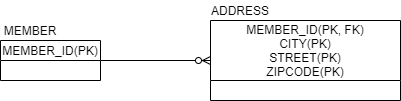

## Embedded Type  

``` java
@Entity
@Getter @Setter
@NoArgsConstructor
public class Member {
    ...
    // 근무 기간
    private LocalDateTime startDate;
    private LocalDateTime endDate;

    // 주소
    private String city;
    private String street;
    private String zipCode;
}
```

엔티티의 정보를 나타내기 위해 기본적으로 문자는 ```String```, 
숫자라면 ```int```, ```Long``` 등을 통해 나타낼 수 있다. 

위의 예제는 컬럼과 객체 필드를 단순히 일대일로 매핑한 것이다. 
하지만 좀 더 객체지향스럽게 표현하기위해 관련된 내용들을 한 번 더 추상화할 수 있다.
이 때 이런 값들을 표현하기 위한 새로운 타입을 만들어 낼 수 있는데 이를 **Embedded Type**이라고 한다. 
근무 기간과 연관된 내용과 주소와 연관된 내용을 별도의 타입으로 처리할 수 있는 것이다. 

``` java
@Embeddable
@NoArgsConstructor
@AllArgsContructor
@Getter
@EqualsAndHashCode
public class Period {
    private LocalDateTime startDate;
    private LocalDateTime endDate;
}
```

``` java
@Embeddable
@NoArgsConstructor
@AllArgsContructor
@Getter
@EqualsAndHashCode
public class Address {
    private String city;
    private String street;
    private String zipCode;
}
```

``` java
@Entity
@Getter @Setter
@NoArgsConstructor
public class Member {
    ...
    // 근무 기간
    @Embedded
    private Period period;

    // 주소
    @Embedded
    private Address address;
}
```

만약, 필드명 대신 새로운 이름이 필요하다면 ```@AttributeOverrides``` 어노테이션을 통해 지정할 수 있다. 

``` java
@Entity
@Getter @Setter
@NoArgsConstructor
public class Member {
    ...
    // 근무 기간
    @Embedded
    private Period period;

    // 주소
    @Embedded
    @AttributeOverrides({
      @AttributeOverride(name = "city", column=@Column(name = "COMPANY_CITY")),
      @AttributeOverride(name = "street", column=@Column(name = "COMPANY_STREET")),
      @AttributeOverride(name = "zipcode", column=@Column(name = "COMPANY_ZIPCODE"))
    })
    private Address address;
}
```

Embedded Type을 사용할 때는 주의해야할 점이 있는데 여러 엔티티에서 동시에 공유하면 안된다는 점이다. 
이렇게 별도로 만들어낸 타입은 객체이다. 
그리고 객체는 **레퍼런스를 기반으로 동작**하기 때문에, 
만약 공유 중인 객체의 내용을 수정하면 이를 참조하는 모든 엔티티에서 수정이 발생하기 때문이다. 

그렇다면 기존 타입에서 이러한 문제는 없는 것일까? 
Primitive Type 같은 경우에는 어차피 Value 기반으로 동작하니 상관 없다. 
그리고 ```String```과 Wrapper Class 등은 일단 값이 초기화되고 나면 수정이 불가능한 **Immutable**한 객체이기 때문에 이러한 문제를 피할 수 있다. 

이처럼 문제를 원천봉쇄하기 위해서는 Embedded Type 또한 **Immutable**하게 만드는 것이 좋다. 
위에서는 setter는 모두 제거하고 오직 생성자를 통해서만 값을 할당할 수 있게하여 구현하였다. 


## 값 타입의 Collection  

``` java
@Entity
@Getter @Setter
@NoArgsConstructor
public class Member extends BaseEntity{
    ...
    
    // 주소
    @ElementCollection
    @CollectionTable(name = "ADDRESS", joinColumns = @JoinColumn(name = "MEMBER_ID"))
    private List<Address> address;
}
```

위처럼 ```@ElementCollection```을 사용하면 컬렉션을 통해 값을 여러 개 저장할 수도 있다. 
관계형 데이터베이스에서는 단일 컬럼에 여러 개의 값이 들어가는 것은 1정규화 위반이다. 
따라서 결국 여러 개의 값을 저장하기 위해서는 별도의 테이블이 필요하고 이에 대한 정보를 ```@CollectionTable```을 통해 지정해줘야한다. 

  

하지만 여기에는 한계점이 분명 존재한다. 
ADDRESS 테이블에는 ADDRESS_ID와 같은 식별자(@Id)가 없고, 단순한 값의 모음일 뿐이다. 
그래서 이 내용이 변경되었을 때, 데이터베이스 상에서의 원본 데이터가 어떤 것인지 찾기가 힘들다는 문제점이 있다. 

그래서 JPA 구현체들은 이 컬렉션에 변경점이 발생하면, 기존의 모든 내용을 삭제하고 컬렉션의 내용을 모두 다시 삽입한다. 
따라서 이런 값들이 몇 개 없고, 간단한 형태라면 괜찮지만 그게 아니라면 엔티티로 일대다 관계를 고려하는 것이 좋다. 

<br/>

참고  
- 김영한, 자바 ORM 표준 JPA 프로그래밍, 에이콘