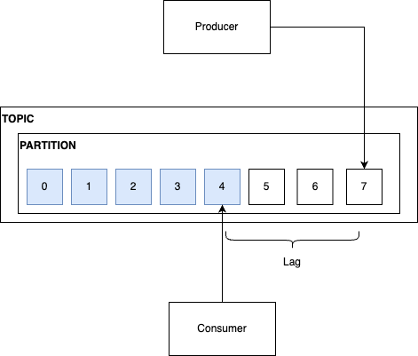

## Consumer Lag

Consumer Lag는 토픽의 log end offset과 current offset 차이이다. 
랙은 파티션별로 생성되며 만약 하나의 토픽, 두개의 파티션, 하나의 컨슈머 그룹이라면 랙의 개수는 2개가 된다.

프로듀서가 만들어 내는 데이터보다 컨슈머의 처리량이 뛰어나다면 랙은 0이고 이는 지연 없음을 의미한다. 
반대로 컨슈머가 프로듀서가 만들어 내는 데이터양을 쫓아가지 못한다면 랙은 늘어나게 된다. 

랙이 늘어나는 첫 번째는 케이스는 갑자기 트래픽이 늘어 평소보다 많은 데이터 양이 쏟아질 때이다. 
컨슈머의 처리량은 고정이기에 갑자기 처리 가능한 양을 상회하는 데이터가 발생한다면 랙이 생길 수 밖에 없다. 
이 같은 경우에는 일시적으로 컨슈머 개수를 늘려 병렬 처리를 늘리는 방향을 고려할 수 있다. 

두 번째 케이스는 컨슈머의 장애 상황이다. 
컨슈머가 제 기능을 못한다면 당연히 랙이 커질 수 밖에 없다. 
만약 여러 개의 파티션이 있고, 컨슈머 그룹도 이를 일대일로 여러 개의 컨슈머로 처리하는 상황에서 특정 파티션의 랙만 늘어난다면 그 파티션에 할당된 컨슈머에 장애가 발생했을 확률이 높다.

이처럼 랙은 컨슈머가 제대로 동작하고 있는지 확인할 수 있는 핵심적인 지표이며, 이는 반드시 모니터링되어야 한다. 
일반적으로 랙은 서드 파티 도구를 사용해서 모니터링 한다. 
콘솔 레벨에서 커맨드로 일회성으로 확인할 수도 있으나 이는 지속적인 모니터링이 아니며, 
컨슈머 애플리케이션 레벨에서 확인할 수도 있지만 이는 컨슈머 애플리케이션이 정상 동작할 때만 모니터링 가능하다. 

 

참고
- 최원영, 아파치 카프카 애플리케이션 프로그래밍, BJ Public