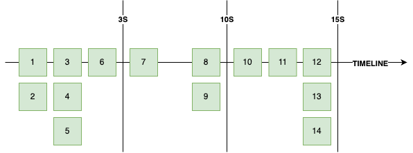
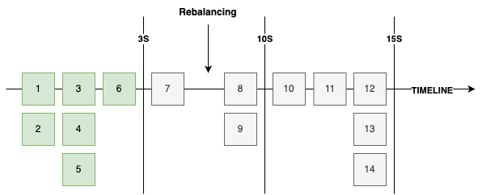

## 커밋 전략

Producer에 의해 브로커에 발행된 레코드에는 오프셋과 타임스탬프 값이 존재하며, 브로커는 각 토픽, 파티션에 대해 어떤 컨슈머 그룹이 몇 번째 레코드까지 읽어갔는지를 기록한다. 
이는 컨슈머의 커밋에 의해 기록되며, 컨슈머에서 커밋을 위한 전략이 몇 가지 존재한다.

### Auto commit

``` java
@Slf4j
public class SimpleConsumer {
	private static final String TOPIC_NAME = "simple.1";
	private static final String BOOTSTRAP_SERVERS = "http://localhost:9092";
	private static final String GROUP_ID = "group.1";

	public static void main(String[] args) throws Exception {
		try (KafkaConsumer<String, String> consumer = new KafkaConsumer<>(getProperties())) {
			consumer.subscribe(List.of(TOPIC_NAME));

			while (true) {
				ConsumerRecords<String, String> kafkaRecords = consumer.poll(Duration.ofSeconds(1));
				for (var kafkaRecord : kafkaRecords) {
					log.info("{}", kafkaRecord);
				}
			}
		}
	}

	private static Properties getProperties() {
		Properties properties = new Properties();

		properties.put(
			ConsumerConfig.BOOTSTRAP_SERVERS_CONFIG,
			BOOTSTRAP_SERVERS
		);

		properties.put(
			ConsumerConfig.GROUP_ID_CONFIG,
			GROUP_ID
		);

		properties.put(
			ConsumerConfig.KEY_DESERIALIZER_CLASS_CONFIG,
			StringDeserializer.class.getName()
		);

		properties.put(
			ConsumerConfig.VALUE_DESERIALIZER_CLASS_CONFIG,
			StringDeserializer.class.getName()
		);

		return properties;
	}
}
```

카프카 컨슈머의 기본 전략이다. 
오토 커밋은 기본적으로 활성화된 상태이며 5초 간격으로 커밋을 하게 된다. 



별도의 설정이 필요 없고, 간편하게 사용할 수 있다. 
한 가지 주의해야할 점은 커밋을 위해 별도의 스레드가 돌거나 하는 것은 아니고 ```poll```하는 시점에 동작한다. 
위 케이스가 1초마다 ```poll```이 발생하고 오토 커밋 간격은 5초라고 했을 때 동작은 아래와 같을 것이다.

|Time|Action|
|:---|:---|
|1|poll|
|2|poll|
|3|poll|
|4|poll|
|5|poll, commit|
|6|poll|
|7|poll|
|8|poll|
|9|poll|
|10|poll, commit|
|11|poll|
|12|poll|

하지만 ```poll``` 간격이 3초라면 오토 커밋 간격이 5초라도 아래와 같이 동작할 것이다.

|Time|Action|
|:---|:---|
|1|-|
|2|-|
|3|poll|
|4|-|
|5|-|
|6|poll, commit|
|7|-|
|8|-|
|9|poll|
|10|-|
|11|-|
|12|poll, commit|

> 코드는 간결해질 수 있으나 상세한 핸들링을 하지 못해 프로덕션에서 사용되는 일은 거의 없다.

### SyncCommit

오토 커밋을 비활성화하고 명시적인 커밋을 사용할 수도 있다. 
아래와 같이 커밋하면 ```poll```을 통해 가져온 가장 마지막 오프셋을 기준으로 커밋한다.

``` java
@Slf4j
public class SyncCommitConsumer {
	private static final String TOPIC_NAME = "simple.1";
	private static final String BOOTSTRAP_SERVERS = "http://localhost:9092";
	private static final String GROUP_ID = "group.1";

	public static void main(String[] args) {
		try (KafkaConsumer<String, String> consumer = new KafkaConsumer<>(getProperties())) {
			consumer.subscribe(List.of(TOPIC_NAME));

			while (true) {
				ConsumerRecords<String, String> kafkaRecords = consumer.poll(Duration.ofSeconds(1));
				for (var kafkaRecord : kafkaRecords) {
					log.info("{}", kafkaRecord);
				}

				consumer.commitSync();
			}
		}
	}

	private static Properties getProperties() {
		Properties properties = new Properties();

		properties.put(
			ConsumerConfig.BOOTSTRAP_SERVERS_CONFIG,
			BOOTSTRAP_SERVERS
		);

		properties.put(
			ConsumerConfig.GROUP_ID_CONFIG,
			GROUP_ID
		);

		properties.put(
			ConsumerConfig.KEY_DESERIALIZER_CLASS_CONFIG,
			StringDeserializer.class.getName()
		);

		properties.put(
			ConsumerConfig.VALUE_DESERIALIZER_CLASS_CONFIG,
			StringDeserializer.class.getName()
		);

		properties.put(
			ConsumerConfig.ENABLE_AUTO_COMMIT_CONFIG,
			false
		);

		return properties;
	}
}
```

레코드 별로 커밋할 수도 있다. 
다만 이 경우에는 커밋에 대한 정보를 직접 채워주는 것이 필요하다. 

``` java
try (KafkaConsumer<String, String> consumer = new KafkaConsumer<>(getProperties())) {
  consumer.subscribe(List.of(TOPIC_NAME));

  while (true) {
    ConsumerRecords<String, String> kafkaRecords = consumer.poll(Duration.ofSeconds(1));
    for (var kafkaRecord : kafkaRecords) {
      log.info("{}", kafkaRecord);

      consumer.commitSync(
        Map.of(
          new TopicPartition(kafkaRecord.topic(), kafkaRecord.partition()),
          new OffsetAndMetadata(kafkaRecord.offset() + 1, null)
        )
      );
    }
  }
}
```

### AsyncCommit

동기식 커밋의 경우에는 커밋 응답을 기다리는 동안 블록되며, 이는 처리량 감소로 이어질 수 있다. 
명시적 커밋이지만 응답을 기다리지 않고 비동기로 커밋 요청할 수 있으며 커밋에 대한 결과는 콜백을 통해 처리한다. 

``` java
@Slf4j
public class SyncCommitConsumer {
	private static final String TOPIC_NAME = "simple.1";
	private static final String BOOTSTRAP_SERVERS = "http://localhost:9092";
	private static final String GROUP_ID = "group.1";

	public static void main(String[] args) {
		try (KafkaConsumer<String, String> consumer = new KafkaConsumer<>(getProperties())) {
			consumer.subscribe(List.of(TOPIC_NAME));

			while (true) {
				ConsumerRecords<String, String> kafkaRecords = consumer.poll(Duration.ofSeconds(1));
				for (var kafkaRecord : kafkaRecords) {
					log.info("{}", kafkaRecord);
				}

				consumer.commitAsync(
					(Map<TopicPartition, OffsetAndMetadata> offsets, Exception e) -> {
						if (e == null) {
							log.info("success!");
						} else {
							log.error("error!, {}", e.getMessage());
						}
					}
				);
			}
		}
	}

	private static Properties getProperties() {
		Properties properties = new Properties();

		properties.put(
			ConsumerConfig.BOOTSTRAP_SERVERS_CONFIG,
			BOOTSTRAP_SERVERS
		);

		properties.put(
			ConsumerConfig.GROUP_ID_CONFIG,
			GROUP_ID
		);

		properties.put(
			ConsumerConfig.KEY_DESERIALIZER_CLASS_CONFIG,
			StringDeserializer.class.getName()
		);

		properties.put(
			ConsumerConfig.VALUE_DESERIALIZER_CLASS_CONFIG,
			StringDeserializer.class.getName()
		);

		properties.put(
			ConsumerConfig.ENABLE_AUTO_COMMIT_CONFIG,
			false
		);

		return properties;
	}
}
```

## Rebalncing

각 파티션은 최대 하나의 컨슈머에 할당될 수 있다. 
따라서 컨슈머가 스케일 다운되거나 노드 자체가 비정상이라고 판단되면 해당 컨슈머가 처리하던 파티션을 처리할 컨슈머를 새롭게 선정해야하며, 
컨슈머가 추가되는 경우에는 이 친구에게 할당될 파티션을 선정하는 작업이 필요하다.
이러한 작업을 **리밸런싱**이라 한다. 
리밸런싱이 일어나면 해당 컨슈머 그룹 관리하는 코디네이터가 기존 컨슈머의 모든 소유권을 박탈하고 재조정하는 작업을 진행한다. 

리밸런싱 이벤트가 발생하면 모든 컨슈머는 리밸런싱이 끝나기 전 까지 ```poll()```을 할 수 없다. 
이는 처리량 감소로 이어지기에 너무 잦은 리밸런싱은 경계해야 한다. 

또한, 리밸런싱은 메시지의 중복 처리를 야기할 수 있다. 
만약 아래와 같은 시점에 리밸런싱이 발생했다고 해보자. 
오프셋 7에 해당하는 데이터를 읽고 처리했으나 리밸런싱으로 인해 이 처리는 커밋되지 못한다. 
결국 리밸런싱 이 후 마지막 커밋은 6이므로 레코드 7은 재처리 된다.



이를 해결하기 위해서는 리밸런싱에 대한 방어 코드를 작성할 수 있다. 
리밸런싱 이벤트를 감지할 수 있는 리스너인 ```ConsumerRebalanceListener``` 제공하며, 리밸런싱 발생 시 현재까지 처리한 내용을 커밋하면 된다.

``` java
@Slf4j
public class RebalanceListenConsumer {
	private static final String TOPIC_NAME = "simple.2";
	private static final String BOOTSTRAP_SERVERS = "http://localhost:9092";
	private static final String GROUP_ID = "group.1";
	private static final Map<TopicPartition, OffsetAndMetadata> offsets = new HashMap<>();

	public static void main(String[] args) {
		try (KafkaConsumer<String, String> consumer = new KafkaConsumer<>(getProperties())) {
			consumer.subscribe(List.of(TOPIC_NAME), new ConsumerRebalanceListener() {
				@Override
				public void onPartitionsRevoked(Collection<TopicPartition> partitions) {
					log.warn("Partitions are assigned.");
				}

				@Override
				public void onPartitionsAssigned(Collection<TopicPartition> partitions) {
					log.warn("Partitions are revoked");
					consumer.commitSync(offsets);
				}
			});

			while (true) {
				ConsumerRecords<String, String> kafkaRecords = consumer.poll(Duration.ofSeconds(1));
				for (var kafkaRecord : kafkaRecords) {
					log.info("{}", kafkaRecord);

					offsets.put(
						new TopicPartition(kafkaRecord.topic(), kafkaRecord.partition()),
						new OffsetAndMetadata(kafkaRecord.offset() + 1, null)
					);
				}

				consumer.commitSync();
			}
		}
	}

	private static Properties getProperties() {
		Properties properties = new Properties();

		properties.put(
			ConsumerConfig.BOOTSTRAP_SERVERS_CONFIG,
			BOOTSTRAP_SERVERS
		);

		properties.put(
			ConsumerConfig.GROUP_ID_CONFIG,
			GROUP_ID
		);

		properties.put(
			ConsumerConfig.KEY_DESERIALIZER_CLASS_CONFIG,
			StringDeserializer.class.getName()
		);

		properties.put(
			ConsumerConfig.VALUE_DESERIALIZER_CLASS_CONFIG,
			StringDeserializer.class.getName()
		);

		properties.put(
			ConsumerConfig.ENABLE_AUTO_COMMIT_CONFIG,
			false
		);

		properties.put(
			ConsumerConfig.MAX_POLL_RECORDS_CONFIG,
			10
		);

		return properties;
	}
}
```

## Graceful Shutdown

애플리케이션의 종료는 어떻게 처리해야할까? 
컨슈머가 비정상 종료되는 경우에는 세션 타임아웃이 발생하기 전까지 컨슈머 그룹에 남아 있게되므로 종료 처리를 잘 해주는 것도 필요하다. 
이 경우 ```wakeup()``` 메서드가 제공되는데 해당 메서드가 호출된 컨슈머는 ```poll()``` 시도 시 ```WakeupException```이 발생하게 된다. 
```wakeup()``` 메서드는 ShutdownHook에서 호출하게 설정하고, Exception 처리 부분에 리소스 해제를 하면 된다. 

> ShutdownHook 설정을 하더라도 SIGTERM이나 SIGINT에서 먹지 SIGKILL은 핸들링하지 못한다.

``` java
@Slf4j
public class GracefulShutdownConsumer {
	private static final String TOPIC_NAME = "simple.2";
	private static final String BOOTSTRAP_SERVERS = "http://localhost:9092";
	private static final String GROUP_ID = "group.1";
	private static final Map<TopicPartition, OffsetAndMetadata> offsets = new HashMap<>();
	private static final KafkaConsumer<String, String> consumer = new KafkaConsumer<>(getProperties());

	public static void main(String[] args) {
		Runtime.getRuntime().addShutdownHook(new Thread(consumer::wakeup));

		try {
			consumer.subscribe(List.of(TOPIC_NAME));

			while (true) {
				ConsumerRecords<String, String> kafkaRecords = consumer.poll(Duration.ofSeconds(1));
				for (var kafkaRecord : kafkaRecords) {
					log.info("{}", kafkaRecord);

					offsets.put(
						new TopicPartition(kafkaRecord.topic(), kafkaRecord.partition()),
						new OffsetAndMetadata(kafkaRecord.offset() + 1, null)
					);
				}

				consumer.commitSync();
			}
		} catch (WakeupException e) {
			log.warn("wakeup exception.");
		} finally {
			consumer.close();
		}
	}

	private static Properties getProperties() {
		Properties properties = new Properties();

		properties.put(
			ConsumerConfig.BOOTSTRAP_SERVERS_CONFIG,
			BOOTSTRAP_SERVERS
		);

		properties.put(
			ConsumerConfig.GROUP_ID_CONFIG,
			GROUP_ID
		);

		properties.put(
			ConsumerConfig.KEY_DESERIALIZER_CLASS_CONFIG,
			StringDeserializer.class.getName()
		);

		properties.put(
			ConsumerConfig.VALUE_DESERIALIZER_CLASS_CONFIG,
			StringDeserializer.class.getName()
		);

		properties.put(
			ConsumerConfig.ENABLE_AUTO_COMMIT_CONFIG,
			false
		);

		return properties;
	}
}
```

<br/>

참고
- 최원영, 아파치 카프카 애플리케이션 프로그래밍, BJ Public